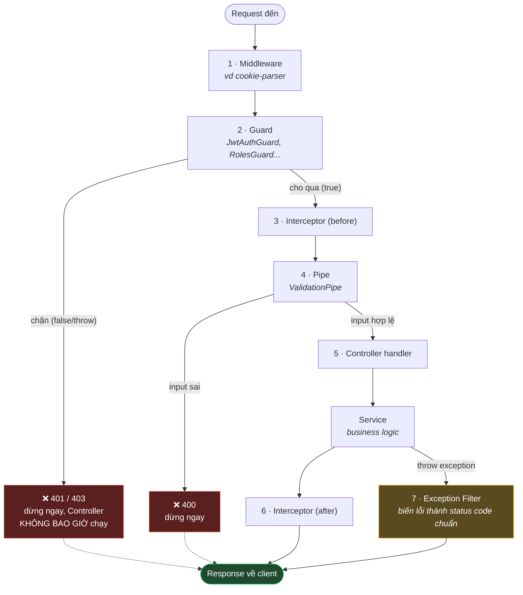
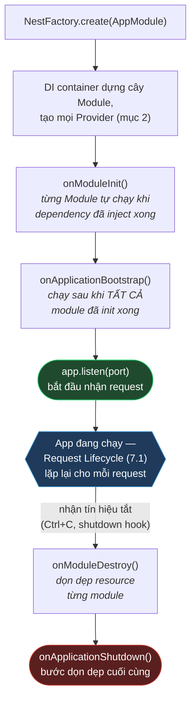

# Glossary — Thuật ngữ dùng trong playbook này

> Dành cho người mới học backend. Mỗi thuật ngữ được giải thích ngắn gọn bằng ví dụ thực tế trong chính playbook Auth này — đọc thuật ngữ nào chưa quen thì tra ở đây, không cần hiểu hết trước khi bắt đầu code. Các khái niệm sâu hơn (vì sao thiết kế thế này, không phải thế khác) đã có sẵn trong box "📘 Khái niệm" ở từng STEP — file này chỉ giải thích **từ/cụm từ**, còn box trong file giải thích **quyết định thiết kế**.

---

## 1. Web & HTTP cơ bản

- **Client / Server** — Client là bên gửi yêu cầu (browser, app mobile, Postman...). Server là bên xử lý yêu cầu đó và trả kết quả về (chính là app NestJS bạn đang xây).
- **HTTP request / response** — 1 lượt "hỏi — đáp" giữa client và server qua giao thức HTTP. Request có method (GET/POST/...), URL, header, body. Response có status code, header, body.
- **HTTP method** — hành động của request: `GET` (lấy dữ liệu, không đổi gì), `POST` (tạo mới / thực hiện hành động, vd login, register), `PUT`/`PATCH` (sửa), `DELETE` (xoá). Trong playbook này hầu hết auth endpoint là `POST` (đăng ký, login, đổi password...) vì đều là hành động làm thay đổi trạng thái; `GET /auth/me` là ngoại lệ vì chỉ đọc dữ liệu.
- **Endpoint** — 1 địa chỉ (URL) + method cụ thể mà server hiểu và xử lý được, vd `POST /auth/login`. "API" (Application Programming Interface) là tập hợp toàn bộ endpoint mà server cung cấp.
- **Status code** — số 3 chữ số server trả về báo hiệu kết quả. Nhóm 2xx = thành công (`200 OK`, `201 Created` — tạo mới thành công). Nhóm 4xx = lỗi do client (`400 Bad Request` — input sai, `401 Unauthorized` — chưa đăng nhập/đăng nhập sai, `403 Forbidden` — đã đăng nhập nhưng không đủ quyền, `404 Not Found` — không tìm thấy, `409 Conflict` — dữ liệu đã tồn tại (vd email trùng), `429 Too Many Requests` — gọi quá nhiều lần, bị rate limit). Nhóm 5xx = lỗi do server (bug, crash).
- **Header** — các cặp key-value đi kèm request/response, không nằm trong body, vd `Authorization: Bearer <token>` (gửi access token), `Content-Type: application/json`, `Set-Cookie` (server bảo browser lưu cookie), `Cookie` (browser gửi lại cookie đã lưu).
- **Body** — phần dữ liệu chính của request/response, thường là JSON, vd `{ "email": "...", "password": "..." }`.
- **Route param** — phần biến trong URL, vd `:id` trong `/orders/:id` — đọc bằng `@Param('id')` trong NestJS.
- **Query param** — phần sau dấu `?` trong URL, vd `/products?page=2`.
- **Cookie** — 1 mẩu dữ liệu nhỏ server bảo browser lưu lại (qua header `Set-Cookie`), rồi browser tự động gửi kèm lại ở các request sau tới cùng domain. Playbook này dùng cookie để lưu refresh token (xem `05-login.md`).
- **JSON** (JavaScript Object Notation) — định dạng text để biểu diễn dữ liệu dạng object/array (`{ "key": "value" }`), là định dạng phổ biến nhất cho API body ngày nay.
- **CORS** (Cross-Origin Resource Sharing) — cơ chế trình duyệt dùng để quyết định 1 trang web ở domain A có được phép gọi API ở domain B hay không. Liên quan tới refresh token cookie khi frontend/backend khác domain — xem `00-overview.md § Known Gaps`.

## 2. NestJS — các khối xây dựng cơ bản

### NestJS theo mô hình gì? (MVC? MVCC?)

- **MVCC không phải là kiến trúc web** — đây là viết tắt của **Multi-Version Concurrency Control**, 1 kỹ thuật ở tầng **database** (PostgreSQL, MySQL InnoDB dùng nó để xử lý nhiều transaction đọc/ghi cùng lúc mà không khoá chặn nhau). Không liên quan gì tới cách tổ chức Controller/Service — dễ nhầm với MVC vì tên gần giống nhau.
- **MVC** (Model — View — Controller) là kiến trúc cho app **có render giao diện HTML ở server** (NestJS có hỗ trợ kiểu này qua view engine như Handlebars, nhưng ít dùng cho REST API). Playbook Auth này (và hầu hết REST API hiện nay) **không có "View"** — server chỉ trả JSON, client (React/mobile app) tự lo hiển thị. Vì vậy gọi NestJS REST API là "theo MVC" không chính xác lắm.
- **Mô hình NestJS thực sự dùng:** **Layered Architecture (kiến trúc phân tầng)**, các tầng nói chuyện với nhau qua **Dependency Injection (DI)** — thường tổ chức theo pattern **Controller — Service — Repository (CSR)**:

  ```mermaid
  flowchart TD
      subgraph L1["Presentation Layer"]
          Ctrl["Controller<br/><i>nhận HTTP request, không xử lý logic</i>"]
      end
      subgraph L2["Business Logic Layer"]
          Svc["Service<br/><i>toàn bộ nghiệp vụ nằm ở đây</i>"]
      end
      subgraph L3["Data Access Layer"]
          Repo["Repository / ORM<br/><i>Prisma đóng vai trò này, tự sinh sẵn</i>"]
      end
      Ctrl --> Svc --> Repo

      style Ctrl fill:#1f3a5a,stroke:#3498db,color:#fff
      style Svc fill:#1f4a2e,stroke:#2ecc71,color:#fff
      style Repo fill:#5a4a1f,stroke:#d4a017,color:#fff
  ```

  Áp vào chính playbook: `AuthController` → `AuthService` → `PrismaService` (Prisma tự sinh sẵn `prisma.user.findUnique()`... nên bạn không cần tự viết class Repository riêng).

- **NestJS không ép bạn theo 1 pattern cố định** (khác Rails ép MVC) — nó chỉ cung cấp **hạ tầng** (Module, DI, Decorator, Guard...) để tự tổ chức code theo layer; Controller-Service-Repository chỉ là **convention phổ biến nhất** cộng đồng dùng. Điều thực sự đặc trưng cho "kiến trúc NestJS" không phải tên pattern, mà là **Module system + Dependency Injection (IoC container)** — lấy cảm hứng từ Angular, khác hẳn Express thuần (không có DI, tự `import`/gọi hàm trực tiếp). Nói gọn 1 câu: **"NestJS = Modular + Layered Architecture, kết nối các layer bằng DI."**

### Các khối xây dựng cơ bản

- **Module** (`*.module.ts`) — 1 "hộp" gom nhóm Controller + Service liên quan tới nhau (vd toàn bộ auth nằm trong `AuthModule`). Xem `01-setup.md § STEP 4`.
- **Controller** (`*.controller.ts`) — nhận HTTP request, gọi Service xử lý, trả response. Không chứa business logic, chỉ điều hướng.
- **Service / Provider** (`*.service.ts`) — nơi chứa logic thật (hash password, tạo user, gửi email...). Đánh dấu bằng `@Injectable()`. "Provider" là tên gọi tổng quát hơn trong NestJS cho bất kỳ class nào có thể được inject (Service là loại provider phổ biến nhất).
- **Dependency Injection (DI)** — thay vì Controller tự `new AuthService()`, NestJS tự tạo và "tiêm" (inject) instance đó vào constructor. Lợi ích: dễ test (thay bằng mock), dễ tái sử dụng 1 instance cho toàn app.
- **Decorator** (`@Something()`) — cú pháp gắn "nhãn"/metadata lên class, method, hoặc tham số. NestJS dùng decorator ở khắp nơi: `@Controller()`, `@Get()`/`@Post()`, `@Injectable()`, `@Body()`, `@Roles('ADMIN')`... Bản thân decorator không tự làm gì — nó chỉ đánh dấu, một đoạn code khác (Guard, Pipe...) sẽ đọc lại nhãn đó lúc chạy.
- **DTO** (Data Transfer Object, `*.dto.ts`) — 1 class định nghĩa hình dạng dữ liệu request/response, vd `RegisterDto` có `email`, `password`. Gắn kèm decorator validate (`@IsEmail()`, `@MinLength()`...) để Nest tự kiểm tra input.
- **Pipe / `ValidationPipe`** — đoạn code chạy để biến đổi/kiểm tra dữ liệu đầu vào trước khi vào Controller. `ValidationPipe` (bật global trong `main.ts`) tự động đọc decorator trên DTO và trả `400` nếu input sai — không cần tự viết `if` kiểm tra tay.
- **Guard** (`*.guard.ts`) — đoạn code chạy **trước** khi request tới Controller, quyết định request có được đi tiếp hay không (return `true`/`false`, hoặc `throw`). Ví dụ: `JwtAuthGuard` chặn request không có token hợp lệ. Xem `07-guards.md`.
- **`ExecutionContext`** — object Guard/Interceptor/param decorator nhận được, chứa thông tin về request hiện tại (route nào, class nào, HTTP request gốc...). Gọi `context.switchToHttp().getRequest()` để lấy về `Request` (Express) từ đó.
- **`Reflector` + `SetMetadata`** — cơ chế "gắn nhãn lên route rồi đọc lại trong Guard". `SetMetadata(key, value)` gắn dữ liệu vào metadata của method (vd `@Roles('ADMIN')` thực chất gọi `SetMetadata('roles', ['ADMIN'])`), `Reflector` dùng để đọc lại giá trị đó lúc Guard chạy. Xem `07-guards.md § RolesGuard`.
- **Param decorator custom** (`createParamDecorator`) — cách tự định nghĩa decorator dùng trên tham số của method Controller, giống `@Body()`/`@Param()` có sẵn nhưng tự viết logic lấy dữ liệu (vd `@CurrentUser()` đọc `request.user`). Xem `07-guards.md`.

## 3. Xác thực & bảo mật (Authentication & Security)

- **Authentication (AuthN)** — xác minh "bạn là ai" (đăng nhập đúng email/password chưa). Authorization (AuthZ) — xác minh "bạn được phép làm gì" (có role ADMIN không, có phải chủ resource không). 2 khái niệm khác nhau: AuthN xảy ra trước (login), AuthZ xảy ra sau (role/ownership check).
- **Hashing** — biến đổi 1 chuỗi (password, token) thành 1 chuỗi khác **không thể đảo ngược lại bản gốc**. Khác với **encryption** (mã hoá — có thể giải mã lại bằng key), hash là hàm 1 chiều: chỉ dùng để _so sánh_ ("chuỗi này hash ra có khớp với hash đã lưu không"), không dùng để lấy lại bản gốc. Password và token trong playbook này luôn được hash trước khi lưu DB — xem `01-setup.md`.
- **Salt** — 1 chuỗi ngẫu nhiên trộn thêm vào trước khi hash password, để 2 user cùng dùng chung 1 password vẫn ra 2 hash khác nhau (chống tấn công dò bằng bảng hash dựng sẵn — "rainbow table"). `argon2` tự sinh và tự lưu salt kèm trong chuỗi hash trả về.
- **`argon2` / `bcrypt`** — 2 thuật toán hash chuyên dùng cho password, cố tình chạy chậm và tốn tài nguyên để brute-force (thử hàng loạt password) trở nên tốn kém. Khác hẳn hash "nhanh" như SHA-256/MD5 (không nên dùng để hash password).
- **JWT** (JSON Web Token) — 1 định dạng token gồm 3 phần nối bằng dấu chấm: `header.payload.signature`. `payload` chứa dữ liệu (vd `sub`, `email`, `roles`) — **ai cũng đọc được** (chỉ encode base64, không mã hoá), chỉ có `signature` đảm bảo dữ liệu không bị sửa. Vì vậy không bao giờ nhét dữ liệu nhạy cảm (password, token khác) vào payload JWT.
- **Access token** — JWT ngắn hạn (15 phút trong playbook này), gửi kèm mọi request cần đăng nhập qua header `Authorization: Bearer <token>`. Đặc điểm **stateless** (server không cần tra DB để verify, chỉ cần verify chữ ký) — xem `05-login.md`.
- **Refresh token** — token dài hạn hơn (7 ngày), dùng để xin cấp access token mới khi access token hết hạn, mà không cần đăng nhập lại. Trong playbook này là "opaque token" (chuỗi ngẫu nhiên, không phải JWT), lưu qua cookie — xem `06-refresh-token.md`.
- **Stateless vs Stateful** — stateless nghĩa là server không lưu trạng thái gì để verify (JWT tự chứa đủ thông tin). Stateful nghĩa là server phải tra cứu 1 nơi lưu trữ (DB, cache) để biết trạng thái — refresh token là "stateful" vì server phải tra DB (bảng `refresh_tokens`) mỗi lần dùng.
- **Token rotation** — mỗi lần dùng refresh token thành công, token cũ bị vô hiệu ngay và cấp 1 token mới — giảm thiệt hại nếu token bị đánh cắp. Xem `06-refresh-token.md`.
- **Reuse detection** — phát hiện 1 refresh token đã bị vô hiệu (do rotation) nhưng vẫn bị gửi lên lần nữa → dấu hiệu token đã bị đánh cắp, phản ứng bằng cách vô hiệu hoá toàn bộ refresh token khác của user đó.
- **Passport / Strategy** — Passport là thư viện xác thực phổ biến trong Node.js, tích hợp vào Nest qua `@nestjs/passport`. "Strategy" định nghĩa "lấy credential từ đâu, verify ra sao" — vd `JwtStrategy` lấy JWT từ header và verify chữ ký. Xem `07-guards.md`.
- **`HttpOnly` cookie** — cờ đánh dấu cookie **không đọc được bằng JavaScript** ở trình duyệt (`document.cookie` không thấy nó) — chỉ server đọc/ghi được qua header. Giảm rủi ro bị đánh cắp qua tấn công XSS.
- **`Secure` cookie** — cờ đánh dấu cookie chỉ được gửi qua kết nối HTTPS, không gửi qua HTTP thường.
- **`SameSite` cookie** — cờ kiểm soát cookie có được gửi kèm request từ site khác hay không (`Strict`/`Lax`/`None`) — liên quan tới chống tấn công CSRF.
- **XSS** (Cross-Site Scripting) — tấn công chèn JavaScript độc hại vào trang web để đánh cắp dữ liệu (vd đọc token lưu ở `localStorage`). Đây là lý do refresh token dùng cookie `HttpOnly` thay vì `localStorage`.
- **CSRF** (Cross-Site Request Forgery) — tấn công lừa browser của nạn nhân tự động gửi request (kèm cookie đăng nhập) tới 1 site khác mà nạn nhân không chủ ý. Xem `00-overview.md § Known Gaps`.
- **Email/User enumeration** — kiểu tấn công dò ra danh sách email đã đăng ký bằng cách quan sát response khác nhau giữa "email tồn tại" và "email không tồn tại". Đây là lý do `forgot-password`/`resend-verification` luôn trả về đúng 1 dạng response — xem `04-resend-verification.md`.
- **Rate limiting** — giới hạn số lần 1 client được gọi 1 endpoint trong 1 khoảng thời gian, chống spam/brute-force. Xem `12-rate-limiting.md`.
- **Middleware** — đoạn code chạy trên **mọi** request trước khi tới route handler (khác Guard — Guard chỉ chạy trên route có khai báo dùng nó). Ví dụ `cookie-parser` là middleware đọc cookie cho mọi request — xem `06-refresh-token.md § STEP 12.1`.

## 4. Database & Prisma (ORM)

- **ORM** (Object-Relational Mapping) — thư viện cho phép thao tác với database bằng code (gọi hàm, method) thay vì viết SQL tay. Prisma là ORM dùng trong dự án này.
- **Schema** (`prisma/schema.prisma`) — file định nghĩa cấu trúc database (model nào, field nào, quan hệ nào) mà Prisma dựa vào để sinh code truy vấn.
- **Model** — 1 "bảng" trong ngôn ngữ Prisma, vd `User`, `Role`, `RefreshToken`. Prisma tự sinh ra các hàm `prisma.user.findUnique()`, `prisma.user.create()`... từ model này.
- **Migration** — 1 bản ghi lại sự thay đổi cấu trúc DB (thêm bảng, thêm cột...) theo thời gian, để áp dụng đồng bộ giữa các môi trường (dev, staging, production). Playbook Auth này **không cần migration mới** vì schema đã có sẵn.
- **Relation** — quan hệ giữa 2 model, vd `User` có nhiều `RefreshToken` (1-nhiều), hoặc `User` — `Role` qua bảng nối `UserRole` (nhiều-nhiều, vì 1 user có thể có nhiều role và 1 role gán cho nhiều user).
- **Seed** — script tạo sẵn dữ liệu mẫu/dữ liệu khởi tạo bắt buộc (vd role `ADMIN`/`CUSTOMER`, tài khoản admin đầu tiên) khi setup DB mới. Xem `01-setup.md § STEP 1`.
- **Transaction** — gom nhiều thao tác ghi DB thành 1 khối "tất cả hoặc không gì cả" — nếu 1 bước lỗi giữa chừng, mọi thay đổi trước đó bị rollback (huỷ), không để dữ liệu nửa vời. Xem `02-register.md § STEP 5.5`.
- **`upsert`** — 1 thao tác Prisma: "nếu bản ghi theo điều kiện `where` đã tồn tại thì update, chưa có thì tạo mới" — dùng cho seed để chạy lại nhiều lần không tạo trùng. Xem `01-setup.md § STEP 1`.
- **Index / Unique constraint** — ràng buộc ở tầng DB đảm bảo 1 cột (vd `email`) không có 2 giá trị trùng nhau — Prisma dựa vào đây để `findUnique()` hoạt động.

## 5. Testing

- **Unit test** — test 1 đơn vị code nhỏ (thường là 1 class/hàm) một cách cô lập, mock hết mọi dependency (DB, network...) — chạy rất nhanh. Xem `13-testing.md`.
- **E2E test** (End-to-End) — test toàn bộ luồng thật, từ gửi HTTP request tới app đã bootstrap, chạy với DB test thật — chậm hơn nhưng bắt được lỗi "wiring" (thiếu Guard, sai route...) mà unit test không thấy được.
- **Mock** — 1 object/hàm giả lập thay thế cho dependency thật trong test (vd giả lập `PrismaService` để không cần DB thật khi unit test `AuthService`).
- **`jest`** — framework chạy test phổ biến nhất trong hệ sinh thái Node.js/NestJS (mặc định khi tạo project bằng `nest new`).
- **`supertest`** — thư viện gửi HTTP request thật tới app NestJS (chạy trong bộ nhớ) để viết e2e test, cho phép assert trên response thật (status, body, header).
- **Coverage** (`npm run test:cov`) — tỉ lệ phần trăm code được chạy qua ít nhất 1 lần trong lúc test — chỉ số tham khảo, không đảm bảo hết bug nhưng giúp phát hiện code chưa có test nào đụng tới.

## 6. Cấu hình & công cụ

- **Environment variable (env var) / `.env`** — biến cấu hình đọc từ môi trường chạy (không hardcode trong code), lưu trong file `.env` (không commit lên git vì chứa secret thật) — có file mẫu `.env.example` (không chứa giá trị thật) để dev khác biết cần khai báo gì. Xem `01-setup.md § STEP 3`.
- **`ConfigService`** — service của NestJS (`@nestjs/config`) đọc `.env` và cung cấp lại qua dependency injection, thay vì gọi `process.env.XXX` trực tiếp khắp nơi trong code.
- **Secret** — giá trị nhạy cảm (mật khẩu, khoá ký JWT...) không bao giờ được lộ ra ngoài (log, response, commit git).
- **TTL** (Time To Live) — thời gian sống của 1 thứ gì đó trước khi hết hạn, vd access token TTL 15 phút, refresh token TTL 7 ngày.
- **`npm` / `npx`** — `npm` quản lý package (cài đặt, chạy script trong `package.json`). `npx` chạy 1 package như 1 lệnh mà không cần cài global trước (vd `npx nest g module auth` chạy CLI của NestJS để sinh code).
- **CLI** (Command Line Interface) — công cụ chạy qua dòng lệnh terminal, vd Nest CLI (`nest g ...`), Prisma CLI (`npx prisma ...`).
- **TypeScript `interface` vs `class`** — `interface` chỉ tồn tại lúc biên dịch (compile-time), biến mất hoàn toàn khi chạy thật (runtime) — vì vậy NestJS không thể dùng `interface` làm token để dependency-inject (`@Inject()` cần 1 giá trị runtime thật, như `class` hoặc `Symbol`). Đây là lý do `MailService` ở MVP dùng `class` cụ thể thay vì `interface` — xem `00-overview.md § Shared Services`.
- **Swagger / OpenAPI** — chuẩn mô tả API bằng 1 file spec (JSON/YAML), `@nestjs/swagger` tự sinh spec đó từ decorator (`@ApiProperty`, `@ApiOperation`...) và hiển thị thành giao diện web tương tác để test thử API. Xem `14-swagger-and-wrapup.md`.

## 7. NestJS/Node.js — khái niệm sâu hơn

"Vòng đời" (lifecycle) trong NestJS có **2 tầng khác nhau**, dễ nhầm lẫn nên tách riêng: (7.1) vòng đời của **1 request** đi qua app — chạy lại từ đầu mỗi lần có request mới; (7.2) vòng đời của **cả application** — chỉ chạy 1 lần lúc app khởi động và 1 lần lúc app tắt.

### 7.1. Vòng đời của 1 Request (Request Lifecycle)

Mỗi request HTTP đi vào app đều chạy qua đúng 1 chuỗi các "lớp" theo thứ tự cố định sau, trước khi (và sau khi) chạm tới code bạn viết trong Controller:



Giải thích từng bước, theo đúng thứ tự chạy:

1. **Middleware** — chạy **sớm nhất**, trên **mọi** request khớp pattern đã đăng ký (thường là toàn app), _không biết_ request đó cuối cùng sẽ vào Controller nào. Giống middleware thuần Express — vd `cookie-parser` (`app.use(cookieParser())`, xem `06-refresh-token.md § STEP 12.1`) đọc header `Cookie` và điền `request.cookies`, để các bước sau (Guard, Controller) dùng được.
2. **Guard** — chạy sau Middleware, **biết rõ** Controller/route nào sắp được gọi (đọc được `@Roles()`, `@OwnedResource()` qua `Reflector`). Trả lời đúng 1 câu hỏi: "request này có được đi tiếp không?" — trả `true` thì đi tiếp, trả `false`/`throw` thì **dừng ngay tại đây**, các bước sau (kể cả Controller) không bao giờ chạy. Ví dụ: `JwtAuthGuard` (verify access token, gắn `request.user`), `RolesGuard` (check role), `OwnershipGuard` (check chủ resource) — xem `07-guards.md`. Nhiều Guard có thể xếp chồng (`@UseGuards(JwtAuthGuard, RolesGuard)`) — chạy **theo đúng thứ tự khai báo trong mảng**, guard sau có thể dựa vào dữ liệu guard trước đã gắn (vd `RolesGuard` cần `request.user` mà `JwtAuthGuard` đã gắn trước đó).
3. **Interceptor (phần "before")** — chạy sau Guard, trước khi dữ liệu được validate. Có thể sửa/log request trước khi nó đi tiếp. Playbook Auth này không cần viết Interceptor riêng (không có STEP nào dùng tới), chỉ giải thích ở đây để bạn biết vị trí của nó trong chuỗi nếu gặp ở project khác.
4. **Pipe** — chạy ngay trước khi dữ liệu (thường là `@Body()`) được truyền vào tham số của Controller method. Dùng để **validate** (kiểm tra hợp lệ, vd `ValidationPipe` tự đọc decorator trên DTO như `@IsEmail()` — xem mục 2) và **transform** (biến đổi kiểu dữ liệu, vd chuỗi `"123"` từ URL thành số `123`). Nếu Pipe thấy dữ liệu sai, nó `throw` ngay tại đây — Controller **không bao giờ được gọi** với dữ liệu sai.
5. **Controller handler** — code bạn viết (vd `async register(@Body() dto: RegisterDto) {...}`) — chỉ chạy tới đây khi đã qua hết Middleware → Guard → Pipe mà không bị chặn. Controller gọi Service xử lý business logic, rồi `return` kết quả.
6. **Interceptor (phần "after")** — sau khi Controller `return` xong, Interceptor có thể "chạm" vào kết quả trước khi nó thực sự được gửi về client (vd log tổng thời gian xử lý, bọc thêm field vào response). Đây là lý do Interceptor "bọc quanh" (wrap) Controller — nó chạy cả trước lẫn sau, còn Guard/Pipe chỉ chạy trước.
7. **Exception Filter** — nếu **bất kỳ bước nào ở trên** (Guard, Pipe, Controller, Service...) ném ra lỗi (`throw new SomeException(...)`), luồng bình thường bị ngắt và Exception Filter là nơi **bắt lại** lỗi đó, biến nó thành 1 HTTP response chuẩn (status code + message JSON), thay vì để lộ ra lỗi thô/crash app. NestJS có sẵn 1 filter mặc định (biến `UnauthorizedException` thành `401`, `NotFoundException` thành `404`...) — bạn không cần tự viết trừ khi muốn custom thêm (playbook nhắc tới `PrismaExceptionFilter`, chưa implement trong repo — xem `00-overview.md § Definition of Done` — nếu có, nó sẽ tự bắt lỗi Prisma như vi phạm unique constraint và biến thành `409` thay vì lỗi `500` thô).

> 🔑 **Ví dụ cụ thể trong chính playbook này** (`GET /auth/me`, xem `08-me.md`): request tới → **Guard** `JwtAuthGuard` chạy trước, verify access token, gắn `request.user = { sub, email, roles }` → request được cho đi tiếp (không có Pipe nào ở đây vì route không nhận body) → **Controller** `getMe()` chạy, đọc lại `request.user` qua decorator `@CurrentUser()` (param decorator — xem mục 2), gọi `authService.getMe(user.sub)` → trả `AuthUserResponseDto`. Nếu không có token, `JwtAuthGuard` đã `throw` ở bước 2 rồi — `getMe()` (Controller) **không bao giờ được gọi tới**, dù bạn không thấy dòng code nào tường minh viết "if không có token thì return 401" trong Controller cả — đó là vì Guard đã lo việc này ở tầng trước.

Vẽ lại đúng ví dụ trên dưới dạng "ai gọi ai theo thời gian" (sequence diagram) — 2 kịch bản cạnh nhau, có token hợp lệ và không có token:

```mermaid
sequenceDiagram
    participant Client
    participant Guard as JwtAuthGuard
    participant Ctrl as AuthController.getMe()
    participant Svc as AuthService.getMe()
    participant DB as Prisma / Database

    rect rgb(30, 60, 40)
    note over Client, DB: Kịch bản 1 — có access token hợp lệ
    Client->>Guard: GET /auth/me<br/>Authorization: Bearer <token>
    Guard->>Guard: verify chữ ký + hạn token
    Guard->>Guard: request.user = payload
    Guard->>Ctrl: cho request đi tiếp
    Ctrl->>Ctrl: @CurrentUser() đọc request.user
    Ctrl->>Svc: getMe(user.sub)
    Svc->>DB: findUniqueOrThrow({ id: userId })
    DB-->>Svc: User + roles
    Svc-->>Ctrl: AuthUserResponseDto
    Ctrl-->>Client: 200 OK + user info
    end

    rect rgb(60, 30, 30)
    note over Client, DB: Kịch bản 2 — thiếu / sai token
    Client->>Guard: GET /auth/me (không có header Authorization)
    Guard->>Guard: verify thất bại
    Guard--xClient: 401 Unauthorized
    note over Ctrl, DB: Controller/Service KHÔNG BAO GIỜ được gọi tới
    end
```



Điểm mấu chốt nhìn từ sequence diagram: ở **Kịch bản 2**, mũi tên dừng lại ngay ở `Guard` — không có mũi tên nào đi tới `Ctrl`/`Svc`/`DB` cả. Đây chính là lý do Guard giúp code Controller/Service "sạch" hơn: bạn không cần viết `if (!token) throw ...` lặp lại ở mọi Controller, vì Guard đã chặn từ tầng trước.

### 7.2. Vòng đời của Application/Module (Application Lifecycle)

Khác với request lifecycle (chạy lại từ đầu mỗi request), đây là các thời điểm chỉ xảy ra **1 lần** khi app khởi động hoặc tắt — thường không cần đụng tới trong playbook Auth này, nhưng hữu ích để biết `main.ts` và các Module thực sự "sống" theo trình tự nào:



> So sánh nhanh: mục **7.1** (Request Lifecycle) là vòng lặp **chạy đi chạy lại** cho mỗi request — nằm gọn trong ô "App đang chạy" ở giữa sơ đồ trên. Mục **7.2** (Application Lifecycle) chỉ chạy **đúng 1 lần** lúc bật app và **đúng 1 lần** lúc tắt app — bao quanh toàn bộ vòng lặp đó.

- **`bootstrap()`** (trong `src/main.ts`) — tên quy ước (không bắt buộc, nhưng hầu như mọi project NestJS đều đặt tên này) cho hàm khởi động app: tạo app (`NestFactory.create(AppModule)`), gắn middleware/pipe **global** (áp dụng cho mọi route, khác với gắn `@UseGuards()` chỉ áp dụng cho 1 route/controller), rồi gọi `app.listen(port)`. Đây là nơi các đoạn code toàn cục như `app.use(cookieParser())` (STEP 12.1) hay `SwaggerModule.setup()` (STEP 14) được gắn vào — chạy đúng 1 lần lúc khởi động, không lặp lại mỗi request.
- **`OnModuleInit`/`OnApplicationBootstrap`/`OnModuleDestroy`/`OnApplicationShutdown`** — các interface NestJS cho phép 1 Service tự định nghĩa method chạy vào đúng thời điểm trên (implement interface rồi viết method cùng tên, vd `class PrismaService implements OnModuleInit { onModuleInit() { ... } }` — dùng phổ biến để mở kết nối DB lúc app khởi động, đóng kết nối lúc app tắt). Playbook Auth này không yêu cầu viết hook nào riêng, nhưng nếu bạn thấy `PrismaService` có sẵn trong repo dùng `onModuleInit()` để gọi `this.$connect()`, đây chính là lý do.
- **DI container** — "bộ nhớ" nội bộ NestJS dùng để lưu và quản lý mọi instance của Service/Provider đã tạo, biết `AuthService` cần gì (`PrismaService`, `PasswordService`...) để tự động "lắp ráp" đúng thứ tự **ngay trong bước `NestFactory.create(AppModule)`** ở trên — trước khi `onModuleInit()` chạy. Bạn không tự thấy container này — chỉ khai `constructor(private readonly x: X)` là NestJS tự lo phần còn lại (xem Dependency Injection ở mục 2).
- **Singleton (provider scope)** — mặc định, NestJS chỉ tạo **1 instance duy nhất** cho mỗi Service, dùng chung cho toàn app trong suốt vòng đời application (không tạo instance mới mỗi request) — đây là lý do Service không nên tự lưu state riêng cho từng request (state nên nằm trong tham số method hoặc DB), vì mọi request (dù chạy song song) đều dùng chung 1 instance.
- **Global prefix** (`app.setGlobalPrefix('api')`) — tiền tố gắn thêm vào **mọi** route của app, vd route thật `/auth/login` trở thành `/api/auth/login`. Playbook nhắc đi nhắc lại phải kiểm tra `main.ts` có dòng này không trước khi hardcode `path: '/auth'` cho cookie (xem `05-login.md`) — nếu có global prefix mà quên cập nhật, cookie sẽ không gửi kèm đúng request.
- **`Logger`** (`@nestjs/common`) — class ghi log tích hợp sẵn của NestJS (`new Logger(AuthService.name)`), dùng thay `console.log` để log có thêm ngữ cảnh (tên class, level: log/error/warn...). Dùng để log lỗi gửi mail thất bại mà không làm crash flow chính (xem `02-register.md § STEP 5.5`).

## 8. Các cụm từ bảo mật/thiết kế khác gặp trong playbook

- **Idempotent** — gọi lại nhiều lần cho cùng kết quả như gọi 1 lần, không tạo ra tác dụng phụ chồng chất. Seed script (`01-setup.md § STEP 1`) phải idempotent vì có thể chạy lại nhiều lần (mỗi lần deploy, mỗi lần setup máy mới).
- **Replay protection** — chống việc dùng lại 1 thứ (token, request) đã dùng rồi. Ví dụ: verify-email token dùng 1 lần xong, gọi lại lần 2 với cùng token phải bị từ chối (xem `03-verify-email.md`) — đây chính là "chống replay".
- **Brute-force** — kiểu tấn công thử **hàng loạt** giá trị (password, token...) cho tới khi trúng. Rate limiting (`12-rate-limiting.md`) và chọn thuật toán hash chậm (`argon2`, mục 3) đều là biện pháp chống brute-force.
- **Phishing** — lừa người dùng tự nguyện cung cấp thông tin (password, OTP...) qua trang giả mạo/email giả. Nhắc tới trong playbook vì email bị lộ (qua enumeration) có thể là bước đầu để kẻ tấn công nhắm phishing có chủ đích.
- **Orchestrate / Orchestration** — "điều phối": 1 class gọi lần lượt nhiều service khác theo đúng thứ tự để hoàn thành 1 flow nghiệp vụ, chứ không tự làm hết mọi việc bên trong nó. `AuthService` "orchestrate" flow register (gọi `PasswordService` → transaction Prisma → `MailService`) — xem `00-overview.md § Shared Services`.
- **Allow-list** (ngược với "deny-list"/"blocklist") — chỉ những field được **liệt kê rõ ràng** mới được đi qua/hiển thị, mọi thứ khác mặc định bị chặn. Response DTO trong playbook này là allow-list: chỉ field khai trong DTO (`id`, `email`, `roles`...) được trả về client, `passwordHash` không nằm trong danh sách nên không bao giờ lộ ra — xem `00-overview.md § Security Rules`.
- **Coupling** — mức độ 1 đoạn code "dính chặt" vào chi tiết cụ thể của 1 đoạn code khác, khiến khó thay đổi cái này mà không ảnh hưởng cái kia. `OwnershipGuard` (`07-guards.md`) bị coupling với Prisma vì callback `fetch` gọi thẳng Prisma — chấp nhận được cho MVP nhưng là điểm cần cải tiến sau.
- **Over-engineering** — thiết kế phức tạp/trừu tượng hơn mức cần thiết cho vấn đề hiện tại (vd tạo interface + DI token cho `MailService` khi chỉ có 1 implementation duy nhất) — playbook cố tình tránh việc này ở nhiều chỗ, chỉ thêm abstraction khi thật sự cần.
- **"God Service"** — 1 Service ôm đồm quá nhiều trách nhiệm (tự hash password, tự sinh token, tự gửi mail, tự query DB...) thay vì tách ra từng service chuyên trách — anti-pattern (thứ nên tránh) mà `AuthService` cố tình không rơi vào, xem `00-overview.md § Shared Services`.
- **Denylist / Token-version / `jti`** (nhắc ở `00-overview.md § Known Gaps`, chưa làm cho MVP) — 2 cách khác nhau để thu hồi access token JWT ngay lập tức (bù cho việc JWT vốn "stateless", không thể xoá giữa chừng): **denylist** là 1 danh sách (thường lưu Redis) các token đã bị thu hồi, mỗi request kiểm tra token có nằm trong danh sách này không (dựa vào `jti` — "JWT ID", 1 field định danh duy nhất cho mỗi token được cấp); **token-version** là 1 số đếm lưu trên `User`, tăng lên mỗi khi cần vô hiệu hết token cũ, JWT payload mang theo số version lúc cấp để so sánh với version hiện tại của user.
- **Double-submit cookie** (nhắc ở `00-overview.md § Known Gaps`, chưa làm cho MVP) — 1 kỹ thuật chống CSRF: server gửi 1 giá trị ngẫu nhiên qua cả cookie **và** 1 field khác (header/body), client phải gửi lại đúng giá trị đó ở field ngoài cookie — kẻ tấn công CSRF chỉ lợi dụng được cookie tự động gửi kèm, không đọc/copy lại được giá trị để đặt vào field kia.
- **Same-site vs Cross-site vs Cross-origin** (nhắc ở `00-overview.md § Known Gaps`) — 3 khái niệm dễ lẫn của trình duyệt: 2 URL là "same-origin" nếu giống hệt cả protocol+domain+port; là "same-site" nếu chung **registrable domain** (domain gốc đăng ký được, vd `example.com`) dù khác subdomain (`app.example.com` và `api.example.com` vẫn same-site); là "cross-site" nếu registrable domain khác hẳn nhau. Cookie `SameSite=Strict/Lax` vẫn hoạt động bình thường giữa các subdomain same-site, chỉ bắt buộc `SameSite=None` khi thật sự cross-site.
- **Registrable domain** — phần domain "gốc" đăng ký được từ 1 tổ chức cấp domain (registrar), vd `example.com` (không tính subdomain `app.` phía trước) — dùng để phân biệt same-site vs cross-site ở trên.
- **Host-only cookie** — cookie không set thuộc tính `Domain`, chỉ gửi kèm đúng request tới đúng hostname đã set nó (vd chỉ `api.example.com`, không lan sang `app.example.com`) — an toàn hơn cookie set `Domain: '.example.com'` (dùng chung nhiều subdomain).
- **Session family (`familyId`)** — 1 hướng cải tiến tương lai (chưa làm cho MVP, xem `00-overview.md § Known Gaps`): thay vì revoke **toàn bộ** refresh token của user khi phát hiện reuse, chỉ revoke đúng "gia đình" token liên quan tới thiết bị/phiên bị lộ, giữ nguyên các phiên đăng nhập khác trên thiết bị khác.
- **Sliding window / Fixed window** (nhắc ở `12-rate-limiting.md`) — 2 thuật toán đếm request khác nhau cho rate limiting: "fixed window" chia thời gian thành khung cố định (vd mỗi phút tròn) và đếm lại từ 0 khi sang khung mới; "sliding window" đếm request trong **N giây gần nhất tính từ hiện tại** (khung trượt theo thời gian thực), chính xác hơn nhưng tốn tài nguyên hơn. `@nestjs/throttler` chọn thuật toán nào tuỳ version — không cần hiểu sâu công thức, chỉ cần biết khái niệm để đọc doc chính thức khi cần.
- **Tracker** (rate limiting) — cách hệ thống "nhận diện ai đang gọi request" để đếm riêng cho từng người — mặc định theo IP, nhưng có thể custom theo email (xem `12-rate-limiting.md`).
- **Wiring** — cách các thành phần (Module, Guard, Service...) được "đấu nối" với nhau (import đúng module, đăng ký đúng provider, gắn đúng Guard lên route). E2E test đặc biệt hữu ích để bắt lỗi "wiring sai" (vd quên đăng ký Guard) mà unit test (chạy cô lập, mock hết) không phát hiện được — xem `13-testing.md`.
- **Bề mặt tấn công (attack surface)** — tổng số "cửa" mà kẻ tấn công có thể thử khai thác (endpoint public, biến env lộ, tính năng thừa...). Nhiều quyết định trong playbook nhằm giảm bề mặt tấn công, vd không tạo endpoint HTTP để tạo ADMIN (`01-setup.md § STEP 1`, quyết định #16).

## 9. SOLID — 5 nguyên tắc thiết kế hướng đối tượng

SOLID là 5 nguyên tắc kinh điển giúp code dễ bảo trì/mở rộng/test — không phải luật cứng phải nhớ thuộc lòng, mà là "cảm giác" để nhận ra code đang bắt đầu khó sửa thì nên tách lại thế nào. NestJS (dựa trên class + Dependency Injection) được thiết kế để SOLID áp dụng tự nhiên — playbook Auth này thực ra đã áp dụng cả 5 nguyên tắc mà không cần bạn "cố tình" làm gì thêm, dưới đây chỉ ra đúng chỗ trong code để bạn nhận ra chúng.

| Chữ   | Tên đầy đủ                      | Ý tưởng 1 câu                                                                                      |
| ----- | ------------------------------- | -------------------------------------------------------------------------------------------------- |
| **S** | Single Responsibility Principle | 1 class chỉ nên có **1 lý do để thay đổi** — làm đúng 1 việc                                       |
| **O** | Open/Closed Principle           | Thêm tính năng mới bằng cách **mở rộng**, không cần **sửa** code cũ                                |
| **L** | Liskov Substitution Principle   | Class con phải **thay thế được** class cha mà không phá vỡ hành vi mong đợi                        |
| **I** | Interface Segregation Principle | Không ép 1 class cài đặt những method nó **không dùng tới** — chia interface nhỏ theo đúng nhu cầu |
| **D** | Dependency Inversion Principle  | Phụ thuộc vào **abstraction**, không phụ thuộc trực tiếp vào 1 implementation cụ thể               |

### S — Single Responsibility Principle (SRP)

**"1 class = 1 lý do để thay đổi."** Nếu 1 class vừa lo hash password, vừa lo query DB, vừa lo gửi email — khi cần đổi _bất kỳ_ thứ nào trong 3 thứ đó, bạn đều phải động vào đúng 1 class này, rủi ro sửa nhầm chỗ khác tăng lên.

Trong playbook: `AuthService` **không tự** hash password, sinh token, hay gọi SMTP — nó chỉ **orchestrate** (điều phối, xem mục 8) `PasswordService`, `TokenService`, `MailService`, mỗi service chỉ chịu trách nhiệm đúng 1 việc. Đổi thuật toán hash chỉ sửa `PasswordService`, đổi provider email chỉ sửa `MailService` — `AuthService` không đổi gì. Nếu gộp hết lại thành 1 class thì đó chính là "God Service" (anti-pattern đã nhắc ở mục 8) — vi phạm SRP. Xem `00-overview.md § 7. Shared Services`.

### O — Open/Closed Principle (OCP)

**"Mở cho mở rộng, đóng cho sửa đổi"** — thêm tính năng mới mà **không cần sửa lại code đã viết xong và đã test**.

Trong playbook: `RolesGuard` (`07-guards.md`) so khớp role dạng **string** lấy từ JWT payload, không hardcode 1 `enum` liệt kê sẵn `ADMIN | CUSTOMER`. Nhờ vậy, muốn thêm role mới (vd `STAFF`) chỉ cần seed thêm dữ liệu (`01-setup.md`) + gắn `@Roles('STAFF')` ở route mới — **không cần sửa 1 dòng nào trong `RolesGuard`** (class đã đóng lại, không cần sửa) mà vẫn "mở rộng" được thêm role (quyết định #6 — role model DB-driven).

### L — Liskov Substitution Principle (LSP)

**"Class con dùng thay class cha ở bất kỳ đâu mà không làm hỏng chương trình."** Nếu class con override 1 method nhưng đổi hành vi theo kiểu bất ngờ (vd cha luôn trả `boolean`, con lại `throw` trong trường hợp cha không `throw`), nơi gọi class cha sẽ "ngạc nhiên" khi nhận class con — vi phạm LSP.

Trong playbook: `JwtAuthGuard extends AuthGuard('jwt')` (`07-guards.md`) — ở bất kỳ đâu NestJS mong đợi 1 Guard (interface `CanActivate`, xem mục 2), `JwtAuthGuard` dùng thay được `AuthGuard('jwt')` gốc mà không phá vỡ hợp đồng: vẫn trả `true`/`false`/`throw` đúng như 1 Guard bình thường phải làm, chỉ khác ở chỗ nó gắn sẵn tên strategy `'jwt'`. Tương tự `OwnershipGuard implements CanActivate` — bất kỳ class nào implement đúng interface `CanActivate` đều dùng được ở `@UseGuards(...)`, NestJS không cần biết bên trong nó làm gì khác nhau.

### I — Interface Segregation Principle (ISP)

**"Không ép 1 class phải cài đặt method nó không dùng tới — chia interface nhỏ theo đúng nhu cầu, thay vì 1 interface khổng lồ ôm hết."**

Trong playbook: thay vì có 1 class kiểu `AuthHelperService` khổng lồ với đủ loại method (hash, generateToken, sendMail, checkRole...), mỗi service chỉ "lộ ra" đúng những gì nó cần: `PasswordService` chỉ có `hash()`/`verify()`, `TokenService` chỉ có `createXToken()`/`hashRawToken()` (`01-setup.md`). Tương tự ở tầng Guard: mỗi route chỉ khai đúng Guard nó cần qua `@UseGuards(...)` — route công khai không cần `JwtAuthGuard`, route cần login nhưng không cần check role thì không khai `RolesGuard` — không có 1 "Guard tổng" bắt buộc mọi route phải dùng chung dù không cần hết mọi tính năng của nó.

### D — Dependency Inversion Principle (DIP)

**"Phụ thuộc vào abstraction, không phụ thuộc trực tiếp vào 1 implementation cụ thể. Class cấp cao không nên tự `new` ra class cấp thấp nó cần."**

> ⚠️ Dễ nhầm: **DIP** (nguyên tắc, chữ D trong SOLID) khác **DI — Dependency Injection** (kỹ thuật cụ thể, xem mục 2). DI là **cách để đạt được** DIP trong NestJS: thay vì `AuthService` tự viết `new PasswordService()` (phụ thuộc cứng vào 1 class cụ thể), nó chỉ khai `constructor(private readonly passwordService: PasswordService)` — NestJS DI container tự "tiêm" instance vào. `AuthService` (module cấp cao — chứa business logic) không cần biết `PasswordService` được tạo ra sao, chỉ cần biết nó có method `hash()`/`verify()`.

Trong playbook, mục 7 của `00-overview.md` (Contract của `MailService`) là ví dụ **rất rõ về mức độ áp dụng DIP có chủ đích**: MVP **cố tình chưa** tách `interface IMailService` + `Symbol` token — `AuthService` vẫn inject thẳng **class cụ thể** `MailService`, nghĩa là DIP ở đây mới áp dụng **một phần** (qua constructor injection, chưa qua abstraction hoàn toàn). Ghi chú trong file nói rõ: chỉ khi nào **thực sự có ≥ 2 implementation** (vd cần đổi qua lại giữa SES/SendGrid theo config) mới đáng để thêm `interface` + DI token — thêm abstraction từ trước khi cần là **over-engineering** (mục 8). Đây là bài học thực tế: SOLID là kim chỉ nam, không phải lý do để luôn áp dụng triệt để nhất có thể ngay từ đầu.

---

➡️ Quay lại [00-overview.md](./00-overview.md) để tiếp tục theo thứ tự implement.
