# E-commerce Backend — Architecture & System Design

> Backend reference architecture for a production-oriented e-commerce system.
>
> Suggested stack: **NestJS + PostgreSQL + Redis + BullMQ + Object Storage + Docker**.
>
> Architecture style: **Modular Monolith first, designed so high-load modules can be extracted into microservices later.**

## How to read this document

This file is the **target architecture and phased roadmap**, not an
implementation specification and not a claim that every diagram exists
today. Every capability belongs to one of these states:

- **Current** — verified in code, schema, migrations, or tests.
- **Committed** — a reviewed decision recorded in an ADR, but not
  necessarily implemented yet.
- **Future** — an extension point that requires a separate decision and
  implementation plan when there is evidence it is needed.

Concrete module work belongs in per-module implementation plans. Canonical
business terms live in `CONTEXT.md`; hard-to-reverse decisions live in
`docs/adr/`. The status snapshot below is the authority for what currently
exists.

---

# 0. Current Status & Gaps (as of 2026-09-17)

Section 1-22 below describe the **target** architecture. This section says
where the project actually is right now, so the rest of the document isn't
mistaken for the current state.

| Component                                | Status                   | Note                                                                                                                                                                                                                                                 |
| ---------------------------------------- | ------------------------ | ---------------------------------------------------------------------------------------------------------------------------------------------------------------------------------------------------------------------------------------------------- |
| Auth                                     | 🟢 Done                  | register/login/refresh/logout/verify-email/forgot-reset-password, RBAC via `Role`/`UserRole` (DB-driven, not hardcoded enum), rate limiting                                                                                                          |
| Categories                               | 🟡 Planned               | Plan ready at `doc/categories-module-plan.md`, 0/8 steps done. Next module to build.                                                                                                                                                                 |
| Users, Products, Cart, Inventory, Orders | 🔴 Not built             | Modeled in `prisma/schema/schema.prisma` already, no module code yet                                                                                                                                                                                 |
| Payments                                 | 🟡 Committed, not built  | No payment models or module yet; MoMo is the approved MVP provider behind a provider-neutral boundary (ADR 0004)                                                                                                                                     |
| Promotions                               | 🔴 Not started           | Not modeled, not designed                                                                                                                                                                                                                            |
| Notifications                            | 🟡 Partial               | `mail` module (nodemailer) covers auth transactional emails; no generic notification/queue system                                                                                                                                                    |
| Redis                                    | 🔴 Not present           | Rate limiting currently runs on `@nestjs/throttler`'s in-memory store                                                                                                                                                                                |
| BullMQ / Queue                           | 🔴 Not present           |                                                                                                                                                                                                                                                      |
| Object Storage                           | 🔴 Not present           |                                                                                                                                                                                                                                                      |
| Observability                            | 🟡 Partial               | `AppLogger` + request-id tracing (AsyncLocalStorage) done; no metrics/tracing/Prometheus/Grafana                                                                                                                                                     |
| Docker / CI-CD                           | 🔴 Not present           | No `Dockerfile`, `docker-compose.yml`, or `.github/workflows` yet                                                                                                                                                                                    |
| Inventory reservation model              | 🟡 Committed, not built  | Schema today only has `inventory.reserved_quantity`; target adds auditable, 15-minute `inventory_reservations` plus a transactional outbox (ADR 0003)                                                                                                |
| Orders discount/subtotal columns         | ⚠️ Needed for Promotions | `orders` only has one final `total_amount` today. Promotions' `POST /promotions/validate` (Section 8) needs `orders.subtotal` + `orders.discount_amount` to exist before checkout can apply a code — plan this migration before building Promotions. |
| API versioning                           | 🟡 Committed             | Runtime is still `/auth/*`; migrate to Nest URI versioning under `/api/v1/*` and move Swagger to `/docs` before adding commerce routes (ADR 0002)                                                                                                    |
| Authorization roles                      | 🟡 Committed             | Runtime/seed still use legacy `ADMIN`; migrate to `CUSTOMER`, `ORDER_STAFF`, `STORE_MANAGER`, `MASTER_ADMIN` before production (ADR 0005)                                                                                                            |
| Production topology                      | 🟡 Committed             | Target is multiple stateless API replicas, a separate worker, managed PostgreSQL/Redis/object storage, and a load balancer; deployment artifacts do not exist yet                                                                                    |
| Payment provider                         | 🟡 Committed             | MoMo is the Vietnam/VND MVP provider; PayPal is deferred for international payments; Stripe is out of scope for a Vietnam entity (ADR 0004)                                                                                                          |

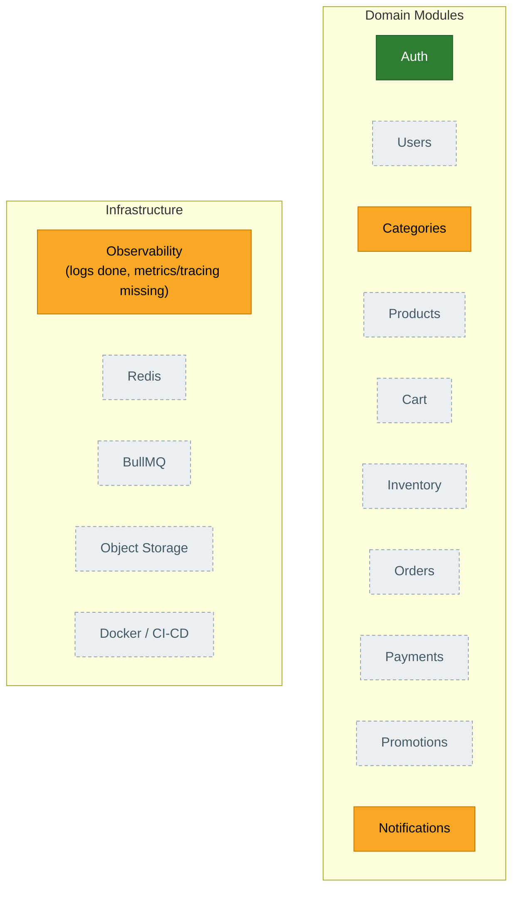

**Where this sits in the roadmap (see Section 22 — Implementation Order):**
Phase 1 (setup/DB) and most of Phase 2 (Auth) are done. RBAC is in place;
Categories (start of Phase 3) is next, followed by Products/Product
Variants. Phases 4 onward (Cart, Orders/Checkout, Payment, Redis/BullMQ,
Notifications, Docker/CI, Observability) have not started.

Update this table/diagram as modules land — it's meant to stay a snapshot
of reality, not a plan (the plan is Section 22).

---

# 1. High-Level Backend Architecture

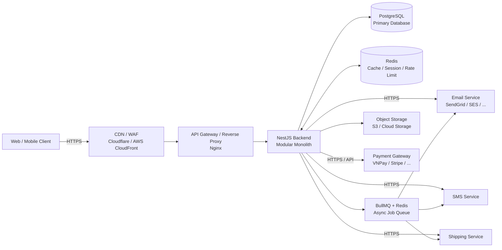

## Main responsibilities

| Component        | Responsibility                                 |
| ---------------- | ---------------------------------------------- |
| CDN / WAF        | DDoS protection, TLS, static assets            |
| API Gateway      | Routing, rate limiting, load balancing         |
| NestJS           | Business logic and API                         |
| PostgreSQL       | Source of truth for transactional data         |
| Redis            | Cache, sessions, rate limiting, temporary data |
| BullMQ           | Background jobs and asynchronous processing    |
| Object Storage   | Product images, invoices, media                |
| Payment Gateway  | Online payment                                 |
| Email/SMS        | Notifications                                  |
| Shipping Service | Delivery integration                           |

## Request Pipeline (NestJS internals)

The "NestJS Backend" box above is one process, but a request passes
through a fixed pipeline inside it. This reflects what's actually wired
in `src/app.module.ts` / `src/bootstrap/configure-app.ts` / `src/main.ts`
today — not a generic NestJS diagram.

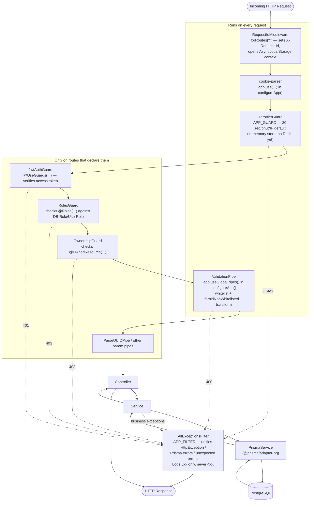

Notes:

- **Global** items run for every route regardless of controller code.
  **Per-route** items only run where the controller explicitly attaches
  them. Auth register/login/verification/reset routes are public;
  logout/logout-all/me use `JwtAuthGuard`. `RolesGuard` and
  `OwnershipGuard` exist for business modules but no current Auth
  controller route uses `RolesGuard`.
- Every exception, whichever layer throws it, is caught by the single
  `AllExceptionsFilter` — there is no per-module exception filter. See
  `doc/convention/error-logging-conventions.md`.
- `RequestIdMiddleware` runs first and stays active for the whole
  request via `AsyncLocalStorage`, so every `Logger` call anywhere
  downstream (guards, services, the filter) is automatically tagged with
  the same request id — no code change needed at call sites.

---

# 2. Backend Domain Architecture

The backend is organized by **business domain**, not by technical layer.

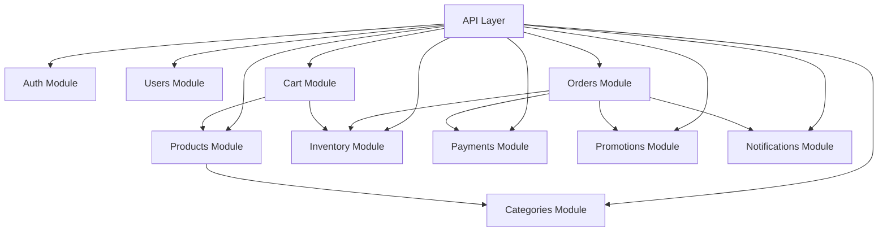

---

# 3. Project Directory Structure (full tree)

This is the **whole repo**, not just `src/` — real files where they exist
today, plus every module the roadmap (Section 0/22) has already committed
to. Status markers reuse the Section 0 legend: 🟢 done · 🟡 partial/planned
· 🔴 not started. Anything with no marker is infra that already exists and
isn't a "domain module" (config, bootstrap, generated code, tooling).

Folder rule behind every domain module below (see
`convention/coding-style-conventions.md` §2): a subfolder (`dto/`,
`guards/`, `services/`, ...) only appears once **≥ 2 files share that
role** — a module with one controller/service/module file and no DTO
stays flat, no empty folders.

```text
nestjs-demo/
├── .env                            # local secrets/config — gitignored, never committed
├── .env.example                    # template of every env var; kept in sync with .env.validation.ts (config-environment-conventions.md)
├── .husky/                         # git hooks — pre-commit runs lint-staged
├── .lintstagedrc                   # which linters/formatters run on staged files pre-commit
├── .prettierrc                     # Prettier formatting rules
├── nest-cli.json                   # Nest CLI config (schematics defaults, compiler options)
├── oxlint.json                     # oxlint (Rust ESLint-compatible linter) rule config
├── package.json / package-lock.json
├── prisma7.config.ts               # Prisma v7 config (schema path, seed command) — replaces the old `"prisma"` block in package.json
├── tsconfig.json                   # base TS config; declares the `@src/*` alias (test files only — see coding-style-conventions.md §4)
├── tsconfig.build.json             # build-only TS config (excludes tests) — what `nest build` actually uses
├── vitest.config.ts                # unit test runner config
├── vitest.config.e2e.ts            # e2e test runner config (boots the real Nest app)
├── CLAUDE.md                       # project-level agent instructions
├── CONTEXT.md                      # domain glossary — canonical meaning of User/Role/Session/... (see docs/agents/domain.md)
│
├── docs/
│   └── adr/                        # Architecture Decision Records — one immutable file per big decision (e.g. 0001-category-delete-restrict.md)
│
├── doc/                            # human-facing docs: conventions, playbooks, architecture (this file), per-module plans
│
├── scripts/
│   └── sync-postman-collection.ts  # regenerates the Postman collection from the live Swagger doc (npm run postman:sync)
│
├── postman/
│   ├── nestjs-demo.postman_collection.json  # generated — never hand-edit, re-run the sync script instead
│   └── local.postman_environment.json       # local Postman env vars (base URL, bearer token placeholder)
│
├── prisma/
│   ├── schema/
│   │   ├── schema.prisma           # every model (see prisma-multifile-schema-convention)
│   │   └── enums.prisma            # every enum, split out so schema.prisma stays readable
│   ├── migrations/
│   │   └── <timestamp>_<name>/migration.sql  # one folder per applied migration — edit only *before* first apply (see the 2 partial-unique-index exceptions in Section 7)
│   └── seed.ts                     # `npx prisma db seed` — idempotent upserts (safe to re-run) for dev/demo data
│
├── test/
│   ├── support/
│   │   ├── create-test-app.ts      # shared e2e app bootstrap — mirrors configureApp(), lets tests override ThrottlerGuard/APP_FILTER
│   │   └── create-test-user.ts     # helper: creates + logs in a test user, returns tokens
│   ├── app.e2e-spec.ts
│   ├── auth-login.e2e-spec.ts
│   ├── auth-register.e2e-spec.ts
│   ├── auth-register-flow.e2e-spec.ts
│   ├── auth-refresh.e2e-spec.ts
│   ├── auth-logout.e2e-spec.ts
│   ├── auth-verify-email.e2e-spec.ts
│   ├── auth-resend-verification.e2e-spec.ts
│   ├── auth-forgot-password.e2e-spec.ts
│   ├── auth-reset-password.e2e-spec.ts
│   ├── auth-rate-limiting.e2e-spec.ts
│   ├── mail-smtp.e2e-spec.ts
│   └── categories.e2e-spec.ts      # 🟡 planned — categories-module-plan.md STEP 7 (one e2e file per module going forward, same pattern)
│
└── src/
    ├── main.ts                     # bootstrap: NestFactory.create → configureApp() → Swagger setup → listen(PORT)
    ├── app.module.ts               # root module: global providers (ThrottlerGuard, AllExceptionsFilter), wires RequestIdMiddleware to all routes
    ├── app.controller.ts           # placeholder root route left over from `nest new` — revisit once a real root route (health check?) is needed
    ├── app.service.ts
    ├── app.controller.spec.ts
    │
    ├── bootstrap/
    │   └── configure-app.ts        # ValidationPipe + cookie-parser + AppLogger — shared by main.ts AND test/support/create-test-app.ts so they can't drift apart
    │
    ├── config/
    │   └── env.validation.ts       # fail-fast: throws at startup if a required env var is missing/invalid (config-environment-conventions.md)
    │
    ├── common/                     # cross-cutting infra shared by every module — not a business domain itself
    │   ├── app-logger.ts           # Logger implementation; tags every log line with the current request id
    │   ├── request-context.ts      # AsyncLocalStorage wrapper carrying the request id through the whole async call chain
    │   ├── request-id.middleware.ts # sets X-Request-Id, opens the AsyncLocalStorage context — global, runs on every route
    │   └── filters/
    │       └── all-exceptions.filter.ts  # the ONE global exception filter — unifies HttpException/Prisma/unexpected errors, logs 5xx only (never 4xx)
    │
    ├── prisma/
    │   ├── prisma.module.ts        # @Global() — PrismaService injectable anywhere without re-importing this module
    │   └── prisma.service.ts       # extends PrismaClient, wired to Postgres via @prisma/adapter-pg
    │
    ├── generated/
    │   └── prisma/                 # `prisma generate` output — do not hand-edit, do not review line-by-line in PRs
    │
    ├── mail/
    │   ├── mail.module.ts
    │   └── mail.service.ts         # nodemailer wrapper — today only sends Auth transactional emails (verify/reset)
    │
    ├── auth/                       # 🟢 done
    │   ├── auth.module.ts
    │   ├── auth.controller.ts      # all /auth/* routes
    │   ├── services/
    │   │   ├── auth.service.ts     # register/login orchestration
    │   │   ├── token.service.ts    # access/refresh token issuance + rotation
    │   │   └── password.service.ts # argon2 hashing + strength checks
    │   ├── strategies/
    │   │   └── jwt.strategy.ts     # passport-jwt strategy — validates the access token
    │   ├── guards/
    │   │   ├── jwt-auth.guard.ts
    │   │   ├── roles.guard.ts      # checks @Roles() against the DB Role/UserRole tables (not a hardcoded enum)
    │   │   ├── ownership.guard.ts  # checks @OwnedResource() — "is this the caller's own record?"
    │   │   └── email-throttler.guard.ts  # tighter throttle specifically for email-sending routes
    │   ├── decorators/
    │   │   ├── current-user.decorator.ts
    │   │   ├── roles.decorator.ts
    │   │   └── owned-resource.decorator.ts
    │   └── dto/                    # one file per request/response shape — register, login, refresh, forgot/reset-password, verify-email, resend-verification, message-response, auth-user-response
    │
    ├── categories/                 # 🟡 planned next — doc/categories-module-plan.md, 0/8 steps
    │   ├── categories.module.ts
    │   ├── categories.controller.ts # GET public; writes → STORE_MANAGER or MASTER_ADMIN
    │   ├── categories.service.ts    # calls PrismaService directly — no repository layer (api-conventions.md §B5b)
    │   ├── categories.service.spec.ts  # unit test — has business logic (slug generation, duplicate/FK checks)
    │   └── dto/                     # no entities/ folder (banned — api-conventions.md §B3); no response DTO — Category has no sensitive field, returns the Prisma type directly (§B11.a)
    │       ├── create-category.dto.ts
    │       ├── update-category.dto.ts  # PartialType(CreateCategoryDto) from @nestjs/swagger, not @nestjs/mapped-types
    │       └── pagination.dto.ts        # { page, limit } shape — copy-pasted per module today (see note below tree), not imported from one shared file
    │
    ├── products/                   # 🔴 not started — standard CRUD, same shape as categories (Section 8)
    │   ├── products.module.ts
    │   ├── products.controller.ts
    │   ├── products.service.ts
    │   ├── products.service.spec.ts
    │   └── dto/
    │       ├── create-product.dto.ts
    │       ├── update-product.dto.ts
    │       └── pagination.dto.ts
    │
    ├── users/                      # 🔴 not started — API not yet in Section 8 either, added there in the same pass as this tree. Role assignment lives here (POST /users/:id/roles), not in a separate roles/ module
    │   ├── users.module.ts
    │   ├── users.controller.ts     # PATCH /users/me; user/status/role administration → MASTER_ADMIN
    │   ├── users.service.ts
    │   ├── users.service.spec.ts
    │   └── dto/
    │       ├── update-profile.dto.ts    # PATCH /users/me body (fullName, phone)
    │       ├── update-status.dto.ts     # PATCH /users/:id/status body
    │       ├── assign-role.dto.ts       # POST /users/:id/roles body
    │       ├── pagination.dto.ts        # GET /users listing
    │       └── user-response.dto.ts     # allow-list DTO — User has passwordHash, must never serialize it directly (§B11.b)
    │
    ├── cart/                       # 🔴 not started — not standard CRUD: cart itself has no create/delete endpoint (auto-owned per user), only items are mutated
    │   ├── cart.module.ts
    │   ├── cart.controller.ts      # GET /cart; POST/PATCH/DELETE /cart/items(/:id)
    │   ├── cart.service.ts
    │   ├── cart.service.spec.ts
    │   └── dto/
    │       ├── add-cart-item.dto.ts     # POST /cart/items
    │       └── update-cart-item.dto.ts  # PATCH /cart/items/:id — no pagination.dto.ts (1 cart per user, nothing to page through)
    │
    ├── inventory/                  # 🔴 not started — resolve the reserved_quantity vs inventory_reservations decision (Section 0/7) before writing this
    │   ├── inventory.module.ts
    │   ├── inventory.controller.ts # GET /inventory/:variantId; PATCH /inventory/:variantId/adjust — no create/delete/list, inventory rows are born with their ProductVariant
    │   ├── inventory.service.ts
    │   ├── inventory.service.spec.ts   # concurrency/adjust logic is exactly the kind of business rule §B8 requires a unit test for
    │   └── dto/
    │       └── adjust-inventory.dto.ts  # the only DTO this module needs
    │
    ├── orders/                     # 🔴 not started — needs products/cart/inventory to exist first (checkout reads all three)
    │   ├── orders.module.ts
    │   ├── orders.controller.ts    # POST /orders; GET /orders, /orders/:id; POST /orders/:id/cancel — no PATCH, "cancel" is the only mutation besides create
    │   ├── orders.service.ts
    │   ├── orders.service.spec.ts
    │   └── dto/
    │       ├── create-order.dto.ts      # checkout — likely near-empty body, reads the caller's active cart server-side
    │       └── pagination.dto.ts        # GET /orders listing
    │
    ├── payments/                   # 🟡 committed, not built — MoMo-first behind PaymentProvider (ADR 0004)
    │   ├── payments.module.ts
    │   ├── payments.controller.ts  # create/retry payment, MoMo webhook, refund
    │   ├── payments.service.ts
    │   ├── payments.service.spec.ts
    │   └── dto/
    │       ├── create-payment.dto.ts
    │       └── payment-response.dto.ts  # allow-list — transaction/provider data is exactly the "sensitive, model grows often" case §B11.b calls for. Webhook body isn't a validated DTO — it's an external provider payload verified by signature, not by class-validator
    │
    ├── promotions/                 # 🔴 not started — no Prisma model yet; needs orders.subtotal/discount_amount first (Section 0 gap)
    │   ├── promotions.module.ts
    │   ├── promotions.controller.ts # CRUD → STORE_MANAGER/MASTER_ADMIN; validate → CUSTOMER
    │   ├── promotions.service.ts
    │   ├── promotions.service.spec.ts  # validate() has the real business logic (expiry/usage-limit/min-order checks)
    │   └── dto/
    │       ├── create-promotion.dto.ts
    │       ├── update-promotion.dto.ts
    │       ├── validate-promotion.dto.ts  # POST /promotions/validate body (code + cart context)
    │       └── pagination.dto.ts
    │
    └── notifications/              # 🟡 partial — mail/ already covers Auth emails. No controller, no dto/: this module has no public API (Section 8) — it's a BullMQ consumer reacting to events from Section 11, once the queue exists
        ├── notifications.module.ts
        ├── notifications.service.ts
        └── notifications.processor.ts  # BullMQ @Processor — the actual entry point once Redis/BullMQ (Section 0) exist; doesn't exist before then
```

`pagination.dto.ts` above is the same `{ page, limit }` shape every time,
but it's a **separate file per module today**, not a shared import — that's
what `categories-module-plan.md` STEP 3 and `api-conventions.md` §B3 both
already do. Worth reconsidering once 3-4 modules have it (extract to
`common/dto/pagination.dto.ts`), but that's a call for whoever builds the
second or third module, not a decision to make now.

### Dependency rule

```text
Controller
    ↓
Service / Use Case
    ↓
PrismaService
    ↓
Database
```

A controller should not directly access PostgreSQL — it goes through the
service. Services call `PrismaService` directly; a separate `Resource
Repository` class is **not** the default here (see
`convention/api-conventions.md` §B5b) — only add one when there's a
concrete reason (a complex query reused in several places, several
aggregates in one business operation, a large transaction, or a real need
to isolate the ORM from business logic).

---

# 4. Request Flow

Example: `POST /api/v1/orders`

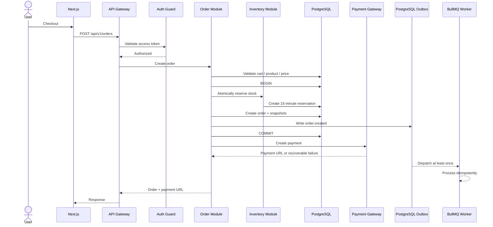

---

# 5. Checkout System Design

Checkout is one of the most important flows.

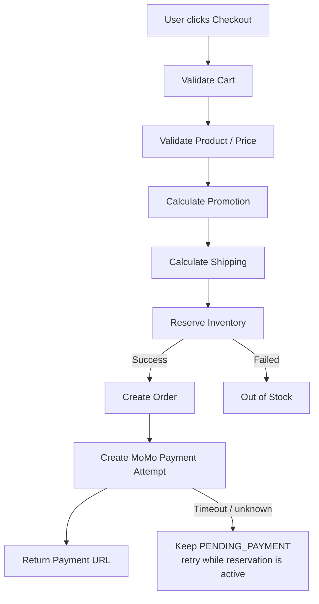

---

# 6. Inventory Concurrency

The system must prevent two customers from purchasing the same final item.

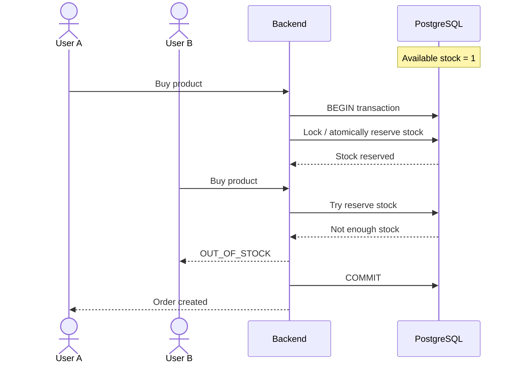

The committed target uses an explicit reservation table:

```text
inventory_reservations
----------------------
id
order_id
variant_id
quantity
status
expires_at
created_at
```

Typical statuses:

```text
ACTIVE
RELEASED
EXPIRED
CONSUMED
```

The hold expires after **15 minutes**. Creating the Order, OrderItem
snapshots, reservation, aggregate stock change, and outbox event is one
PostgreSQL transaction. Database constraints keep all quantities
non-negative and enforce `reserved_quantity <= quantity`. Payment success
and reservation expiry compete through an atomic state transition: only one
can consume or expire an `ACTIVE` reservation.

---

# 7. Database Architecture

The ER diagram below is the **real, already-migrated** schema (15 tables —
see `prisma/schema/schema.prisma`, migration `20260911030156_init_ecommerce`),
not an aspirational one. `Payments`/`Promotions` are intentionally absent —
they don't exist yet (see Section 0). Full field-by-field rationale lives in
`doc/ecommerce-postgresql-database-summary.md` and the step-by-step Prisma
guide in `doc/convention/ecommerce-prisma-schema-guide.md`; this is the condensed view.

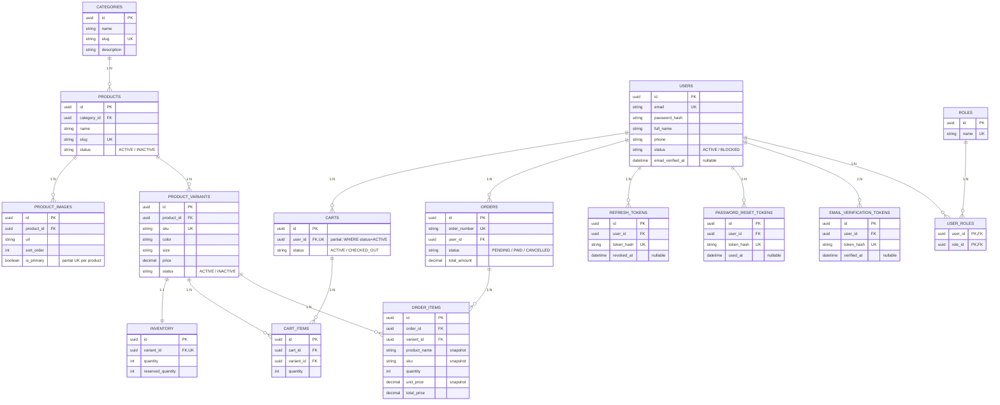

**Business rules that don't show up as columns:**

- **Cart price is live, Order price is a snapshot.** `cart_items` has no
  `unit_price` — it always reads the current `product_variants.price`, so
  it can drift between "added to cart" and "checked out". `order_items`
  freezes `product_name`/`sku`/`unit_price` at order-creation time, so a
  later product/price edit never rewrites history.
- **`available_quantity = inventory.quantity - inventory.reserved_quantity`.**
  `reserved_quantity` only moves on `Order` status transitions, never on
  cart changes (a cart never reserves stock): Order created (PENDING) →
  `reserved_quantity += qty`; Order → PAID → `quantity -= qty` and
  `reserved_quantity -= qty`; Order → CANCELLED → `reserved_quantity -= qty`
  only in the current schema. **Committed target (ADR 0003):** add an
  auditable `inventory_reservations` table with 15-minute expiry.
  Reservation state and the aggregate counters change atomically in
  PostgreSQL; a worker expires holds, and payment-vs-expiry races use an
  atomic state transition so only one outcome wins.
- **Two partial unique indexes exist that Prisma's schema DSL can't
  express** (added by hand into the migration SQL): one `ACTIVE` cart per
  user (`carts.user_id WHERE status = 'ACTIVE'`), and one primary image
  per product (`product_images.product_id WHERE is_primary = true`).
- **`ON DELETE` differs by table**, not "cascade everywhere": `carts`,
  `user_roles`, `refresh_tokens`, `password_reset_tokens`,
  `email_verification_tokens` all `CASCADE` on user deletion (meaningless
  without the user); `orders` is `RESTRICT` (a financial record must
  survive user deletion — soft-delete `users` instead of hard-deleting a
  user who has orders).
- **Composite indexes for listing/pagination** exist ahead of need on the
  columns actually filtered/sorted on: `products(category_id, status,
created_at DESC)`, `orders(user_id, created_at DESC)`,
  `orders(status, created_at DESC)`, `product_variants(product_id,
created_at DESC)`. Postgres doesn't index FKs automatically — a leading
  column in one of these composites doubles as that FK's index, so no
  separate single-column FK index is needed alongside it.
- **No multi-warehouse, no guest cart, no category hierarchy** in this
  schema — `inventory` is one global count per variant (not per
  warehouse), `carts.user_id` is `NOT NULL` (no anonymous cart), and
  `categories` is flat (no `parent_id`). All three are documented
  extension points, not oversights.

**Committed migrations before Checkout/Payment:**

- Add `inventory_reservations`, idempotency records, outbox events,
  Payments, Payment Attempts, webhook events, Refunds, and audit records.
- Add Order money snapshots: `subtotal`, `discount_amount`,
  `shipping_amount`, `tax_amount`, `total_amount`, and `currency`.
- Add immutable shipping-address and per-line discount snapshots.
- Add database checks for positive cart/order quantities, non-negative
  Inventory, and `reserved_quantity <= quantity`; prevent duplicate
  `(cart_id, variant_id)` rows and duplicate active
  `(order_id, variant_id)` reservations.
- Use one warehouse and VND-only integral amounts for the MVP while keeping
  an explicit ISO currency on every Order, Payment, and Refund.

---

# 8. API Design

All APIs are versioned:

```text
/api/v1/...
```

This is a **committed target, not current runtime**. The app still exposes
`/auth/*` until ADR 0002 is implemented. The migration uses Nest URI
versioning with global prefix `api`, version `1`, no permanent
unversioned aliases, refresh-cookie path `/api/v1/auth`, and Swagger at
`/docs`.

## Auth

```http
POST /api/v1/auth/register
POST /api/v1/auth/login
POST /api/v1/auth/refresh
POST /api/v1/auth/logout
POST /api/v1/auth/verify-email
POST /api/v1/auth/resend-verification
POST /api/v1/auth/forgot-password
POST /api/v1/auth/reset-password
GET  /api/v1/auth/me
```

## Products

```http
GET    /api/v1/products
GET    /api/v1/products/:id
POST   /api/v1/products
PATCH  /api/v1/products/:id
DELETE /api/v1/products/:id
```

## Categories

```http
GET    /api/v1/categories
GET    /api/v1/categories/:id
POST   /api/v1/categories
PATCH  /api/v1/categories/:id
DELETE /api/v1/categories/:id
```

## Cart

```http
GET    /api/v1/cart
POST   /api/v1/cart/items
PATCH  /api/v1/cart/items/:id
DELETE /api/v1/cart/items/:id
```

## Orders

```http
POST   /api/v1/orders
GET    /api/v1/orders
GET    /api/v1/orders/:id
POST   /api/v1/orders/:id/cancel
```

## Payments

```http
POST /api/v1/payments
POST /api/v1/payments/:id/retry
POST /api/v1/payments/webhooks/momo
POST /api/v1/payments/:id/refunds
```

## Inventory

```http
GET   /api/v1/inventory/:variantId
PATCH /api/v1/inventory/:variantId/adjust
```

## Users 🔴 not started

Scope stops where Auth's `GET /auth/me` already ends — this is
self-service profile edit plus admin management, not another login/me.

```http
PATCH  /api/v1/users/me                — self-edit fullName/phone (JwtAuthGuard only)
GET    /api/v1/users                   — MASTER_ADMIN — paginated, filter by status/email
GET    /api/v1/users/:id               — MASTER_ADMIN
PATCH  /api/v1/users/:id/status        — MASTER_ADMIN block/unblock
POST   /api/v1/users/:id/roles         — MASTER_ADMIN assign a role
DELETE /api/v1/users/:id/roles/:roleId — MASTER_ADMIN revoke a role
```

## Promotions 🔴 not started — no Prisma model yet

Standard coupon-code shape; `POST .../validate` is read-only (checks the
code against the current cart, returns the discount, doesn't apply
anything) so a customer can preview it before checkout.

The MVP allows one coupon code per Order, no stacking, and no automatic
promotion. Consumption and usage-limit enforcement are atomic in
PostgreSQL, and the applied promotion identity/rule/value is stored as an
Order discount snapshot; Redis counters are never authoritative.

```http
POST   /api/v1/promotions          — STORE_MANAGER or MASTER_ADMIN
GET    /api/v1/promotions          — STORE_MANAGER or MASTER_ADMIN
GET    /api/v1/promotions/:id      — STORE_MANAGER or MASTER_ADMIN
PATCH  /api/v1/promotions/:id      — STORE_MANAGER or MASTER_ADMIN
DELETE /api/v1/promotions/:id      — STORE_MANAGER or MASTER_ADMIN
POST   /api/v1/promotions/validate — CUSTOMER — validate a code against the caller's active cart
```

⚠️ **Schema gap this creates**: applying a promotion at checkout needs
`orders.subtotal` and `orders.discount_amount` — today `orders` only has
one final `total_amount` (see Section 7, and the MVP note in
`ecommerce-postgresql-database-summary.md` §4.8: "chưa có
discount/shipping/tax nên chưa cần `subtotal`"). A migration adding those
columns has to land before `POST /orders` can call into Promotions.

## Notifications 🟡 no public API planned for MVP

Internal only — triggered by the queue events already listed in
Section 11 (`order.created`, `payment.completed`, ...), not a REST
resource. No Prisma model exists for notification history yet, so a
future `GET /api/v1/notifications` (in-app history) stays **undecided**
rather than speculated here.

---

# 9. Payment Architecture

The frontend redirect is never the source of truth for payment status.
MoMo is the first production provider for the Vietnam/VND MVP (ADR 0004).
PayPal is a future international adapter; Stripe is out of scope unless the
business has an eligible entity in a Stripe-supported country.

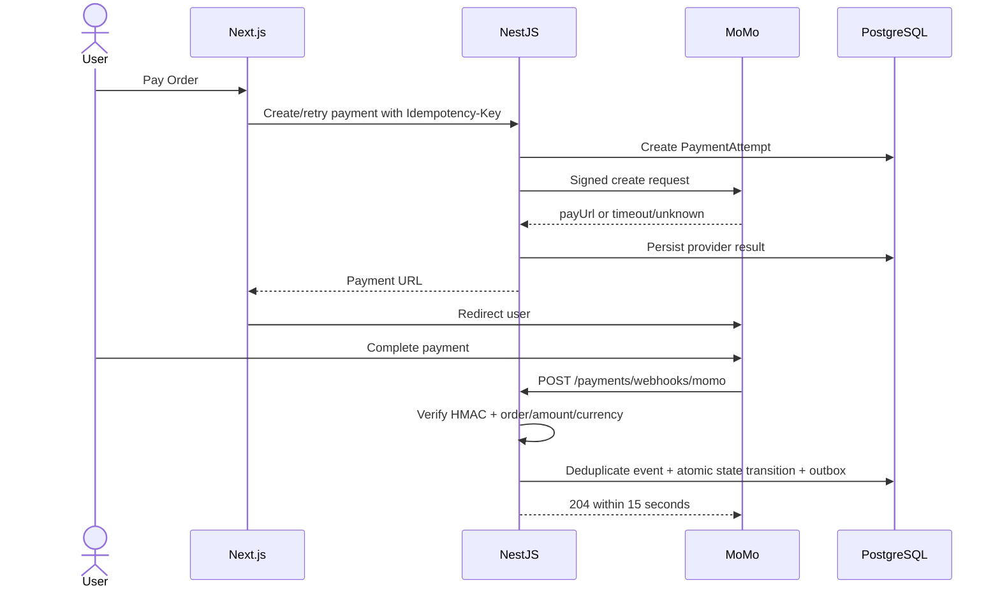

Minimum persisted records:

```text
payments               — one payment obligation for an Order
payment_attempts       — every provider call, retry, timeout, or unknown result
payment_webhook_events — verified/deduplicated provider notifications
refunds                — refund request, actor, reason, provider result
```

Order, Payment, and Fulfillment are separate state axes:

```text
Order:       PENDING_PAYMENT → CONFIRMED → CANCELLED → COMPLETED
Payment:     PENDING → PROCESSING → SUCCEEDED | FAILED | EXPIRED → REFUNDED
Fulfillment: UNFULFILLED → PROCESSING → SHIPPED → DELIVERED | RETURNED
```

Provider calls never live inside a long-running database transaction. If
payment creation times out, the Order remains `PENDING_PAYMENT`; a
`PaymentAttempt` records the unknown result and can be reconciled/retried
while the reservation remains active. A late success after reservation
expiry enters reconciliation/refund instead of silently confirming an
unfulfillable Order.

Before production, MoMo requires a signed merchant contract, production
credentials, sandbox/UAT coverage, settlement account and payout cadence,
an agreed reconciliation artifact, and documented refund/dispute/support
procedures.

---

# 10. Redis Architecture

Redis should be used selectively.

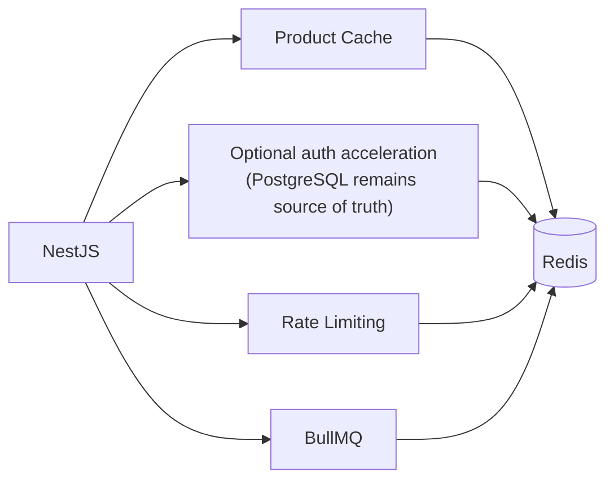

Potential keys:

```text
product:{id}
product:list:{hash}
category:{id}
session:{id}
rate-limit:{ip}
cart:{userId}
```

Use TTL for temporary/cache data.

PostgreSQL remains the source of truth for Sessions, Inventory Reservations,
Orders, Payments, Refunds, idempotency records, and the outbox. Redis loss
must not lose commercial state: cache falls back to PostgreSQL, outbox rows
wait for recovery, and payment webhooks persist to PostgreSQL. Security-
sensitive endpoints that cannot enforce distributed rate limits fail closed
with `503` rather than silently becoming unlimited.

---

# 11. Async Processing

Do not make the checkout request wait for every non-critical operation.

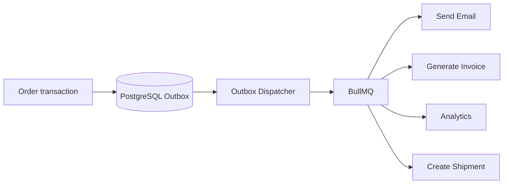

Examples of jobs:

```text
order.created
payment.completed
order.cancelled
inventory.low
user.registered
password.reset.requested
```

Delivery is **at least once**, not exactly once. The transaction that changes
domain state also inserts the versioned outbox event. Dispatch may repeat;
every consumer and external side effect therefore needs a stable
deduplication key and idempotent state transition.

---

# 12. Idempotency

Checkout, payment creation/retry, refund requests, and payment webhooks are
idempotent.

Example:

```http
POST /api/v1/payments
Idempotency-Key: 8b7c-1234-...
```

If the client retries:

```text
Request #1 → Payment created
Request #2 → Same Idempotency-Key
Request #3 → Same Idempotency-Key
```

The backend should not create three payments.

```text
Idempotency Key
       ↓
Check PostgreSQL idempotency record
       ↓
Already processed?
   ├── YES → Return previous result
   └── NO  → Process request
```

The record is unique by `scope + actor/provider + key` and stores a request
fingerprint, processing state, and response snapshot. Reusing a key with a
different payload returns `409`; concurrent requests race on the database
uniqueness constraint so only one executes. Redis may accelerate lookup but
is not authoritative.

---

# 13. Authentication & Authorization

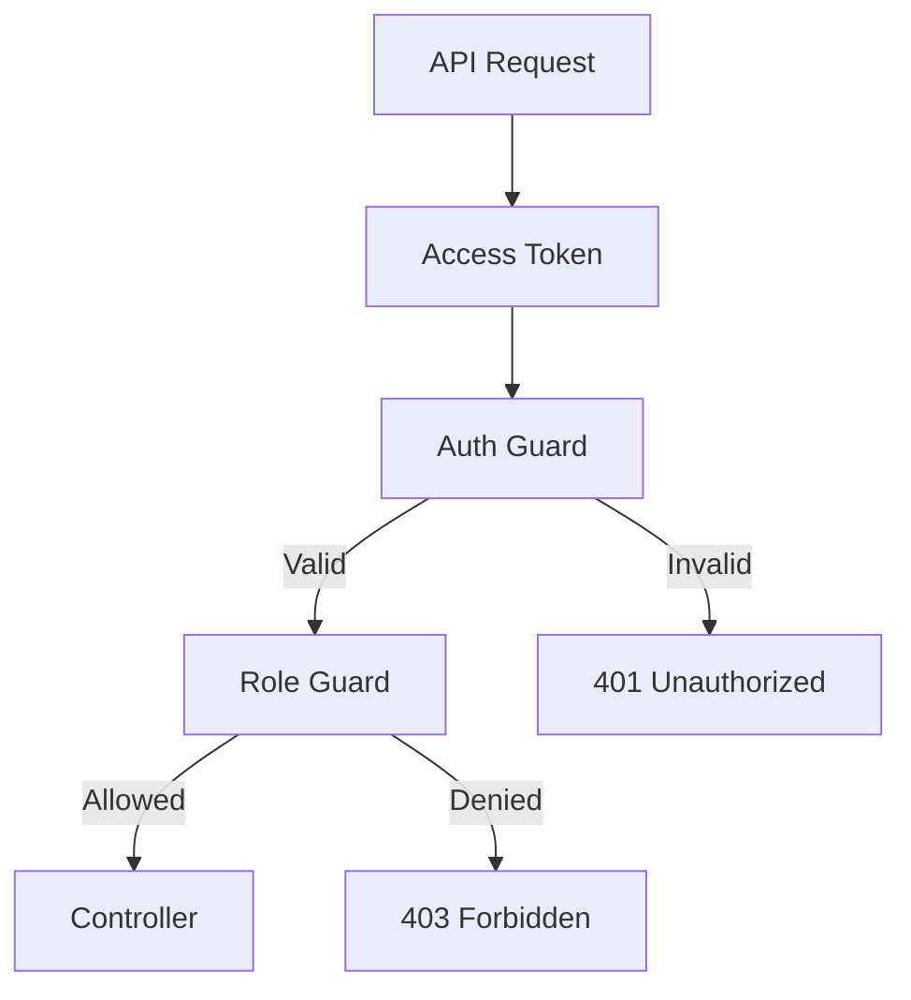

Canonical roles (ADR 0005):

```text
CUSTOMER
ORDER_STAFF
STORE_MANAGER
MASTER_ADMIN
```

Authorization should be based on business permissions, not only UI visibility.
There is no hidden role hierarchy; every endpoint explicitly lists all
accepted roles.

| Role            | Allowed scope                                                                                         |
| --------------- | ----------------------------------------------------------------------------------------------------- |
| `CUSTOMER`      | Own profile, cart, checkout, payment, and eligible Order cancellation                                 |
| `ORDER_STAFF`   | Read/process Orders and Fulfillment; cannot manage catalog, roles, account status, or execute refunds |
| `STORE_MANAGER` | Catalog, Inventory, Promotions, Order operations, and refunds                                         |
| `MASTER_ADMIN`  | User/status/role administration plus all store operations                                             |

Role/status changes increment the User's `authorizationVersion`, revoke
refresh Sessions, and invalidate cached authorization. Protected requests
must match the current version; privileged authorization fails closed when
the version cannot be verified. The service also prevents removing,
blocking, or demoting the last active, verified `MASTER_ADMIN`.

---

# 14. Security Layers

```text
Internet
   ↓
CDN / WAF
   ↓
API Gateway
   ↓
Rate Limiting
   ↓
Authentication
   ↓
Authorization
   ↓
Input Validation
   ↓
Business Logic
   ↓
Database
```

Important controls:

- TLS / HTTPS
- Password hashing
- Access token validation
- Refresh token rotation/revocation
- Rate limiting
- Input validation
- CORS
- CSRF protection when applicable
- Secure cookies when applicable
- SQL injection protection
- XSS protection
- Audit logs
- Webhook signature verification
- Secrets stored outside source code

---

# 15. Observability

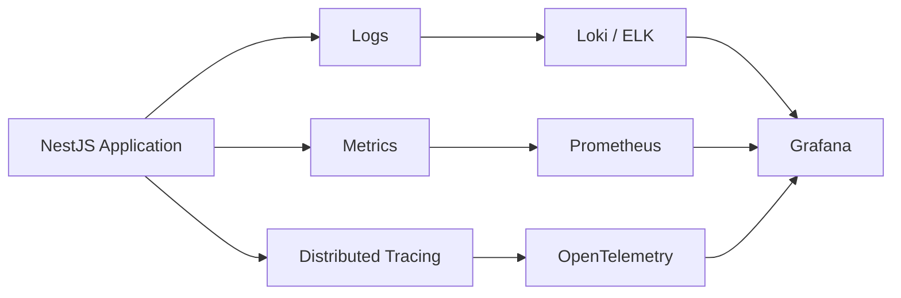

Monitor:

```text
Request latency
P50 / P95 / P99
Error rate
CPU
Memory
Database connections
Redis memory
Queue length
Failed jobs
Payment failures
Inventory failures
```

Before production, the baseline includes structured JSON logs with
request/correlation IDs, audit logs for role/status changes, Inventory
adjustments, Order transitions and Refunds, plus alerts for outbox backlog,
failed IPN handling, reservation expiry failures, queue lag, and
reconciliation mismatch. Advanced dashboards can evolve later; visibility
into money and stock cannot.

---

# 16. Deployment Architecture

The production target uses managed PostgreSQL, managed Redis, and
S3-compatible object storage, with at least two stateless API replicas and a
separately scalable worker behind a load balancer. Provider selection stays
deployment-specific; PostgreSQL and payment state are never stored only in
an application container.

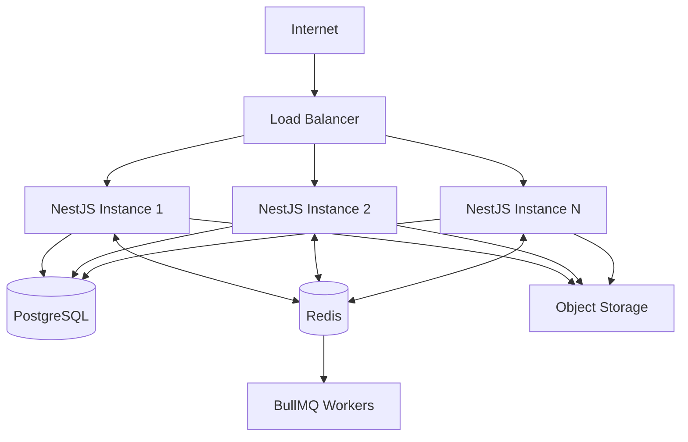

---

# 17. Docker Development Architecture

This Compose topology is for local development and CI integration tests.
It is not the production deployment topology described in Section 16.

```text
docker-compose.yml

services:

  api
    └── NestJS

  worker
    └── BullMQ Worker

  postgres
    └── PostgreSQL

  redis
    └── Redis

  nginx
    └── Reverse Proxy
```

Example:

```text
                    Nginx
                      │
             ┌────────┴────────┐
             ↓                 ↓
          API #1             API #2
             │                 │
             └────────┬────────┘
                      ↓
                 PostgreSQL
                      │
                    Redis
                      │
                 BullMQ Worker
```

---

# 18. Modular Monolith → Microservices Evolution

Start:

```text
                 NestJS
                    │
       ┌────────────┼────────────┐
       ↓            ↓            ↓
   Products       Orders      Payments
       │            │            │
       └────────────┼────────────┘
                    ↓
               PostgreSQL
```

Later, if there is a real scaling/team/domain reason:

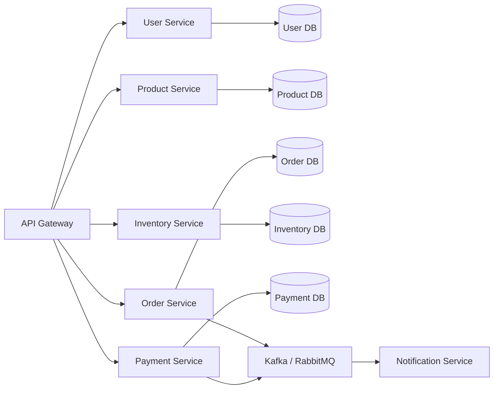

Do **not** split into microservices only because the architecture diagram looks more impressive.

---

# 19. Important System Design Problems

For this e-commerce system, the important problems to solve are:

## Product

```text
How do we handle millions of products?
How do we search products?
How do we cache product data?
```

## Cart

```text
Where is cart state stored?
What happens when product price changes?
What happens when product becomes unavailable?
```

## Inventory

```text
How do we prevent overselling?
How do we reserve stock?
How do reservations expire?
```

## Order

```text
What is the order state machine?
How do we handle cancellation?
How do we handle retry?
```

## Payment

```text
How do we verify payment?
How do we handle duplicate webhook events?
How do we handle payment timeout?
```

## Scalability

```text
What happens at 10K requests/sec?
Where is the bottleneck?
Can API instances scale horizontally?
Can PostgreSQL handle the workload?
Where should Redis be introduced?
```

## Reliability

```text
What if payment provider is down?
What if Redis is down?
What if a queue worker crashes?
What if the webhook is delivered twice?
What if database connection is exhausted?
```

---

# 20. Recommended Architecture for the Learning Project

For a realistic learning project, use:

```text
Frontend
    │
    │ HTTPS
    ▼
Next.js
    │
    ▼
Nginx / API Gateway
    │
    ▼
NestJS Modular Monolith
    │
    ├── Auth
    ├── Users
    ├── Products
    ├── Categories
    ├── Cart
    ├── Orders
    ├── Inventory
    ├── Payments
    ├── Promotions
    └── Notifications
         │
         ├───────────────┐
         ▼               ▼
   PostgreSQL           Redis
                           │
                           ▼
                        BullMQ
                           │
                           ▼
                       Workers
```

Then add:

```text
Object Storage
Search Engine
Payment Gateway
Shipping Provider
Email Provider
Monitoring
CI/CD
Docker
```

as the system grows.

---

# 21. Architecture Principles

1. **Modular Monolith first**
2. **Domain-oriented modules**
3. **PostgreSQL as transactional source of truth**
4. **Redis for performance and temporary state**
5. **Queue for asynchronous work**
6. **Webhook for payment confirmation**
7. **Idempotency for retryable operations**
8. **Transactions for critical inventory/order operations**
9. **Horizontal scaling for stateless API servers**
10. **Observability from the beginning**
11. **Security at every layer**
12. **Microservices only when there is a concrete reason**

---

# 22. Implementation Order

A practical implementation sequence for the multi-instance, real-payment
MVP:

```text
Phase 1
├── Migrate routes to /api/v1; Swagger to /docs
├── Migrate ADMIN to the four canonical roles
├── Authorization-version revocation and audit foundation
├── Docker image + local Compose for PostgreSQL/Redis
├── CI, migration job, graceful shutdown, liveness/readiness
└── Structured logs + baseline metrics

Phase 2
├── Categories
├── Products
├── Product Variants
└── Object Storage for product media

Phase 3
├── Users
└── Staff authorization matrix

Phase 4
├── Cart
├── Inventory
└── 15-minute Inventory Reservations

Phase 5
├── Orders + financial/address snapshots
├── Checkout concurrency + idempotency
└── Transactional Outbox + idempotent worker

Phase 6
├── MoMo Payment + Payment Attempts
├── Signed/deduplicated IPN
├── Refund + reconciliation
└── Sandbox/UAT and production gates

Phase 7
└── Single-code Promotions

Phase 8
├── Fulfillment + domestic shipping workflow
└── Notifications

Phase 9
├── Load Testing
├── Database Optimization
├── Product cache only after measured need
├── Search engine only after PostgreSQL search is insufficient
├── PayPal international adapter when required
└── Microservice extraction only when justified
```

Every schema rollout across multiple replicas uses
**expand–migrate–contract**: add backward-compatible schema, deploy dual-
compatible code, backfill and verify, replace all replicas, then remove the
old shape in a later release.

Production payment gates include real PostgreSQL/Redis integration tests,
oversell and duplicate-checkout concurrency tests, provider contract tests,
MoMo timeout/duplicate/out-of-order IPN scenarios, worker/outbox replay,
reservation expiry, rolling migrations, and graceful shutdown.

---

## Final Architecture

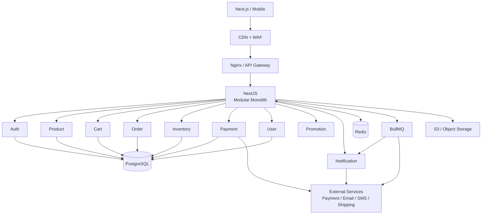
