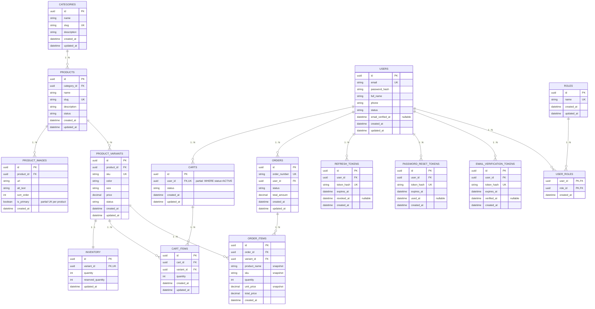

# E-commerce Database Design Summary

## 1. Tổng quan

Database MVP hiện tại gồm **15 bảng**, chia làm 2 domain:

**Catalog / Cart / Order** (10 bảng):

1. `users`
2. `categories`
3. `products`
4. `product_images`
5. `product_variants`
6. `inventory`
7. `carts`
8. `cart_items`
9. `orders`
10. `order_items`

**Auth** (5 bảng, xem mục 4.10 → 4.14):

11. `roles`
12. `user_roles`
13. `refresh_tokens`
14. `password_reset_tokens`
15. `email_verification_tokens`

---

## 2. Sơ đồ quan hệ tổng thể

```text
                    USERS
                   /     \
                  /       \
                 v         v
              CARTS      ORDERS
                |           |
                v           v
           CART_ITEMS   ORDER_ITEMS
                \           /
                 \         /
                  v       v
              PRODUCT_VARIANTS
                     |
                     v
                  PRODUCTS ----> PRODUCT_IMAGES
                     |
                     v
                 CATEGORIES

              PRODUCT_VARIANTS
                     |
                     v
                 INVENTORY


                                          USERS
                    ┌───────────┬───────────┼───────────┐
                    v           v           v           v
             REFRESH_TOKENS  PASSWORD_   EMAIL_       USER_ROLES
                             RESET_      VERIFICATION_     |
                             TOKENS      TOKENS            v
                                                          ROLES
```

> Nhánh `USERS → ...` phía dưới là domain **Auth** (5 bảng) — xem chi tiết quan hệ M:N `USER_ROLES ↔ ROLES` ở mục 7 "Auth".

---

## 2.1. ER Diagram

👉 **Bản trực quan, dễ đọc hơn (hover/focus vào 1 bảng để làm nổi bật liên kết FK → PK của nó):**
https://claude.ai/code/artifact/8f76b013-35be-4995-9a1e-c12f2e4092a4

Bản Mermaid dưới đây là fallback dạng text, dùng khi không mở được link trên (editor không hỗ trợ Mermaid vẫn xem được cấu trúc field/PK/FK/UK):



> Ghi chú ký hiệu: `||--o{` = 1:N, `||--||` = 1:1. `PK` = Primary Key, `FK` = Foreign Key, `UK` = Unique Key. Mermaid không có key type riêng cho "partial unique", nên ràng buộc `carts.user_id` (chỉ unique khi `status = 'ACTIVE'`, xem mục 4.6) được ghi chú thêm bằng text bên cạnh. `USER_ROLES` có PK là **cặp** `(user_id, role_id)` (mỗi cột đánh dấu `PK, FK`) — không có cột `id` riêng, xem mục 4.11.

---

## 3. Nguyên tắc PK và FK

### Primary Key - PK

Primary Key dùng để xác định duy nhất một record trong table.

Ví dụ:

```text
users.id
products.id
orders.id
```

### Foreign Key - FK

Foreign Key dùng để liên kết một table với table khác.

Ví dụ:

```text
products.category_id
        ↓
categories.id
```

Quy tắc dễ nhớ:

> Với quan hệ `1:N`, Foreign Key thường nằm ở phía `N`.

### Lưu ý: PK tự động có index, FK thì KHÔNG

Postgres tự tạo index cho Primary Key, nhưng **không** tự tạo index cho Foreign Key. Các bảng có FK hay bị query theo (ví dụ `cart_items.cart_id`, `order_items.order_id`, `products.category_id`) cần tạo index thủ công, nếu không sẽ chậm dần khi data lớn:

```sql
CREATE INDEX ON cart_items (cart_id);
CREATE INDEX ON order_items (order_id);
CREATE INDEX ON products (category_id);
```

### Gợi ý index cho phân trang (listing)

Phân trang (`GET /products?...`, `GET /orders?...`) không cần thêm cột hay bảng mới — `id`/`created_at` có sẵn ở mọi bảng đã đủ làm cursor/sort key. Nhưng để filter + sort + phân trang không bị chậm dần khi data lớn, cần **composite index** đúng thứ tự (các cột filter trước, cột sort sau):

```sql
-- products: liệt kê theo category, lọc status, mới nhất trước
CREATE INDEX ON products (category_id, status, created_at DESC);

-- orders: "đơn hàng của tôi" — lọc theo user, mới nhất trước
CREATE INDEX ON orders (user_id, created_at DESC);

-- orders: trang quản trị — lọc theo status, mới nhất trước
CREATE INDEX ON orders (status, created_at DESC);

-- product_variants: liệt kê variant theo product, thứ tự ổn định
CREATE INDEX ON product_variants (product_id, created_at DESC);
```

> Cột đứng **đầu tiên** trong composite index (VD: `category_id`, `user_id`) đã tự đóng luôn vai trò index cho FK đó — không cần tạo thêm 1 index đơn cột riêng nữa (tránh trùng lặp, tốn bộ nhớ + chậm ghi). VD: đã có `products (category_id, status, created_at DESC)` thì không cần `CREATE INDEX ON products (category_id)` riêng như ví dụ ở trên nữa.

---

# 4. Chi tiết từng bảng

## 4.1. `users`

Lưu thông tin người dùng.

| Field | Type gợi ý | Ý nghĩa |
|---|---|---|
| `id` | UUID | ID user |
| `email` | VARCHAR(255) | Email |
| `password_hash` | TEXT | Password đã hash |
| `full_name` | VARCHAR(255) | Họ tên |
| `phone` | VARCHAR(30) | Số điện thoại |
| `status` | VARCHAR(30) | ACTIVE / BLOCKED |
| `email_verified_at` | TIMESTAMPTZ (nullable) | NULL = chưa xác thực email |
| `created_at` | TIMESTAMPTZ | Ngày tạo |
| `updated_at` | TIMESTAMPTZ | Ngày cập nhật |

### Khóa

```text
PK:
id

UNIQUE:
email
```

### Giả định MVP (Auth)

- `email_verified_at` được set khi user bấm link xác thực gửi qua `email_verification_tokens` (mục 4.12). Trước khi verify, `status` vẫn có thể là `ACTIVE` (tuỳ bạn có muốn chặn login trước khi verify hay không) — đây là quyết định nghiệp vụ cần chốt riêng khi code, tài liệu này chỉ mô tả chỗ lưu.
- Phân quyền dùng bảng `roles` + `user_roles` (mục 4.10, 4.11) vì 1 user có thể có **nhiều role cùng lúc** — không lưu role trực tiếp trên `users`.

---

## 4.2. `categories`

Lưu danh mục sản phẩm.

Ví dụ:

```text
Áo
Quần
Giày
Phụ kiện
```

| Field | Type gợi ý | Ý nghĩa |
|---|---|---|
| `id` | UUID | ID category |
| `name` | VARCHAR(150) | Tên category |
| `slug` | VARCHAR(150) | URL slug |
| `description` | TEXT | Mô tả |
| `created_at` | TIMESTAMPTZ | Ngày tạo |
| `updated_at` | TIMESTAMPTZ | Ngày cập nhật |

### Khóa

```text
PK:
id

UNIQUE:
slug
```

### Giả định MVP

Category chỉ có **1 cấp** (`name`, `slug` phẳng), **không** có `parent_id` — chưa hỗ trợ danh mục con (VD: Áo → Áo nam/Áo nữ). Nếu cần phân cấp, đây là bước mở rộng sau, không nằm trong 15 bảng này.

---

## 4.3. `products`

Lưu sản phẩm ở cấp tổng quát.

Ví dụ:

```text
Nike T-Shirt
Nike Air Max
Adidas Polo
```

| Field | Type gợi ý | Ý nghĩa |
|---|---|---|
| `id` | UUID | ID product |
| `category_id` | UUID | Category của product |
| `name` | VARCHAR(255) | Tên product |
| `slug` | VARCHAR(255) | URL slug |
| `description` | TEXT | Mô tả |
| `status` | VARCHAR(30) | ACTIVE / INACTIVE |
| `created_at` | TIMESTAMPTZ | Ngày tạo |
| `updated_at` | TIMESTAMPTZ | Ngày cập nhật |

### Khóa

```text
PK:
id

FK:
category_id
    ↓
categories.id

UNIQUE:
slug
```

### Quan hệ

```text
Category 1 : N Product
```

---

## 4.3.1. `product_images`

Lưu ảnh gallery của Product (nhiều ảnh / product).

Ví dụ:

```text
Nike T-Shirt
├── ảnh 1 (is_primary = true, sort_order = 0)
├── ảnh 2 (sort_order = 1)
└── ảnh 3 (sort_order = 2)
```

| Field | Type gợi ý | Ý nghĩa |
|---|---|---|
| `id` | UUID | ID image |
| `product_id` | UUID | Product cha |
| `url` | TEXT | Đường dẫn ảnh (CDN) |
| `alt_text` | VARCHAR(255) | Mô tả ảnh (accessibility/SEO) |
| `sort_order` | INTEGER | Thứ tự hiển thị |
| `is_primary` | BOOLEAN | Ảnh đại diện (dùng ở listing/thumbnail) |
| `created_at` | TIMESTAMPTZ | Ngày tạo |

### Khóa

```text
PK:
id

FK:
product_id
    ↓
products.id
```

### Quan hệ

```text
Product 1 : N ProductImage
```

### Giả định MVP

- Chỉ 1 ảnh được đánh `is_primary = true` mỗi product — cần ép bằng partial unique index, tương tự cách làm ở `carts` (mục 4.6):
  ```sql
  CREATE UNIQUE INDEX ON product_images (product_id) WHERE is_primary = true;
  ```
- Ảnh gắn theo **product**, không gắn theo variant (màu) — mọi variant của cùng 1 product dùng chung 1 bộ ảnh. Nếu sau này cần ảnh khác nhau theo màu (VD: Black và White có ảnh riêng), thêm cột nullable `variant_id` (FK → `product_variants.id`) vào bảng này; `variant_id IS NULL` nghĩa là ảnh dùng chung cho cả product.

---

## 4.4. `product_variants`

Lưu phiên bản cụ thể của Product.

Ví dụ:

```text
Nike T-Shirt
├── Black / M
├── Black / L
├── White / M
└── White / L
```

| Field | Type gợi ý | Ý nghĩa |
|---|---|---|
| `id` | UUID | ID variant |
| `product_id` | UUID | Product cha |
| `sku` | VARCHAR(100) | Mã SKU |
| `color` | VARCHAR(50) | Màu |
| `size` | VARCHAR(50) | Size |
| `price` | NUMERIC(12,2) | Giá |
| `status` | VARCHAR(30) | Trạng thái |
| `created_at` | TIMESTAMPTZ | Ngày tạo |
| `updated_at` | TIMESTAMPTZ | Ngày cập nhật |

### Khóa

```text
PK:
id

FK:
product_id
    ↓
products.id

UNIQUE:
sku
```

### Quan hệ

```text
Product 1 : N ProductVariant
```

---

## 4.5. `inventory`

Lưu tồn kho của từng variant.

| Field | Type gợi ý | Ý nghĩa |
|---|---|---|
| `id` | UUID | ID inventory |
| `variant_id` | UUID | Variant |
| `quantity` | INTEGER | Tổng số lượng |
| `reserved_quantity` | INTEGER | Số lượng đang được giữ |
| `updated_at` | TIMESTAMPTZ | Ngày cập nhật |

### Khóa

```text
PK:
id

FK:
variant_id
    ↓
product_variants.id

UNIQUE:
variant_id
```

### Quan hệ

```text
ProductVariant 1 : 1 Inventory
```

### Công thức số lượng có thể bán

```text
available_quantity
=
quantity - reserved_quantity
```

### Giả định MVP

`inventory` là tồn kho **toàn cục theo variant**, không có `warehouse_id`/location — giả định **1 kho hàng duy nhất**. Multi-warehouse là bước mở rộng sau (xem mục 9), khi đó `inventory` sẽ cần thêm `warehouse_id` và trở thành composite theo `(variant_id, warehouse_id)`.

### Vòng đời `reserved_quantity` (gắn với `orders.status`)

`reserved_quantity` **không** thay đổi khi thêm/xoá `cart_items` — giỏ hàng không giữ chỗ tồn kho. Việc giữ chỗ chỉ bắt đầu khi tạo `Order`:

```text
Order tạo (status = PENDING)
    → reserved_quantity += quantity   (giữ chỗ)

Order → PAID
    → quantity -= quantity            (trừ thật)
    → reserved_quantity -= quantity   (nhả phần đã giữ, vì đã trừ thật rồi)

Order → CANCELLED
    → reserved_quantity -= quantity   (chỉ nhả chỗ, không đụng quantity)
```

Không có bước này thì `available_quantity` không phản ánh đúng số lượng thực sự bán được khi có nhiều order đang chờ thanh toán cùng lúc.

---

## 4.6. `carts`

Lưu giỏ hàng của User.

| Field | Type gợi ý | Ý nghĩa |
|---|---|---|
| `id` | UUID | ID cart |
| `user_id` | UUID | User sở hữu cart |
| `status` | VARCHAR(30) | ACTIVE / CHECKED_OUT |
| `created_at` | TIMESTAMPTZ | Ngày tạo |
| `updated_at` | TIMESTAMPTZ | Ngày cập nhật |

### Khóa

```text
PK:
id

FK:
user_id
    ↓
users.id
```

### Quan hệ

```text
User 1 : N Cart
```

Thông thường một user chỉ nên có **1 ACTIVE cart** tại một thời điểm. Đây là ràng buộc nghiệp vụ, **không** tự động đảm bảo chỉ bằng PK/FK — cần ép bằng DB, ví dụ partial unique index:

```sql
CREATE UNIQUE INDEX ON carts (user_id) WHERE status = 'ACTIVE';
```

### Giả định MVP

`user_id` là FK bắt buộc (NOT NULL) → **không hỗ trợ giỏ hàng cho khách chưa đăng nhập** (guest cart). Muốn hỗ trợ guest cart sau này thường cần thêm cơ chế theo session/cookie, nằm ngoài phạm vi 15 bảng này.

---

## 4.7. `cart_items`

Lưu những Variant đang nằm trong Cart.

| Field | Type gợi ý | Ý nghĩa |
|---|---|---|
| `id` | UUID | ID cart item |
| `cart_id` | UUID | Cart |
| `variant_id` | UUID | Product Variant |
| `quantity` | INTEGER | Số lượng |
| `created_at` | TIMESTAMPTZ | Ngày tạo |
| `updated_at` | TIMESTAMPTZ | Ngày cập nhật |

### Khóa

```text
PK:
id

FK:
cart_id
    ↓
carts.id

FK:
variant_id
    ↓
product_variants.id
```

### Quan hệ

```text
Cart 1 : N CartItem

ProductVariant 1 : N CartItem
```

### Giá trong cart là giá "sống", không snapshot

`cart_items` **không** lưu `unit_price` — giá hiển thị trong giỏ hàng luôn lấy trực tiếp từ `product_variants.price` hiện tại, nên có thể đổi giữa lúc thêm vào giỏ và lúc checkout. Đây là điểm đối lập có chủ đích với `order_items` (mục 4.9), nơi giá được **đông cứng lại (snapshot)** ngay khi tạo Order — cart phản ánh giá thị trường hiện tại, order phản ánh giá tại thời điểm mua.

---

## 4.8. `orders`

Lưu đơn hàng sau khi checkout.

| Field | Type gợi ý | Ý nghĩa |
|---|---|---|
| `id` | UUID | ID order (khoá kỹ thuật, không hiển thị cho khách) |
| `order_number` | VARCHAR(30) | Mã đơn hàng dễ đọc, hiển thị cho khách (VD: `#1001`) |
| `user_id` | UUID | User đặt hàng |
| `status` | VARCHAR(30) | PENDING / PAID / CANCELLED |
| `total_amount` | NUMERIC(12,2) | Tổng cuối |
| `created_at` | TIMESTAMPTZ | Ngày tạo |
| `updated_at` | TIMESTAMPTZ | Ngày cập nhật |

### Khóa

```text
PK:
id

FK:
user_id
    ↓
users.id

UNIQUE:
order_number
```

### Quan hệ

```text
User 1 : N Order
```

### Giả định MVP

- **`total_amount` là tổng cuối duy nhất** — MVP hiện tại chưa có discount/shipping/tax, nên không cần thêm `subtotal` (tránh gây hiểu lầm là đã hỗ trợ). Khi có discount/shipping/tax thật, mới bổ sung `subtotal`, `discount_amount`, `shipping_fee`, `tax_amount` và định nghĩa `total_amount = subtotal - discount_amount + shipping_fee + tax_amount`.
- **`order_number` tách riêng khỏi `id`**: `id` (UUID) dùng làm khoá kỹ thuật/FK nội bộ, `order_number` là mã ngắn, dễ đọc, do hệ thống tự sinh (VD: sequence hoặc format theo ngày) — dùng để hiển thị cho khách hàng và tra cứu qua support. Không dùng UUID để hiển thị/nói miệng với khách.
- **`status` chỉ có 3 giá trị tối giản cho MVP** (`PENDING / PAID / CANCELLED`). Khi cần theo dõi vận chuyển thật, nên mở rộng thêm `SHIPPED`, `DELIVERED`, `REFUNDED`.
- Mọi giá trị `status` (ở tất cả các bảng trong tài liệu này) nên được ràng buộc bằng `CHECK (status IN (...))` hoặc Postgres `ENUM` type, không chỉ dựa vào tầng ứng dụng để tránh giá trị rác lọt vào DB.

---

## 4.9. `order_items`

Lưu các sản phẩm trong một Order.

| Field | Type gợi ý | Ý nghĩa |
|---|---|---|
| `id` | UUID | ID order item |
| `order_id` | UUID | Order |
| `variant_id` | UUID | Product Variant |
| `product_name` | VARCHAR(255) | Snapshot tên sản phẩm |
| `sku` | VARCHAR(100) | Snapshot SKU |
| `quantity` | INTEGER | Số lượng |
| `unit_price` | NUMERIC(12,2) | Giá tại thời điểm mua |
| `total_price` | NUMERIC(12,2) | quantity × unit_price |
| `created_at` | TIMESTAMPTZ | Ngày tạo |

### Khóa

```text
PK:
id

FK:
order_id
    ↓
orders.id

FK:
variant_id
    ↓
product_variants.id
```

### Quan hệ

```text
Order 1 : N OrderItem

ProductVariant 1 : N OrderItem
```

### Lưu ý quan trọng

`order_items` nên lưu snapshot:

```text
product_name
sku
unit_price
```

để Order cũ không bị thay đổi khi Product hoặc giá hiện tại thay đổi.

---

## 4.10. `roles`

Danh sách các vai trò (phân quyền).

Ví dụ:

```text
CUSTOMER
STAFF
ADMIN
```

| Field | Type gợi ý | Ý nghĩa |
|---|---|---|
| `id` | UUID | ID role |
| `name` | VARCHAR(50) | Tên role |
| `created_at` | TIMESTAMPTZ | Ngày tạo |
| `updated_at` | TIMESTAMPTZ | Ngày cập nhật (khi đổi tên role) |

### Khóa

```text
PK:
id

UNIQUE:
name
```

---

## 4.11. `user_roles`

Bảng nối (junction table) — gán role cho user, hỗ trợ **nhiều role / user**.

| Field | Type gợi ý | Ý nghĩa |
|---|---|---|
| `user_id` | UUID | User |
| `role_id` | UUID | Role |
| `created_at` | TIMESTAMPTZ | Ngày gán role |

### Khóa

```text
PK:
(user_id, role_id)   ← composite PK, không có cột id riêng

FK:
user_id
    ↓
users.id

FK:
role_id
    ↓
roles.id
```

### Quan hệ

```text
User M : N Role
```

### Giả định MVP

Đây là bảng **many-to-many thuần** (chỉ 2 FK, không có thuộc tính riêng nào khác ngoài `created_at`) nên dùng PK là cặp `(user_id, role_id)` — không cần thêm cột `id` UUID giả (surrogate key), vì cặp này đã tự nhiên unique.

---

## 4.12. `refresh_tokens`

Lưu refresh token đã phát cho user, dùng để cấp lại access token mới mà không cần đăng nhập lại.

| Field | Type gợi ý | Ý nghĩa |
|---|---|---|
| `id` | UUID | ID refresh token |
| `user_id` | UUID | User sở hữu token |
| `token_hash` | TEXT | Hash của refresh token (không lưu token gốc) |
| `expires_at` | TIMESTAMPTZ | Hạn dùng |
| `revoked_at` | TIMESTAMPTZ (nullable) | NULL = còn hiệu lực; có giá trị = đã bị thu hồi (logout, đổi mật khẩu...) |
| `created_at` | TIMESTAMPTZ | Ngày phát hành |

### Khóa

```text
PK:
id

FK:
user_id
    ↓
users.id

UNIQUE:
token_hash
```

### Quan hệ

```text
User 1 : N RefreshToken
```

### Giả định MVP

- **Chỉ lưu `token_hash`, không lưu token gốc** — giống nguyên tắc với `password_hash`, để lộ DB cũng không dùng lại được token. `UNIQUE (token_hash)` giúp tra cứu lúc verify (`WHERE token_hash = ?`) nhanh bằng index thay vì full table scan, đồng thời đảm bảo không có 2 token trùng hash.
- `revoked_at` cho phép **thu hồi từng token riêng lẻ** (logout 1 thiết bị) mà không ảnh hưởng các refresh token khác của cùng user (logout tất cả thiết bị = revoke tất cả token của `user_id` đó).
- 1 user có thể có nhiều dòng "còn sống" cùng lúc (1 dòng / thiết bị đang đăng nhập).

---

## 4.13. `password_reset_tokens`

Lưu token dùng 1 lần để đặt lại mật khẩu khi user quên mật khẩu.

| Field | Type gợi ý | Ý nghĩa |
|---|---|---|
| `id` | UUID | ID token |
| `user_id` | UUID | User yêu cầu reset |
| `token_hash` | TEXT | Hash của token gửi qua email |
| `expires_at` | TIMESTAMPTZ | Hạn dùng (thường ngắn, VD: 15-30 phút) |
| `used_at` | TIMESTAMPTZ (nullable) | NULL = chưa dùng; có giá trị = đã dùng, không cho dùng lại |
| `created_at` | TIMESTAMPTZ | Ngày tạo |

### Khóa

```text
PK:
id

FK:
user_id
    ↓
users.id

UNIQUE:
token_hash
```

### Quan hệ

```text
User 1 : N PasswordResetToken
```

### Giả định MVP

`UNIQUE (token_hash)` để tra cứu lúc verify nhanh bằng index, không phải full table scan.

Là bảng riêng (không nhét vào `users`) vì **1:N theo thời gian** — user có thể bấm "quên mật khẩu" nhiều lần, mỗi lần tạo 1 token mới; các token cũ chưa hết hạn vẫn còn tồn tại cho tới khi hết hạn hoặc bị dùng (`used_at`).

---

## 4.14. `email_verification_tokens`

Lưu token xác thực email khi user đăng ký tài khoản.

| Field | Type gợi ý | Ý nghĩa |
|---|---|---|
| `id` | UUID | ID token |
| `user_id` | UUID | User cần xác thực |
| `token_hash` | TEXT | Hash của token gửi qua email |
| `expires_at` | TIMESTAMPTZ | Hạn dùng |
| `verified_at` | TIMESTAMPTZ (nullable) | NULL = chưa xác thực; có giá trị = đã xác thực bằng token này |
| `created_at` | TIMESTAMPTZ | Ngày tạo |

### Khóa

```text
PK:
id

FK:
user_id
    ↓
users.id

UNIQUE:
token_hash
```

### Quan hệ

```text
User 1 : N EmailVerificationToken
```

### Giả định MVP

`UNIQUE (token_hash)` để tra cứu lúc verify nhanh bằng index, không phải full table scan.

Khi user xác thực thành công qua token này → set `verified_at` ở đây **và** set `users.email_verified_at` (mục 4.1) cùng lúc. Giữ 2 chỗ vì lý do khác nhau: `users.email_verified_at` để **query nhanh** "user đã verify chưa" mà không cần JOIN, còn `verified_at` ở đây để giữ lịch sử token nào đã dùng.

---

# 5. Tổng hợp Primary Key và Foreign Key

| Table | Primary Key | Foreign Key | Unique |
|---|---|---|---|
| `users` | `id` | — | `email` |
| `categories` | `id` | — | `slug` |
| `products` | `id` | `category_id → categories.id` | `slug` |
| `product_images` | `id` | `product_id → products.id` | — (xem giả định `is_primary` ở mục 4.3.1) |
| `product_variants` | `id` | `product_id → products.id` | `sku` |
| `inventory` | `id` | `variant_id → product_variants.id` | `variant_id` |
| `carts` | `id` | `user_id → users.id` | `user_id` (partial, `WHERE status = 'ACTIVE'`) |
| `cart_items` | `id` | `cart_id → carts.id`, `variant_id → product_variants.id` | — |
| `orders` | `id` | `user_id → users.id` | `order_number` |
| `order_items` | `id` | `order_id → orders.id`, `variant_id → product_variants.id` | — |
| `roles` | `id` | — | `name` |
| `user_roles` | `(user_id, role_id)` composite | `user_id → users.id`, `role_id → roles.id` | — |
| `refresh_tokens` | `id` | `user_id → users.id` | `token_hash` |
| `password_reset_tokens` | `id` | `user_id → users.id` | `token_hash` |
| `email_verification_tokens` | `id` | `user_id → users.id` | `token_hash` |

---

# 6. Toàn bộ Foreign Key

```text
categories.id
      ↑
      |
products.category_id


products.id
      ↑
      |
product_images.product_id


products.id
      ↑
      |
product_variants.product_id


product_variants.id
      ↑
      |
inventory.variant_id


users.id
      ↑
      |
carts.user_id


carts.id
      ↑
      |
cart_items.cart_id


product_variants.id
      ↑
      |
cart_items.variant_id


users.id
      ↑
      |
orders.user_id


orders.id
      ↑
      |
order_items.order_id


product_variants.id
      ↑
      |
order_items.variant_id


users.id
      ↑
      |
user_roles.user_id


roles.id
      ↑
      |
user_roles.role_id


users.id
      ↑
      |
refresh_tokens.user_id


users.id
      ↑
      |
password_reset_tokens.user_id


users.id
      ↑
      |
email_verification_tokens.user_id
```

---

## 6.1. Hành vi khi xoá (ON DELETE)

Mặc định Postgres cho FK là `ON DELETE RESTRICT` (chặn xoá nếu còn con tham chiếu tới). Tài liệu trước đây chưa nói rõ dòng nào cần đổi — dưới đây là hành vi khuyến nghị cho các FK trỏ về `users.id`:

| FK | ON DELETE | Vì sao |
|---|---|---|
| `carts.user_id → users.id` | `CASCADE` | Giỏ hàng không còn ý nghĩa khi user không còn |
| `user_roles.user_id → users.id` | `CASCADE` | Gán quyền vô nghĩa khi user không còn |
| `refresh_tokens.user_id → users.id` | `CASCADE` | Token gắn chặt với user, xoá user thì token vô nghĩa |
| `password_reset_tokens.user_id → users.id` | `CASCADE` | Tương tự |
| `email_verification_tokens.user_id → users.id` | `CASCADE` | Tương tự |
| `orders.user_id → users.id` | `RESTRICT` (giữ mặc định) | Đơn hàng là hồ sơ tài chính — **không được xoá** chỉ vì user bị xoá |

### Hệ quả của dòng cuối cùng

Vì `orders.user_id` là `RESTRICT`, **không thể xoá cứng (`DELETE`) một user đã từng đặt hàng** — Postgres sẽ chặn lại. Có 2 cách xử lý khi cần "xoá tài khoản":

1. **Soft-delete `users`** (khuyến nghị): thêm cột `deleted_at` (TIMESTAMPTZ, nullable) vào `users`, không `DELETE` thật — chỉ set `deleted_at` + ẩn khỏi ứng dụng. Giữ nguyên được lịch sử đơn hàng, không đụng tới `RESTRICT`.
2. Hoặc chấp nhận: xoá tài khoản = phải xử lý riêng đơn hàng cũ trước (ẩn danh hoá `user_id`, hoặc archive) — phức tạp hơn cách 1.

`cart_items` và `order_items` không cần khai riêng — chúng tự động theo hành vi của `carts`/`orders` (`carts` bị xoá theo `CASCADE` thì `cart_items` cũng nên `CASCADE` theo `carts`; `orders` bị `RESTRICT` không cho xoá thì `order_items` không bao giờ rơi vào tình huống mồ côi).

## 6.2. Dọn dẹp token hết hạn (cleanup job)

3 bảng `refresh_tokens`, `password_reset_tokens`, `email_verification_tokens` **không tự xoá dòng cũ** — mỗi lần phát hành token là thêm 1 dòng mới, token hết hạn (`expires_at < now()`) hoặc đã dùng/thu hồi vẫn nằm nguyên trong bảng. Nếu không dọn, 3 bảng này phình to vô hạn theo thời gian dù dữ liệu đó không còn giá trị sử dụng.

Cần 1 job chạy định kỳ (VD: cron mỗi ngày) xoá các dòng không còn cần giữ:

```sql
-- Xoá refresh token đã hết hạn HOẶC đã bị thu hồi từ lâu
DELETE FROM refresh_tokens
WHERE expires_at < now() OR revoked_at < now() - INTERVAL '30 days';

-- Xoá password reset token đã hết hạn HOẶC đã dùng
DELETE FROM password_reset_tokens
WHERE expires_at < now() OR used_at IS NOT NULL;

-- Xoá email verification token đã hết hạn HOẶC đã dùng
DELETE FROM email_verification_tokens
WHERE expires_at < now() OR verified_at IS NOT NULL;
```

> Đây không phải thay đổi schema — chỉ là việc vận hành (ops) cần nhớ làm khi lên production, không thì bảng token sẽ âm thầm phình to mãi dù ứng dụng vẫn chạy đúng.

---

# 7. Nhìn theo nghiệp vụ

## Catalog

```text
Category
   ↓
Product ──→ Product Image (gallery, N ảnh)
   ↓
Product Variant
   ↓
Inventory
```

## Shopping Cart

```text
User
 ↓
Cart
 ↓
Cart Item
 ↓
Product Variant
```

## Checkout

```text
User
 ↓
Order
 ↓
Order Item
 ↓
Product Variant
```

## Auth

```text
                  User
        ┌──────────┼──────────┬──────────┐
        ↓          ↓          ↓          ↓
  Refresh    PasswordReset  EmailVerif  UserRole
   Token         Token        Token        │
                                            ↓
                                          Role
```

- `User 1 : N RefreshToken` — mỗi thiết bị đăng nhập giữ 1 refresh token.
- `User 1 : N PasswordResetToken` — mỗi lần "quên mật khẩu" tạo 1 token mới.
- `User 1 : N EmailVerificationToken` — token xác thực email khi đăng ký.
- `User M : N Role` qua `UserRole` — 1 user có thể có nhiều role, 1 role có thể gán cho nhiều user.

---

# 8. Luồng dữ liệu ví dụ

```text
User: Daniel
        ↓
Cart
        ↓
Cart Item
        ↓
Nike T-Shirt / Black / M
        ↓
Product: Nike T-Shirt
        ↓
Category: Áo
```

Khi checkout:

```text
Daniel
   ↓
Order (order_number = #1001, id = UUID nội bộ)
   ↓
Order Item
   ↓
2 x Nike T-Shirt / Black / M
   ↓
unit_price = 500000
```

---

# 9. Bước tiếp theo

Sau khi hiểu rõ 15 bảng này, có thể mở rộng thêm:

```text
addresses
payments
payment_transactions
warehouses
reviews
wishlists
coupons
coupon_usages
```

Không nên thêm ngay khi chưa nắm chắc PK, FK và relationship của 15 bảng hiện tại.
