# E-commerce Backend — Kiến trúc & Thiết kế Hệ thống

> Kiến trúc tham chiếu cho backend của một hệ thống e-commerce hướng tới production.
>
> Stack đề xuất: **NestJS + PostgreSQL + Redis + BullMQ + Object Storage + Docker**.
>
> Phong cách kiến trúc: **Modular Monolith trước, thiết kế sao cho các module tải cao có thể tách thành microservices sau này.**

## Cách đọc tài liệu này

File này là **kiến trúc mục tiêu và roadmap theo từng phase**, không phải một implementation specification, và không khẳng định mọi sơ đồ đã tồn tại ở hiện tại. Mỗi năng lực thuộc một trong các trạng thái sau:

- **Current (Hiện có)** — đã xác nhận trong code, schema, migration, hoặc test.
- **Committed (Đã chốt)** — một quyết định đã được review và ghi trong ADR, nhưng chưa chắc đã implement.
- **Future (Tương lai)** — một điểm mở rộng cần quyết định/spec riêng khi có bằng chứng cần thiết.

Công việc cụ thể của từng module nằm trong [Module Specifications Index](specs/MODULE-SPECS.md). Thuật ngữ nghiệp vụ chuẩn nằm ở `CONTEXT.md`; quyết định khó đảo ngược và trạng thái thực thi nằm trong [ADR index](adr/ADR-INDEX.md). Bảng bên dưới là snapshot hiện trạng.

---

# 0. Trạng thái hiện tại & Khoảng trống (xác minh 2026-09-23)

Mục 1-22 bên dưới mô tả kiến trúc **mục tiêu**. Mục này nói rõ dự án hiện đang ở đâu trong thực tế, để phần còn lại của tài liệu không bị nhầm là trạng thái hiện tại.

| Component                        | Status                     | Ghi chú                                                                                                                                                                                                                                                         |
| -------------------------------- | -------------------------- | --------------------------------------------------------------------------------------------------------------------------------------------------------------------------------------------------------------------------------------------------------------- |
| Auth                             | 🟢 Current                 | Toàn bộ Auth MVP, JWT/RBAC, rate limiting và E2E đã có                                                                                                                                                                                                          |
| Categories                       | 🟢 Current                 | CRUD, RBAC, FK restrict và tests đã có ([ADR 0001](adr/0001-category-delete-restrict.md))                                                                                                                                                                       |
| Products / Variants              | 🟡 Current có gap          | Aggregate API và tests đã có; `PATCH` Product + Variant full-sync còn thiếu transaction atomic chung                                                                                                                                                            |
| Product Images / Object Storage  | 🟡 Current có gate         | Presign/attach/list/primary/delete và S3 adapter đã có; còn external MinIO/S3 verification                                                                                                                                                                      |
| Users                            | 🔴 Chưa build              | Schema/Auth foundation có; chưa có administration module và last-MASTER_ADMIN guard                                                                                                                                                                             |
| Cart, Inventory, Orders          | 🔴 Chưa build              | Có model nền; chưa có module, Reservation, Checkout hoặc Outbox                                                                                                                                                                                                 |
| Payments                         | 🟡 Committed               | Chưa có model/module; MoMo-first theo [ADR 0004](adr/0004-momo-first-payment-provider.md)                                                                                                                                                                       |
| Promotions                       | 🔴 Future                  | Chưa model/build; cần Order financial snapshot trước                                                                                                                                                                                                            |
| Notifications                    | 🟡 Một phần                | Auth mail đã có; chưa có queue/history/event consumers                                                                                                                                                                                                          |
| Redis                            | 🟡 Hạ tầng local           | Có Compose service nhưng application chưa dùng; throttling vẫn in-memory                                                                                                                                                                                        |
| BullMQ / Queue                   | 🔴 Chưa có                 | Chưa có dependency, worker hoặc job contract                                                                                                                                                                                                                    |
| Observability                    | 🟡 Một phần                | Request-id, structured logger và Prometheus metrics endpoint đã có; chưa có tracing/dashboard stack                                                                                                                                                             |
| Docker / CI-CD                   | 🟡 Implemented, cần verify | Dockerfile, Compose và CI workflow đã có; cần ghi remote execution evidence                                                                                                                                                                                     |
| Inventory Reservation / Outbox   | 🟡 Committed               | Chưa có schema/module; quyết định tại [ADR 0003](adr/0003-inventory-reservations-and-transactional-outbox.md)                                                                                                                                                   |
| Orders discount/subtotal columns | ⚠️ Cần cho Promotions      | `orders` hiện chỉ có một cột `total_amount` cuối cùng. `POST /promotions/validate` của Promotions (Mục 8) cần `orders.subtotal` + `orders.discount_amount` tồn tại trước khi checkout có thể áp mã — cần lên kế hoạch migration này trước khi build Promotions. |
| API versioning                   | 🟢 Current                 | Runtime dùng `/api/v1/*`, Swagger `/docs`; route `/auth/*` cũ bị từ chối ([ADR 0002](adr/0002-uri-versioned-api-contract.md))                                                                                                                                   |
| Authorization roles              | 🟡 Partial                 | Bốn Role canonical và explicit route checks đã có; Users administration/invariant admin cuối chưa có ([ADR 0005](adr/0005-canonical-four-role-authorization-model.md))                                                                                          |
| Production topology              | 🟡 Đã chốt                 | Mục tiêu là nhiều API replica stateless, một worker riêng, managed PostgreSQL/Redis/object storage, và một load balancer; các artifact deployment chưa tồn tại                                                                                                  |
| Payment provider                 | 🟡 Đã chốt                 | MoMo là provider MVP cho VND/Việt Nam; PayPal được lùi lại cho thanh toán quốc tế; Stripe nằm ngoài phạm vi với một pháp nhân Việt Nam (ADR 0004)                                                                                                               |

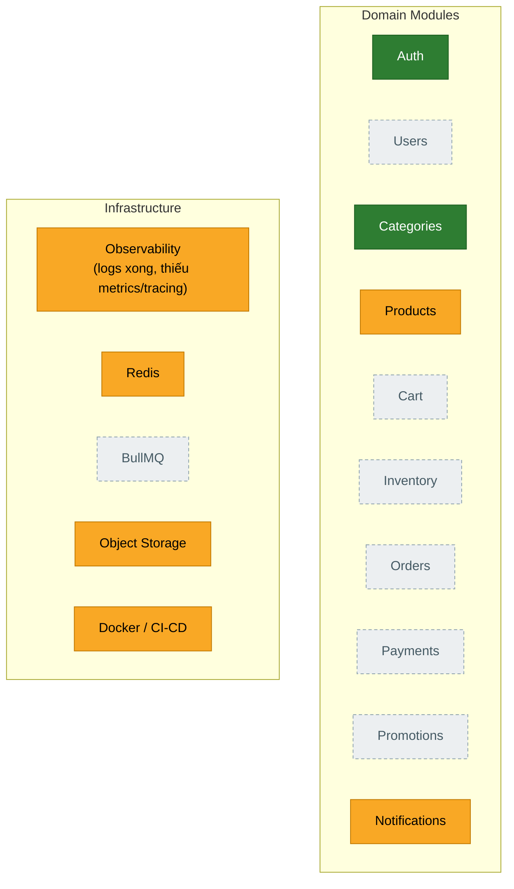

**Vị trí trong roadmap (xem Mục 22 — Thứ tự Implementation):** Phase 1 và Phase 2 đã được implement phần lớn. Trước Phase 3 cần đóng các P0 gate: Product aggregate update atomicity, wildcard compatibility, Docker/remote-CI/Object-Storage verification và OpenAPI drift. Module tiếp theo là Users; sau đó Inventory Reservation → Cart → Orders/Checkout → Payments.

Cập nhật bảng/sơ đồ này khi từng module hoàn thành — nó được thiết kế để luôn là một bản snapshot của thực tế, không phải một kế hoạch (kế hoạch nằm ở Mục 22).

---

# 1. Kiến trúc Backend Tổng quan

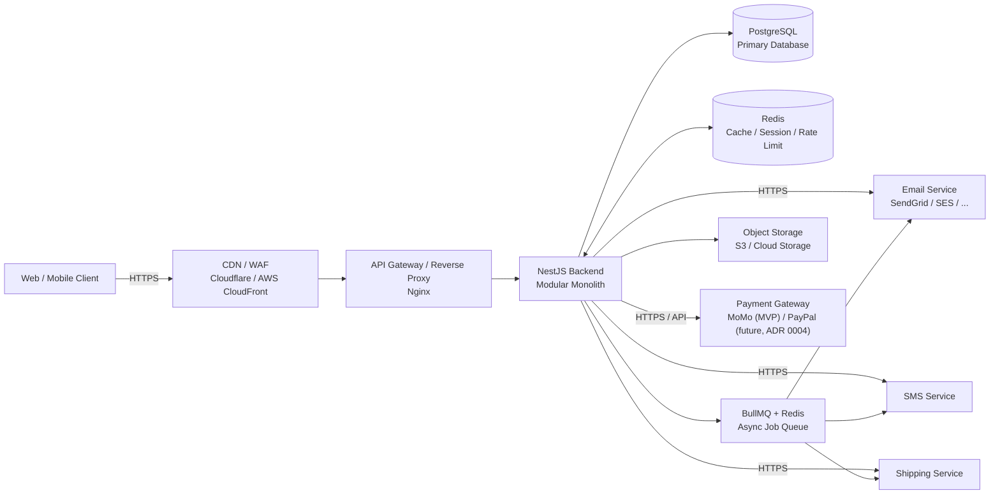

## Trách nhiệm chính

| Component        | Trách nhiệm                                     |
| ---------------- | ----------------------------------------------- |
| CDN / WAF        | Chống DDoS, TLS, static assets                  |
| API Gateway      | Routing, rate limiting, load balancing          |
| NestJS           | Business logic và API                           |
| PostgreSQL       | Nguồn dữ liệu chính cho dữ liệu giao dịch       |
| Redis            | Cache, session, rate limiting, dữ liệu tạm thời |
| BullMQ           | Background job và xử lý bất đồng bộ             |
| Object Storage   | Ảnh sản phẩm, hóa đơn, media                    |
| Payment Gateway  | Thanh toán online                               |
| Email/SMS        | Thông báo                                       |
| Shipping Service | Tích hợp giao hàng                              |

## Request Pipeline (nội bộ NestJS)

Khối "NestJS Backend" ở trên là một process duy nhất, nhưng một request đi qua một pipeline cố định bên trong nó. Sơ đồ này phản ánh đúng những gì thực sự được wire trong `src/app.module.ts` / `src/bootstrap/configure-app.ts` / `src/main.ts` hiện tại — không phải một sơ đồ NestJS chung chung.

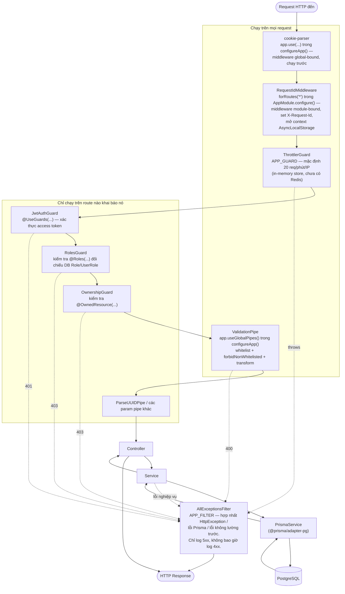

Ghi chú:

- **Thứ tự middleware đã được sửa lại trong bản này**: middleware global-bound (`app.use()` trong `configure-app.ts`) chạy trước middleware module-bound (`consumer.apply().forRoutes()` trong `app.module.ts`), theo đúng request lifecycle mà NestJS đã tài liệu hóa — bất kể dòng nào xuất hiện trước trong source. Đã xác nhận đối chiếu với binding thật của repo này (`app.module.ts:42`, `configure-app.ts:24`); vẫn nên có một integration test kiểm tra thứ tự request trước khi dựa hẳn vào nó, vì đây là hành vi ở mức framework, không phải điều codebase này tự kiểm soát trực tiếp.
- Các mục **Global** chạy trên mọi route bất kể code controller. Các mục **Per-route** chỉ chạy ở nơi controller gắn tường minh chúng. Route register/login/verification/reset của Auth là public; logout/logout-all/me dùng `JwtAuthGuard`. `RolesGuard` và `OwnershipGuard` tồn tại cho các module nghiệp vụ nhưng chưa route Auth controller nào hiện tại dùng `RolesGuard`.
- Mọi exception, dù được throw ở tầng nào, đều được bắt bởi một `AllExceptionsFilter` duy nhất — không có exception filter riêng cho từng module. Xem [`convention/`](convention/README.md).
- `RequestIdMiddleware` mở context `AsyncLocalStorage` của nó trước khi request tới các guard và mọi thứ phía sau (nó vẫn chạy sau `cookie-parser`, theo đúng thứ tự đã sửa ở trên), và context đó vẫn hoạt động trong suốt phần còn lại của request — nên mọi lời gọi `Logger` ở bất kỳ đâu phía sau (guard, service, filter) đều tự động được gắn cùng một request id, không cần sửa code ở nơi gọi.

---

# 2. Kiến trúc Domain của Backend

Backend được tổ chức theo **domain nghiệp vụ**, không phải theo tầng kỹ thuật.

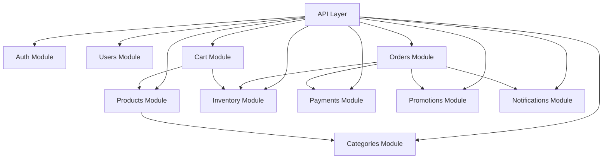

## Quyền sở hữu dữ liệu giữa các module

Tổ chức folder-per-domain sắp xếp _code_, nhưng tự nó không nói rõ module nào được phép ghi bảng nào khi nhiều module cùng dùng chung `PrismaService` global (Mục 3). Đề xuất quyền sở hữu — thao tác ghi lên một bảng phải đi qua service của module sở hữu, không phải qua bất kỳ module nào tình cờ import `PrismaService`:

| Module         | Sở hữu (được phép mutate)                                                 |
| -------------- | ------------------------------------------------------------------------- |
| **Inventory**  | `inventory`, `inventory_reservations` — reserve, release, consume, adjust |
| **Orders**     | `orders`, `order_items` — status, snapshot, điều phối checkout            |
| **Payments**   | `payments`, `payment_attempts`, `payment_webhook_events`, `refunds`       |
| **Promotions** | định nghĩa promotion và các bản ghi sử dụng/tiêu thụ                      |

Việc Orders gọi vào Inventory/Payments/Promotions trong lúc checkout vẫn là một lời gọi trong cùng transaction, nằm trong một transaction PostgreSQL duy nhất (Mục 6); transaction client được truyền xuyên suốt, không mở riêng cho từng module. Bảng này là một đề xuất cần xác nhận khi viết implementation plan của từng module, chưa phải một rule đã được enforce.

---

# 3. Cấu trúc Thư mục Dự án (full tree)

Đây là **toàn bộ repo**, không chỉ `src/` — file thật ở nơi chúng đã tồn tại, cộng với mọi module mà roadmap (Mục 0/22) đã chốt. Ký hiệu trạng thái dùng lại chú giải ở Mục 0: 🟢 xong · 🟡 một phần/đã lên kế hoạch · 🔴 chưa bắt đầu. Bất cứ thứ gì không có ký hiệu là infra đã tồn tại sẵn và không phải "module nghiệp vụ" (config, bootstrap, code generated, tooling).

Quy tắc folder áp dụng cho mọi module nghiệp vụ bên dưới (xem [`convention/`](convention/README.md) §2): một subfolder (`dto/`, `guards/`, `services/`, ...) chỉ xuất hiện khi **≥ 2 file cùng vai trò** — một module chỉ có 1 file controller/service/module và không có DTO thì giữ phẳng (flat), không tạo folder rỗng. `inventory/dto/` bên dưới là ngoại lệ duy nhất đã được ghi nhận: nó tồn tại với đúng 1 file (`adjust-inventory.dto.ts`) vì file DTO vẫn phải nằm ở đâu đó bất kể số lượng, và Inventory thực sự chỉ cần đúng 1 file — quy tắc này nói về việc không tạo folder rỗng một cách suy đoán trước, không phải bắt buộc một module phải đạt 2 file mới được có folder `dto/`.

```text
nestjs-demo/
├── .env                            # secrets/config local — gitignored, không bao giờ commit
├── .env.example                    # template mọi env var; đồng bộ với .env.validation.ts (config-environment-conventions.md)
├── .husky/                         # git hooks — pre-commit chạy lint-staged
├── .lintstagedrc                   # linter/formatter nào chạy trên file staged trước commit
├── .prettierrc                     # rule format của Prettier
├── nest-cli.json                   # config Nest CLI (schematics mặc định, compiler option)
├── oxlint.json                     # config rule của oxlint (linter viết bằng Rust, tương thích ESLint)
├── package.json / package-lock.json
├── prisma7.config.ts               # config Prisma v7 (đường dẫn schema, seed command) — thay cho block `"prisma"` cũ trong package.json
├── tsconfig.json                   # config TS gốc; khai báo alias `@src/*` (chỉ dùng cho test — xem coding-style-conventions.md §4)
├── tsconfig.build.json             # config TS chỉ dùng để build (loại trừ test) — cái mà `nest build` thực sự dùng
├── vitest.config.ts                # config unit test runner
├── vitest.config.e2e.ts            # config e2e test runner (khởi động app Nest thật)
├── CLAUDE.md                       # instruction cho agent ở mức project
├── CONTEXT.md                      # glossary domain — ý nghĩa chuẩn của User/Role/Session/... (xem docs/agents/domain.md)
│
├── docs/
│   └── adr/                        # Architecture Decision Records — một file bất biến cho mỗi quyết định lớn (vd 0001-category-delete-restrict.md)
│
├── docs/                           # tài liệu cho người đọc: convention, playbook, kiến trúc (file này), plan từng module
│
├── scripts/
│   └── sync-postman-collection.ts  # tạo lại Postman collection từ Swagger doc đang chạy (npm run postman:sync)
│
├── postman/
│   ├── nestjs-demo.postman_collection.json  # generated — không tự sửa tay, chạy lại sync script
│   └── local.postman_environment.json       # env var Postman local (base URL, chỗ để bearer token)
│
├── prisma/
│   ├── schema/
│   │   ├── schema.prisma           # toàn bộ model (xem prisma-multifile-schema-convention)
│   │   └── enums.prisma            # toàn bộ enum, tách riêng để schema.prisma dễ đọc
│   ├── migrations/
│   │   └── <timestamp>_<name>/migration.sql  # một folder cho mỗi migration đã áp dụng — chỉ sửa *trước khi* apply lần đầu (xem 2 ngoại lệ partial-unique-index ở Mục 7)
│   └── seed.ts                     # `npx prisma db seed` — upsert idempotent (chạy lại an toàn) cho dữ liệu dev/demo
│
├── test/
│   ├── support/
│   │   ├── create-test-app.ts      # bootstrap app e2e dùng chung — mô phỏng configureApp(), cho phép test override ThrottlerGuard/APP_FILTER
│   │   └── create-test-user.ts     # helper: tạo + login một test user, trả về token
│   ├── app.e2e-spec.ts
│   ├── auth-login.e2e-spec.ts
│   ├── auth-register.e2e-spec.ts
│   ├── auth-register-flow.e2e-spec.ts
│   ├── auth-refresh.e2e-spec.ts
│   ├── auth-logout.e2e-spec.ts
│   ├── auth-verify-email.e2e-spec.ts
│   ├── auth-resend-verification.e2e-spec.ts
│   ├── auth-forgot-password.e2e-spec.ts
│   ├── auth-reset-password.e2e-spec.ts
│   ├── auth-rate-limiting.e2e-spec.ts
│   ├── mail-smtp.e2e-spec.ts
│   └── categories.e2e-spec.ts      # 🟡 đã lên kế hoạch — categories-module-plan.md STEP 7 (từ giờ mỗi module có 1 file e2e, cùng pattern)
│
└── src/
    ├── main.ts                     # bootstrap: NestFactory.create → configureApp() → setup Swagger → listen(PORT)
    ├── app.module.ts               # root module: provider global (ThrottlerGuard, AllExceptionsFilter), gắn RequestIdMiddleware vào mọi route
    ├── app.controller.ts           # route gốc placeholder còn sót lại từ `nest new` — xem lại khi cần một route gốc thật (health check?)
    ├── app.service.ts
    ├── app.controller.spec.ts
    │
    ├── bootstrap/
    │   └── configure-app.ts        # ValidationPipe + cookie-parser + AppLogger — dùng chung bởi main.ts VÀ test/support/create-test-app.ts để không bị lệch nhau
    │
    ├── config/
    │   └── env.validation.ts       # fail-fast: throw ngay lúc khởi động nếu thiếu/sai một env var bắt buộc (config-environment-conventions.md)
    │
    ├── common/                     # infra cross-cutting dùng chung cho mọi module — không phải bản thân một domain nghiệp vụ
    │   ├── app-logger.ts           # implementation của Logger; gắn request id hiện tại vào mọi dòng log
    │   ├── request-context.ts      # wrapper AsyncLocalStorage mang request id xuyên suốt chuỗi gọi bất đồng bộ
    │   ├── request-id.middleware.ts # set X-Request-Id, mở context AsyncLocalStorage — global, chạy trên mọi route
    │   └── filters/
    │       └── all-exceptions.filter.ts  # MỘT exception filter global duy nhất — hợp nhất HttpException/lỗi Prisma/lỗi không lường trước, chỉ log 5xx (không bao giờ log 4xx)
    │
    ├── prisma/
    │   ├── prisma.module.ts        # @Global() — PrismaService inject được ở bất kỳ đâu mà không cần import lại module này
    │   └── prisma.service.ts       # extends PrismaClient, nối với Postgres qua @prisma/adapter-pg
    │
    ├── generated/
    │   └── prisma/                 # output của `prisma generate` — không tự sửa tay, không review từng dòng trong PR
    │
    ├── mail/
    │   ├── mail.module.ts
    │   └── mail.service.ts         # wrapper nodemailer — hiện chỉ gửi email giao dịch của Auth (verify/reset)
    │
    ├── auth/                       # 🟢 xong
    │   ├── auth.module.ts
    │   ├── auth.controller.ts      # toàn bộ route /auth/*
    │   ├── services/
    │   │   ├── auth.service.ts     # điều phối register/login
    │   │   ├── token.service.ts    # cấp phát + rotate access/refresh token
    │   │   └── password.service.ts # hash argon2 + kiểm tra độ mạnh mật khẩu
    │   ├── strategies/
    │   │   └── jwt.strategy.ts     # strategy passport-jwt — xác thực access token
    │   ├── guards/
    │   │   ├── jwt-auth.guard.ts
    │   │   ├── roles.guard.ts      # kiểm tra @Roles() đối chiếu bảng Role/UserRole trong DB (không phải enum hardcode)
    │   │   ├── ownership.guard.ts  # kiểm tra @OwnedResource() — "đây có phải bản ghi của chính người gọi không?"
    │   │   └── email-throttler.guard.ts  # throttle chặt hơn riêng cho các route gửi email
    │   ├── decorators/
    │   │   ├── current-user.decorator.ts
    │   │   ├── roles.decorator.ts
    │   │   └── owned-resource.decorator.ts
    │   └── dto/                    # mỗi file cho một hình dạng request/response — register, login, refresh, forgot/reset-password, verify-email, resend-verification, message-response, auth-user-response
    │
    ├── categories/                 # 🟢 Current — CRUD/RBAC/tests đã implement
    │   ├── categories.module.ts
    │   ├── categories.controller.ts # GET public; ghi → STORE_MANAGER hoặc MASTER_ADMIN
    │   ├── categories.service.ts    # gọi thẳng PrismaService — không có lớp repository (api-conventions.md §B5b)
    │   ├── categories.service.spec.ts  # unit test — có business logic (sinh slug, kiểm tra trùng/FK)
    │   └── dto/                     # không có folder entities/ (bị cấm — api-conventions.md §B3); không có response DTO — Category không có field nhạy cảm, trả thẳng type của Prisma (§B11.a)
    │       ├── create-category.dto.ts
    │       ├── update-category.dto.ts  # PartialType(CreateCategoryDto) từ @nestjs/swagger, không phải @nestjs/mapped-types
    │       └── pagination.dto.ts        # hình dạng `{ page, limit }` — hiện copy-paste ở từng module (xem ghi chú dưới cây thư mục), chưa import từ một file dùng chung
    │
    ├── products/                   # 🟡 Current có P0 gap — Product/Variant/Image/Object Storage đã implement; aggregate update cần atomic transaction
    │   ├── products.module.ts
    │   ├── products.controller.ts
    │   ├── products.service.ts
    │   ├── products.service.spec.ts
    │   └── dto/
    │       ├── create-product.dto.ts
    │       ├── update-product.dto.ts
    │       └── pagination.dto.ts
    │
    ├── users/                      # 🔴 chưa bắt đầu — module kế tiếp; quản lý profile/status/role, không tạo module roles riêng
    │   ├── users.module.ts
    │   ├── users.controller.ts     # PATCH /users/me; quản trị user/status/role → MASTER_ADMIN
    │   ├── users.service.ts
    │   ├── users.service.spec.ts
    │   └── dto/
    │       ├── update-profile.dto.ts    # body PATCH /users/me (fullName, phone)
    │       ├── update-status.dto.ts     # body PATCH /users/:id/status
    │       ├── assign-role.dto.ts       # body POST /users/:id/roles
    │       ├── pagination.dto.ts        # danh sách GET /users
    │       └── user-response.dto.ts     # DTO allow-list — User có passwordHash, không bao giờ được serialize trực tiếp (§B11.b)
    │
    ├── cart/                       # 🔴 chưa bắt đầu — không phải CRUD chuẩn: bản thân cart không có endpoint create/delete (tự sở hữu theo user), chỉ item mới được mutate
    │   ├── cart.module.ts
    │   ├── cart.controller.ts      # GET /cart; POST/PATCH/DELETE /cart/items(/:id)
    │   ├── cart.service.ts
    │   ├── cart.service.spec.ts
    │   └── dto/
    │       ├── add-cart-item.dto.ts     # POST /cart/items
    │       └── update-cart-item.dto.ts  # PATCH /cart/items/:id — không có pagination.dto.ts (mỗi user 1 cart, không có gì để phân trang)
    │
    ├── inventory/                  # 🔴 chưa bắt đầu — explicit Inventory Reservation + Outbox đã chốt ở ADR 0003, chưa migrate/implement
    │   ├── inventory.module.ts
    │   ├── inventory.controller.ts # GET /inventory/:variantId; PATCH /inventory/:variantId/adjust — không có create/delete/list, dòng inventory sinh ra cùng ProductVariant của nó
    │   ├── inventory.service.ts
    │   ├── inventory.service.spec.ts   # logic concurrency/adjust đúng là loại business rule mà §B8 yêu cầu phải có unit test
    │   └── dto/
    │       └── adjust-inventory.dto.ts  # DTO duy nhất module này cần
    │
    ├── orders/                     # 🔴 chưa bắt đầu — cần products/cart/inventory tồn tại trước (checkout đọc cả ba)
    │   ├── orders.module.ts
    │   ├── orders.controller.ts    # POST /orders; GET /orders, /orders/:id; POST /orders/:id/cancel — không có PATCH, "cancel" là mutation duy nhất ngoài create
    │   ├── orders.service.ts
    │   ├── orders.service.spec.ts
    │   └── dto/
    │       ├── create-order.dto.ts      # checkout — body gần như rỗng, đọc cart đang active của người gọi ở phía server
    │       └── pagination.dto.ts        # danh sách GET /orders
    │
    ├── payments/                   # 🟡 đã chốt, chưa build — MoMo-first đứng sau PaymentProvider (ADR 0004)
    │   ├── payments.module.ts
    │   ├── payments.controller.ts  # tạo/retry payment, webhook MoMo, refund
    │   ├── payments.service.ts
    │   ├── payments.service.spec.ts
    │   └── dto/
    │       ├── create-payment.dto.ts
    │       └── payment-response.dto.ts  # allow-list — dữ liệu giao dịch/provider đúng là trường hợp "nhạy cảm, model hay thay đổi" mà §B11.b nói tới. Body webhook dùng hợp đồng riêng của provider, không phải DTO CRUD nội bộ: xác minh chữ ký (§9) xác thực payload, sau đó kiểm tra cấu trúc/nghiệp vụ (order, amount, currency) chạy trước khi đổi trạng thái — xác minh chữ ký không thay thế các kiểm tra đó
    │
    ├── promotions/                 # 🔴 chưa bắt đầu — chưa có Prisma model; cần orders.subtotal/discount_amount trước (gap ở Mục 0)
    │   ├── promotions.module.ts
    │   ├── promotions.controller.ts # CRUD → STORE_MANAGER/MASTER_ADMIN; validate → CUSTOMER
    │   ├── promotions.service.ts
    │   ├── promotions.service.spec.ts  # validate() chứa business logic thật (kiểm tra hết hạn/giới hạn sử dụng/đơn tối thiểu)
    │   └── dto/
    │       ├── create-promotion.dto.ts
    │       ├── update-promotion.dto.ts
    │       ├── validate-promotion.dto.ts  # body POST /promotions/validate (mã + context cart)
    │       └── pagination.dto.ts
    │
    └── notifications/              # 🟡 một phần — mail/ đã phủ email của Auth. Không có controller, không có dto/: module này không có public API (Mục 8) — nó là một BullMQ consumer phản ứng với event từ Mục 11, một khi queue tồn tại
        ├── notifications.module.ts
        ├── notifications.service.ts
        └── notifications.processor.ts  # BullMQ @Processor — điểm vào thật một khi Redis/BullMQ (Mục 0) tồn tại; chưa tồn tại trước đó
```

`pagination.dto.ts` ở trên luôn cùng một hình dạng `{ page, limit }`, nhưng hiện tại là **một file riêng cho từng module**, không phải một import dùng chung — đó là cách `categories-module-plan.md` STEP 3 và `api-conventions.md` §B3 đang làm. Đáng cân nhắc lại khi có 3-4 module cùng dùng nó (tách ra `common/dto/pagination.dto.ts`), nhưng đó là quyết định của người build module thứ hai hoặc thứ ba, không phải quyết định cần đưa ra bây giờ.

### Quy tắc dependency

```text
Controller
    ↓
Service / Use Case
    ↓
PrismaService
    ↓
Database
```

Controller không được truy cập PostgreSQL trực tiếp — phải đi qua service. Service gọi `PrismaService` trực tiếp; một lớp `Resource Repository` riêng **không phải** mặc định ở đây (xem [`api-conventions.md`](convention/api-conventions.md) §B5b) — chỉ thêm khi có lý do cụ thể (một query phức tạp được tái sử dụng ở nhiều nơi, nhiều aggregate trong một thao tác nghiệp vụ, một transaction lớn, hoặc nhu cầu thật sự cần tách ORM khỏi business logic).

---

# 4. Luồng Request

Ví dụ: `POST /api/v1/orders`

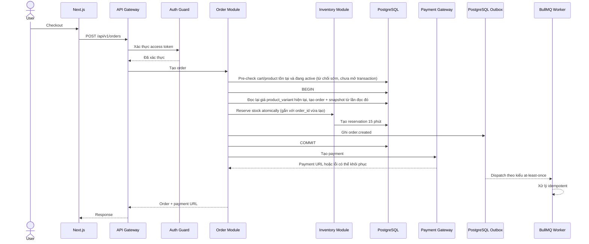

**Chính sách giá:** pre-check trước `BEGIN` chỉ là một lượt từ chối rẻ tiền (cart tồn tại, product/variant vẫn đang active) — nó không bao giờ cung cấp giá được ghi vào `order_items`. Giá snapshot luôn đến từ câu `SELECT` thực hiện **bên trong** transaction, ngay trước khi ghi snapshot. Nếu giá thay đổi giữa lúc "xem cart" và "bấm checkout," Order dùng giá hiện hành tại thời điểm tạo Order, không phải giá mà cart đã hiển thị trước đó. Không có cột version hay row lock trên `product_variants` — việc admin sửa giá trùng thời điểm với một lượt checkout đủ hiếm để "giá trị nào transaction đọc được" là một kết quả chấp nhận được; đây là một lựa chọn đơn giản có chủ đích, không phải bỏ sót.

---

# 5. Thiết kế Hệ thống Checkout

Checkout là một trong những luồng quan trọng nhất.

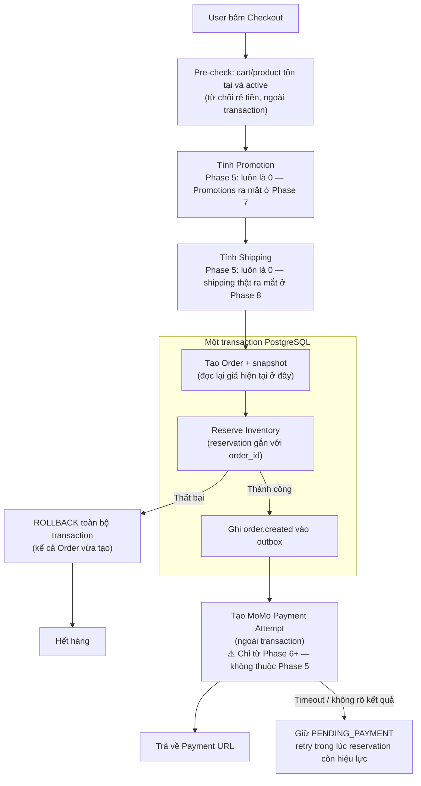

Phạm vi Phase 5: `orders.subtotal = orders.total_amount`, `orders.discount_amount = 0`, `orders.shipping_amount = 0` cho tới khi Promotions (Phase 7) và tính phí shipping thật (Phase 8) tồn tại — việc tạo Order không bao giờ bị chặn chờ các module đó; chỉ có phần tính discount/shipping bị hardcode về 0 tới lúc đó.

**Sơ đồ này thể hiện Checkout ở trạng thái cuối cùng, trải dài qua hai phase — không phải mọi thứ được build hết trong Phase 5:**

```text
Phase 5 mang lại: pre-check → Order + snapshot → Reserve Inventory →
                  ghi outbox, trong một transaction. Trả về một
                  contract "Order đã tạo," chưa phải payment URL.

Phase 6 bổ sung:  nhánh Payment/MoMo — Tạo Payment Attempt,
                  Result, và đường Pending/timeout.
```

Việc Phase 5 có gọi vào Payment đồng bộ trong cùng request checkout (như sơ đồ vẽ ở trên) hay để client tự gọi `POST /api/v1/payments` riêng khi Payments đã tồn tại (đã có trong catalog ở Mục 8) là quyết định thuộc về implementation plan của Orders/Payments, không bị cố định bởi sơ đồ này — dù theo cách nào, `POST /orders` vẫn phải tự trả về một kết quả dùng được ở Phase 5, trước khi Payment tồn tại.

---

# 6. Concurrency của Inventory

Hệ thống phải ngăn hai khách hàng cùng mua trúng một sản phẩm cuối cùng.

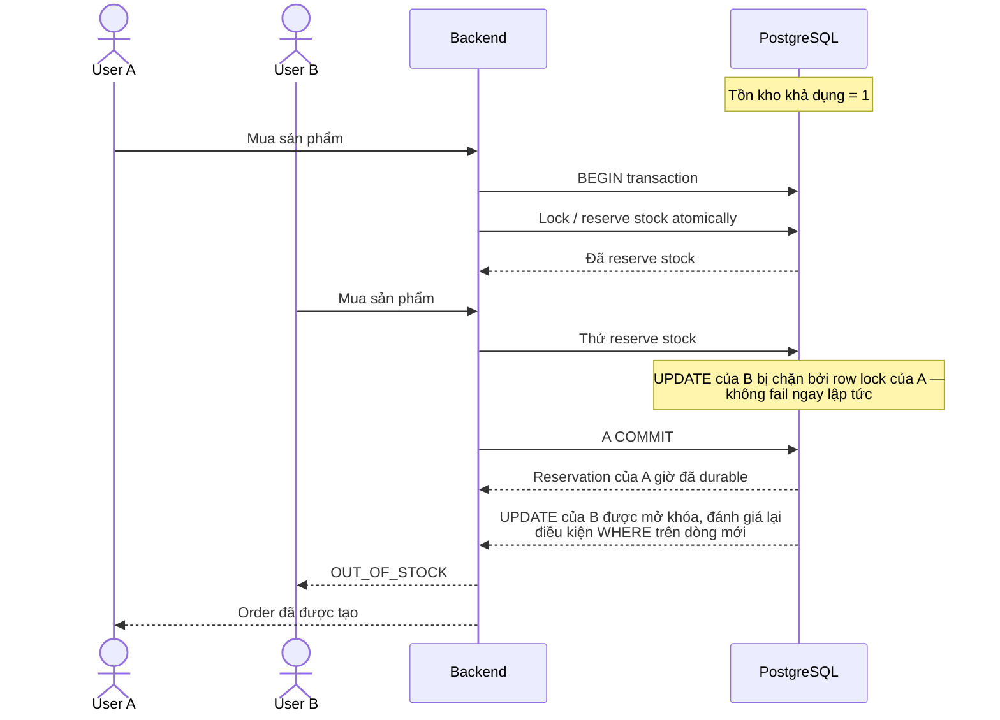

Nếu A rollback thay vì commit, `UPDATE` đang bị chặn của B sẽ đánh giá lại trên trạng thái đã rollback và vẫn có thể thành công — B không bao giờ bị từ chối trước khi biết kết quả của A. Sơ đồ này giả định câu lệnh reserve của B là một `UPDATE ... WHERE available_quantity >= qty` điều kiện duy nhất, đây chính là kiểu câu lệnh thực sự bị chặn bởi row lock của Postgres; một chiến lược đọc-rồi-ghi bằng hai câu lệnh riêng cần tự có cơ chế khóa riêng (vd `SELECT ... FOR UPDATE`) để đạt hành vi này.

Mục tiêu đã chốt dùng một bảng reservation tường minh:

```text
inventory_reservations
----------------------
id
order_id
variant_id
quantity
status
expires_at
created_at
```

Các status thường gặp:

```text
ACTIVE
RELEASED
EXPIRED
CONSUMED
```

Lượt giữ hàng hết hạn sau **15 phút**. Trong một transaction PostgreSQL: Order và snapshot OrderItem của nó được tạo trước (để transaction có `order_id` để gắn vào), sau đó reservation được tạo dựa trên `order_id` đó, rồi bộ đếm tồn kho tổng thay đổi, rồi outbox event được ghi. Ràng buộc database giữ mọi số lượng không âm và enforce `reserved_quantity <= quantity`. Thanh toán thành công và reservation hết hạn cạnh tranh nhau qua một chuyển trạng thái atomic: chỉ một bên được consume hoặc expire một reservation `ACTIVE`.

**Chỉ `status = 'ACTIVE'` không có nghĩa là "vẫn còn trong 15 phút giữ hàng."** Worker cập nhật `status` thành `EXPIRED` có thể trễ hơn `expires_at` (worker downtime, delayed-job chỉ là best-effort, không chính xác tuyệt đối). Việc consume một reservation khi thanh toán thành công phải kiểm tra cả hai điều kiện trong cùng một câu lệnh atomic: `UPDATE ... SET status = 'CONSUMED' WHERE status = 'ACTIVE' AND expires_at > clock_timestamp()`.

**Dùng `clock_timestamp()`, không phải `NOW()`/`transaction_timestamp()`:** trong PostgreSQL, `NOW()` cố định tại thời điểm bắt đầu transaction và không nhích lên trong lúc câu lệnh chờ lock, nên một transaction bắt đầu trước `expires_at` nhưng chỉ giành được row lock sau `expires_at` vẫn sẽ đọc `NOW()` là thời điểm trước khi hết hạn. `clock_timestamp()` đọc đúng thời gian thực tại thời điểm điều kiện được đánh giá. **Đây là chính sách đã chọn: hiệu lực của một reservation được xét tại thời điểm chuyển trạng thái thực sự thực thi (khi giành được row lock và điều kiện được kiểm tra), không phải tại thời điểm transaction bắt đầu** — một webhook đến trễ, bị xếp hàng sau một lock quá `expires_at`, vẫn bị coi là hết hạn, dù transaction của nó mở trước `expires_at`. Một webhook đến sau `expires_at` nhưng trước khi worker đánh dấu dòng đó `EXPIRED` phải fail ở kiểm tra này và rơi vào cùng đường xử lý reconciliation cho late-success mà Mục 9 mô tả — không bao giờ âm thầm xác nhận. Với một Order nhiều sản phẩm, toàn bộ reservation của Order đó được consume hoặc expire cùng nhau trong một câu lệnh/transaction — không bao giờ consume một phần rồi để lại một reservation khác.

**Ngăn hai Order từ cùng một Cart qua hai Idempotency-Key khác nhau:** header Idempotency-Key (Mục 12) chỉ loại trùng các retry _giống hệt nhau_: nó không ngăn được hai request thực sự khác nhau (khác key) cùng cố checkout một Cart. Cơ chế bảo vệ thay vào đó đến từ chính cột `status` của Cart (Mục 7): checkout chỉ hợp lệ với một Cart đang `ACTIVE`, và cùng transaction tạo Order cũng chuyển Cart đó sang `CHECKED_OUT` — vd `UPDATE carts SET status = 'CHECKED_OUT' WHERE id = :cartId AND status = 'ACTIVE'`. Một lượt checkout thứ hai chạy đồng thời trên cùng Cart sẽ thua ở conditional update đó (0 dòng bị ảnh hưởng) và bị từ chối, bất kể dùng Idempotency-Key nào.

**Đã quyết định ([ADR 0009](adr/0009-cart-row-lock-over-optimistic-version.md)): Checkout và mọi CartItem mutation phải dùng cùng Cart row-lock protocol.** Mỗi path bắt đầu transaction, `SELECT ... FOR UPDATE` cùng Cart row, xác nhận `status = 'ACTIVE'`, rồi mới đọc/thay đổi Cart Items hoặc chuyển Cart sang `CHECKED_OUT`. Chỉ khóa ở Checkout là không đủ để serialize mutation trên child rows. Không dùng `carts.version`: một Cart có một chủ sở hữu, tranh chấp hiếm/ngắn hạn và row lock không cần migration schema.

---

# 7. Kiến trúc Database

Sơ đồ ER bên dưới là schema **thật, đã migrate** (15 bảng — xem `prisma/schema/schema.prisma`, migration `20260911030156_init_ecommerce`), không phải một schema kỳ vọng. `Payments`/`Promotions` cố tình vắng mặt — chúng chưa tồn tại (xem Mục 0). Lý do chi tiết từng field nằm ở `ecommerce-postgresql-database-summary.md` và hướng dẫn Prisma từng bước ở `convention/`; đây là bản rút gọn.

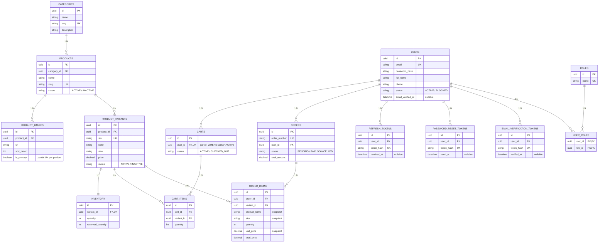

**Business rule không thể hiện thành cột:**

- **Giá của Cart là giá sống (live), giá của Order là snapshot.** `cart_items` không có `unit_price` — nó luôn đọc `product_variants.price` hiện tại, nên có thể trôi giữa lúc "thêm vào cart" và "checkout". `order_items` đóng băng `product_name`/`sku`/`unit_price` tại thời điểm tạo order, nên một lượt sửa product/giá sau đó không bao giờ viết lại lịch sử.
- **`available_quantity = inventory.quantity - inventory.reserved_quantity`.** `reserved_quantity` chỉ thay đổi theo chuyển trạng thái của `Order`, không bao giờ theo thay đổi của cart (một cart không bao giờ reserve stock): Order được tạo (PENDING) → `reserved_quantity += qty`; Order → PAID → `quantity -= qty` và `reserved_quantity -= qty`; Order → CANCELLED → `reserved_quantity -= qty` chỉ trong schema hiện tại. **Mục tiêu đã chốt (ADR 0003):** thêm một bảng `inventory_reservations` có thể kiểm chứng (auditable), hết hạn sau 15 phút. Trạng thái reservation và bộ đếm tổng thay đổi atomic trong PostgreSQL; một worker sẽ expire các lượt giữ hàng, và cuộc đua giữa thanh toán và hết hạn dùng một chuyển trạng thái atomic để chỉ một kết quả thắng.
- **Các giá trị `orders.status` ở trên (`PENDING`/`PAID`/`CANCELLED`) là schema đã migrate, không phải state machine mục tiêu đầy đủ.** Bảng trạng thái Order ở Mục 9 thêm `PENDING_PAYMENT`/`CONFIRMED`/`COMPLETED`; việc ánh xạ 3 giá trị hiện tại sang mô hình 4+ trạng thái đó là một trong các "migration đã chốt trước Checkout/Payment" bên dưới, chưa phải điều gì đã được áp dụng.
- **Hai partial unique index được quản lý bằng migration SQL viết tay, không phải qua Prisma schema**: một cart `ACTIVE` cho mỗi user (`carts.user_id WHERE status = 'ACTIVE'`), và một ảnh chính cho mỗi sản phẩm (`product_images.product_id WHERE is_primary = true`). Prisma đã thêm Preview feature `partialIndexes` từ **v7.4.0**, cho phép `@unique`/`@@unique`/`@@index` nhận một tham số `where` trên PostgreSQL, nên hai index này có thể chuyển vào `schema.prisma` nếu team quyết định bật Preview feature đó — **chỉ khi version Prisma đang cài của project thực sự ≥ 7.4.0** (kiểm tra `package.json`/lockfile; `prisma7.config.ts` chỉ chứng minh định dạng config là v7, không chứng minh đúng minor version). Không bắt buộc — đây là một lựa chọn để cân nhắc, không phải một điều cần sửa cho migration đã áp dụng.
- **`ON DELETE` khác nhau theo từng bảng**, không phải "cascade khắp nơi": `carts`, `user_roles`, `refresh_tokens`, `password_reset_tokens`, `email_verification_tokens` đều `CASCADE` khi xóa user (vô nghĩa nếu không còn user); `orders` là `RESTRICT` (một bản ghi tài chính phải tồn tại qua cả khi user bị xóa — soft-delete `users` thay vì hard-delete một user còn có order).
- **Composite index cho listing/pagination** được tạo trước khi cần, trên đúng những cột thực sự được filter/sort: `products(category_id, status, created_at DESC)`, `orders(user_id, created_at DESC)`, `orders(status, created_at DESC)`, `product_variants(product_id, created_at DESC)`. Postgres không tự động index FK — cột dẫn đầu trong một trong các composite này đồng thời đóng vai trò index cho FK đó, nên không cần thêm index FK đơn cột riêng.
- **Không multi-warehouse, không guest cart, không category phân cấp** trong schema này — `inventory` là một số đếm toàn cục cho mỗi variant (không theo kho), `carts.user_id` là `NOT NULL` (không có cart ẩn danh), và `categories` phẳng (không có `parent_id`). Cả ba đều là điểm mở rộng đã được ghi nhận, không phải bỏ sót.

**Migration đã chốt trước Checkout/Payment:**

- Thêm `inventory_reservations`, bản ghi idempotency, outbox event, Payments, Payment Attempts, webhook event, Refunds, và bản ghi audit.
- Thêm các cột snapshot tiền của Order: `subtotal`, `discount_amount`, `shipping_amount`, `tax_amount`, `total_amount`, và `currency`.
- Thêm snapshot bất biến cho địa chỉ giao hàng và discount theo từng dòng.
- Thêm check ở database cho số lượng cart/order dương, Inventory không âm, và `reserved_quantity <= quantity`; ngăn dòng `(cart_id, variant_id)` trùng và reservation active `(order_id, variant_id)` trùng.
- Dùng một kho duy nhất và số tiền nguyên chỉ tính bằng VND cho MVP, trong khi vẫn giữ một mã tiền tệ ISO tường minh trên mỗi Order, Payment, và Refund.

---

# 8. Thiết kế API

Mọi API đều được versioned:

```text
/api/v1/...
```

Đây là **runtime hiện tại, đã xác minh theo [ADR 0002](adr/0002-uri-versioned-api-contract.md)**. App dùng Nest URI versioning với global prefix `api`, version `1`, không giữ alias không-version; refresh-cookie path là `/api/v1/auth`, Swagger ở `/docs`.

## Auth

```http
POST /api/v1/auth/register
POST /api/v1/auth/login
POST /api/v1/auth/refresh
POST /api/v1/auth/logout
POST /api/v1/auth/logout-all
POST /api/v1/auth/verify-email
POST /api/v1/auth/resend-verification
POST /api/v1/auth/forgot-password
POST /api/v1/auth/reset-password
GET  /api/v1/auth/me
```

## Products

```http
GET    /api/v1/products
GET    /api/v1/products/:id
POST   /api/v1/products
PATCH  /api/v1/products/:id
DELETE /api/v1/products/:id
```

⚠️ **Contract của Product Variants và product-media (Object Storage) chưa được chốt**, dù cả hai đều ra mắt ở Phase 2 cùng với CRUD này (Mục 22). Việc variant có nằm lồng dưới Products (`/products/:id/variants`) hay là một resource top-level, và cách upload ảnh gắn vào một Product, đều còn mở — danh sách này chỉ là CRUD của Product, chưa phải toàn bộ bề mặt của Phase 2.

## Categories

```http
GET    /api/v1/categories
GET    /api/v1/categories/:id
POST   /api/v1/categories
PATCH  /api/v1/categories/:id
DELETE /api/v1/categories/:id
```

## Cart

```http
GET    /api/v1/cart
POST   /api/v1/cart/items
PATCH  /api/v1/cart/items/:id
DELETE /api/v1/cart/items/:id
```

## Orders

```http
POST   /api/v1/orders
GET    /api/v1/orders
GET    /api/v1/orders/:id
POST   /api/v1/orders/:id/cancel
```

## Payments

```http
POST /api/v1/payments
POST /api/v1/payments/:id/retry
POST /api/v1/payments/webhooks/momo
POST /api/v1/payments/:id/refunds
```

## Inventory

```http
GET   /api/v1/inventory/:variantId
PATCH /api/v1/inventory/:variantId/adjust
```

## Users 🔴 chưa bắt đầu

Phạm vi dừng lại ở nơi `GET /auth/me` của Auth đã kết thúc — đây là self-service edit profile cộng quản trị của admin, không phải một login/me khác.

```http
PATCH  /api/v1/users/me                — tự sửa fullName/phone (chỉ cần JwtAuthGuard)
GET    /api/v1/users                   — MASTER_ADMIN — phân trang, filter theo status/email
GET    /api/v1/users/:id               — MASTER_ADMIN
PATCH  /api/v1/users/:id/status        — MASTER_ADMIN block/unblock
POST   /api/v1/users/:id/roles         — MASTER_ADMIN gán một role
DELETE /api/v1/users/:id/roles/:roleId — MASTER_ADMIN thu hồi một role
```

## Promotions 🔴 chưa bắt đầu — chưa có Prisma model

Hình dạng coupon-code chuẩn; `POST .../validate` chỉ đọc (kiểm tra mã theo cart hiện tại, trả về mức giảm giá, không áp dụng gì cả) để khách hàng có thể xem trước lúc checkout.

MVP cho phép một mã coupon cho mỗi Order, không stack, và không có promotion tự động. Việc tiêu thụ và kiểm tra giới hạn sử dụng là atomic trong PostgreSQL, và định danh/rule/giá trị của promotion đã áp dụng được lưu thành một snapshot discount của Order; bộ đếm ở Redis không bao giờ là nguồn xác thực.

```http
POST   /api/v1/promotions          — STORE_MANAGER hoặc MASTER_ADMIN
GET    /api/v1/promotions          — STORE_MANAGER hoặc MASTER_ADMIN
GET    /api/v1/promotions/:id      — STORE_MANAGER hoặc MASTER_ADMIN
PATCH  /api/v1/promotions/:id      — STORE_MANAGER hoặc MASTER_ADMIN
DELETE /api/v1/promotions/:id      — STORE_MANAGER hoặc MASTER_ADMIN
POST   /api/v1/promotions/validate — CUSTOMER — validate một mã theo cart đang active của người gọi
```

⚠️ **Gap về schema mà điều này tạo ra**: áp dụng một promotion lúc checkout cần `orders.subtotal` và `orders.discount_amount` — hiện tại `orders` chỉ có một `total_amount` cuối cùng (xem Mục 7, và ghi chú MVP trong `ecommerce-postgresql-database-summary.md` §4.8: "chưa có discount/shipping/tax nên chưa cần `subtotal`"). Một migration thêm các cột đó phải xong trước khi `POST /orders` có thể gọi vào Promotions.

## Fulfillment 🔴 chưa bắt đầu — chưa chốt API/event contract

Phase 8 (Mục 22) đã chốt một workflow shipping nội địa cho Fulfillment và một trục trạng thái `Fulfillment` (Mục 9: `UNFULFILLED → PROCESSING → SHIPPED → DELIVERED | RETURNED`), nhưng chưa có endpoint hay event nào thực sự đưa một Order tới `DELIVERED` tồn tại trong tài liệu này — dù đó là một mutation `PATCH /orders/:id/fulfillment` cho staff, một webhook từ Shipping-provider, hay cả hai, đều **chưa được quyết định**, không phải bị bỏ sót do vô ý.

## Notifications 🟡 chưa có kế hoạch public API cho MVP

Chỉ nội bộ — được kích hoạt bởi các queue event đã liệt kê ở Mục 11 (`order.created`, `payment.completed`, ...), không phải một REST resource. Chưa có Prisma model nào cho lịch sử notification, nên một `GET /api/v1/notifications` (lịch sử in-app) trong tương lai vẫn ở trạng thái **chưa quyết định** thay vì được suy đoán ở đây.

---

# 9. Kiến trúc Payment

Việc redirect ở frontend không bao giờ là nguồn xác thực cho trạng thái thanh toán. MoMo là provider production đầu tiên cho MVP Việt Nam/VND (ADR 0004). PayPal là một adapter quốc tế cho tương lai; Stripe nằm ngoài phạm vi trừ khi doanh nghiệp có một pháp nhân hợp lệ tại quốc gia mà Stripe hỗ trợ.

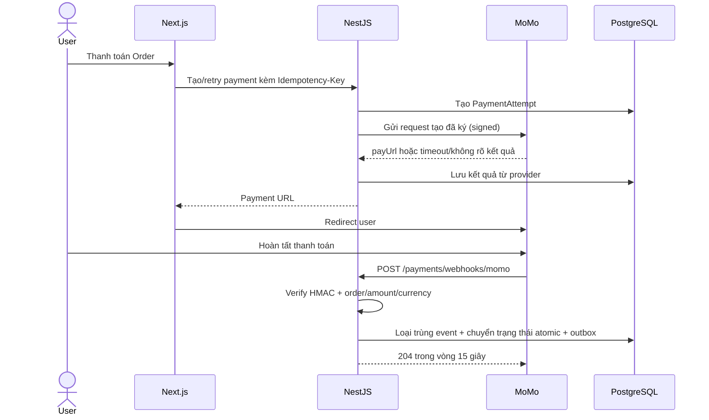

Các bản ghi tối thiểu cần lưu:

```text
payments               — một nghĩa vụ thanh toán cho một Order
payment_attempts       — mỗi lần gọi provider, retry, timeout, hoặc kết quả chưa rõ
payment_webhook_events — thông báo từ provider đã xác minh/loại trùng
refunds                — yêu cầu refund, người thực hiện, lý do, kết quả từ provider
```

Order, Payment, và Fulfillment là ba trục trạng thái riêng biệt. Các danh sách ở bản trước của mục này đọc như một chuỗi liên tiếp (ngụ ý, ví dụ, rằng Payment `FAILED` phải dẫn tới `REFUNDED`); không phải vậy — mỗi dòng bên dưới là một chuyển trạng thái độc lập, không phải một chuỗi cố định:

**Order** (mô hình mục tiêu — schema hiện tại chỉ có `PENDING`/`PAID`/`CANCELLED`; thêm `CONFIRMED`/`COMPLETED` là một trong các "migration đã chốt trước Checkout/Payment" ở Mục 7):

| Từ                | Sang              | Sự kiện                                                                                                                                                                                                                                                                                                                | Ảnh hưởng tồn kho/tiền                                                               |
| ----------------- | ----------------- | ---------------------------------------------------------------------------------------------------------------------------------------------------------------------------------------------------------------------------------------------------------------------------------------------------------------------- | ------------------------------------------------------------------------------------ |
| _(không có)_      | `PENDING_PAYMENT` | Checkout tạo Order                                                                                                                                                                                                                                                                                                     | reservation được tạo, `reserved_quantity += qty`                                     |
| `PENDING_PAYMENT` | `CONFIRMED`       | Webhook thanh toán báo `SUCCEEDED` **và** reservation vượt qua đầy đủ kiểm tra consume ở Mục 6 (`status = 'ACTIVE' AND expires_at > clock_timestamp()`, đánh giá atomic tại thời điểm consume — không chỉ "`status` là `ACTIVE`")                                                                                      | reservation → `CONSUMED`; `quantity -= qty`, `reserved_quantity -= qty`              |
| `PENDING_PAYMENT` | `CANCELLED`       | Reservation hết hạn mà không có thanh toán thành công, hoặc khách/staff hủy trước khi thanh toán                                                                                                                                                                                                                       | reservation → `EXPIRED`/`RELEASED`; `reserved_quantity -= qty`                       |
| `CONFIRMED`       | `COMPLETED`       | Trục Fulfillment đạt `DELIVERED`                                                                                                                                                                                                                                                                                       | không có                                                                             |
| `CONFIRMED`       | `CANCELLED`       | **Đã quyết định (ADR 0006):** cho phép staff hủy sau khi đã thanh toán, nhưng chỉ khi Fulfillment vẫn còn `UNFULFILLED` — một khi đạt `PROCESSING`/`SHIPPED`, đây là quy trình return/exception, không phải hủy                                                                                                        | Kích hoạt luồng full-refund bên dưới (MVP chỉ hoàn tiền toàn phần, xem bảng Payment) |
| `CANCELLED`       | `CANCELLED`       | **Đã quyết định (ADR 0006):** thanh toán thành công sau khi reservation đã hết hạn (late success) — Order giữ nguyên `CANCELLED`; không chuyển sang trạng thái mới nào. Việc "còn tiền cần hoàn" được theo dõi hoàn toàn ở phía Payment (`REFUND_PENDING`/`REFUNDED`), không nhân đôi thành một trạng thái Order riêng | Xem dòng `REFUND_PENDING` ở bảng Payment                                             |

**`payments` và `payment_attempts` là hai đối tượng khác nhau với hai vòng đời khác nhau — chúng không dùng chung một state machine.** Một `payment` là nghĩa vụ thanh toán tổng thể của Order và tổng hợp các attempt của nó.

**Một dòng `payment_attempt` đại diện cho một lần thanh toán hợp lý (logical), được nhận diện bằng một `requestId` của MoMo — không phải một HTTP call.** Một retry ở tầng mạng cho một lời gọi mà kết quả vẫn chưa rõ (client timeout, chưa có response) dùng lại **cùng** dòng attempt và **cùng** `requestId`: đây là điều giúp bản ghi idempotency phía ta (Mục 12) khớp với hợp đồng retry-theo-`requestId` của chính MoMo thay vì xung đột với nó. Một dòng attempt **mới** (với `requestId` mới) chỉ được tạo khi khách hàng bắt đầu một lượt thanh toán mới sau khi lượt trước đã đạt trạng thái terminal (`SUCCEEDED`/`FAILED`, hoặc `EXPIRED` và đã xác nhận không thể khôi phục). Nói theo chiều ngược lại: "MoMo retry một lời gọi dưới cùng `requestId`" mô tả việc _backend của ta_ tự retry lời gọi chưa có response tới MoMo — MoMo là bên thực thi hợp đồng idempotency trên `requestId` đó, không phải bên khởi xướng retry.

**PaymentAttempt** (một dòng cho mỗi lần thanh toán hợp lý):

| Từ           | Sang                      | Sự kiện                                                                                                                                                                               |
| ------------ | ------------------------- | ------------------------------------------------------------------------------------------------------------------------------------------------------------------------------------- |
| _(không có)_ | `PENDING`                 | Dòng attempt được tạo, trước khi gửi lời gọi tới provider                                                                                                                             |
| `PENDING`    | `PROCESSING`              | Đã gửi request đã ký tới provider                                                                                                                                                     |
| `PROCESSING` | `SUCCEEDED`               | Webhook xác nhận thành công cho attempt này                                                                                                                                           |
| `PROCESSING` | `FAILED`                  | Webhook/provider báo từ chối cho attempt này — không có khoản tiền nào được thu                                                                                                       |
| `PROCESSING` | `EXPIRED`                 | Không có xác nhận trước khi cửa sổ attempt/reservation đóng lại; kết quả chưa rõ, không phải thất bại                                                                                 |
| `EXPIRED`    | `SUCCEEDED` hoặc `FAILED` | Reconciliation sau đó truy vấn provider theo `requestId`/`transId` và biết được kết quả thật — một attempt `EXPIRED` không phải ngõ cụt, nó được giải quyết một khi biết kết quả thật |

**Payment** (một dòng cho mỗi Order, tổng hợp các attempt của nó):

| Từ                     | Sang                          | Sự kiện                                                                                                                                                                                                                                                               |
| ---------------------- | ----------------------------- | --------------------------------------------------------------------------------------------------------------------------------------------------------------------------------------------------------------------------------------------------------------------- |
| _(không có)_           | `PENDING`                     | Order được tạo, chưa có attempt nào                                                                                                                                                                                                                                   |
| `PENDING`              | `PROCESSING`                  | Attempt đầu tiên chuyển sang `PROCESSING`                                                                                                                                                                                                                             |
| `PROCESSING`           | `SUCCEEDED`                   | **Bất kỳ** attempt nào đạt `SUCCEEDED` — Payment thành công ngay từ attempt thành công đầu tiên, bất kể các attempt `FAILED`/`EXPIRED` trước đó trên cùng Payment                                                                                                     |
| `PROCESSING`           | `FAILED`                      | Chỉ dùng khi Payment kết thúc bởi một business/provider failure đã được xác định; một Payment Attempt bị từ chối không tự làm Payment tổng thể fail nếu reservation còn mở và vẫn được phép retry                                                                     |
| `PENDING`/`PROCESSING` | `EXPIRED`                     | **Đã quyết định ([ADR 0006](adr/0006-payment-refund-mvp-scope.md)):** reservation hết hạn khi chưa có attempt nào `SUCCEEDED`; đây là terminal state canonical cho expiry, không dùng `FAILED`                                                                        |
| `SUCCEEDED`            | `REFUND_PENDING` → `REFUNDED` | Nhận diện nhu cầu hoàn tiền → gọi refund tới provider → provider xác nhận refund. **Đã quyết định (ADR 0006): chỉ hoàn tiền toàn phần cho MVP** — không hoàn tiền một phần theo OrderItem/số lượng; điều đó được lùi lại tới khi có nhu cầu thật về đổi/trả một phần. |
| `FAILED`/`EXPIRED`     | `REFUND_PENDING` → `REFUNDED` | Phát hiện late success trong lúc reconciliation sau khi Payment đã được đánh dấu `FAILED`/`EXPIRED` (Case B ở trên, hoặc một webhook đến trễ) — cùng trạng thái trung gian `REFUND_PENDING` áp dụng                                                                   |

**Hai tình huống khác nhau đều trông giống "hai attempt cùng SUCCEEDED" nhưng cần xử lý khác nhau:**

- **Case A — một giao dịch, được thông báo hai lần.** Provider gửi cùng một kết quả (cùng `transId` của MoMo) nhiều hơn một lần — một webhook trùng, hoặc một retry cũ chạy đua với một retry mới, cả hai cùng báo cáo về một giao dịch nền tảng. Việc loại trùng `payment_webhook_events` theo `transId` bắt được trường hợp này: thông báo thứ hai được nhận diện là cùng một event và không tạo thêm tác dụng phụ nào (không xác nhận Order lần hai, không consume inventory lần hai).
- **Case B — hai giao dịch thực sự khác nhau, cả hai đều thành công.** Hai attempt khác nhau, mỗi cái hoàn tất một `transId` MoMo _khác nhau_, và provider xác nhận cả hai đều thành công (vd khách bị trừ tiền hai lần, hoặc một attempt "thất bại" thực ra vẫn đi qua và một retry cũng thành công). Loại trùng theo `transId` **không** gộp được trường hợp này — thực sự có hai lượt thu tiền thành công. Chuyển trạng thái atomic "`SUCCEEDED` đầu tiên thắng" trên dòng Payment vẫn áp dụng (Order chỉ được confirm đúng một lần, từ `transId` đầu tiên được nhận là thành công), nhưng nó **không** làm khoản thu thứ hai biến mất: cả hai payment event đều phải được lưu lại (cả hai `transId` được ghi vào attempt tương ứng), và khoản thứ hai phải đi vào reconciliation/refund cho phần thu dư — không được coi như "chỉ là một webhook trùng" rồi bỏ qua. **Đã quyết định (ADR 0006): khoản refund cho phần thu dư không tự động kích hoạt** — nó được đưa lên cho `STORE_MANAGER` review (role đã sở hữu refund theo bảng Authorization, Mục 13) trước khi gọi API refund. Việc tự động refund ngay khi phát hiện đã được cân nhắc và loại bỏ cho MVP: trường hợp này hiếm và liên quan tiền thật, chưa có test coverage, nên mặc định an toàn hơn là để một người xác nhận, thay vì hệ thống tự âm thầm chuyển tiền dựa trên suy luận của chính nó.

**Một Payment chỉ chuyển sang `REFUNDED` khi bản thân khoản refund đã được xác nhận, không bao giờ chỉ vì một refund mới được quyết định hoặc yêu cầu.** Đường đi từ "nhận diện thanh toán cần refund" tới `REFUNDED` luôn đi qua: ghi nhận nhu cầu refund (→ `REFUND_PENDING`) → gọi API refund của provider → chờ provider xác nhận đúng khoản refund đó (→ `REFUNDED`). Một yêu cầu refund vẫn đang chờ, hoặc chưa rõ kết quả, ở lại `REFUND_PENDING` thay vì nhảy thẳng sang `REFUNDED`.

**Fulfillment** (một chuỗi tuyến tính duy nhất, không mơ hồ — giữ nguyên dạng list):

```text
UNFULFILLED → PROCESSING → SHIPPED → DELIVERED | RETURNED
```

Các lời gọi tới provider không bao giờ nằm trong một database transaction chạy lâu. Nếu việc tạo payment timeout, Order vẫn giữ `PENDING_PAYMENT`; một `PaymentAttempt` ghi lại kết quả chưa rõ và có thể được reconcile/retry trong khi reservation vẫn còn hiệu lực. Một late success sau khi reservation hết hạn sẽ đi vào reconciliation/refund thay vì âm thầm confirm một Order không thể fulfill được nữa.

Trước khi lên production, MoMo yêu cầu một hợp đồng merchant đã ký, thông tin xác thực (credentials) production, sandbox/UAT coverage, tài khoản settlement và chu kỳ payout, một artifact reconciliation đã thống nhất, và quy trình refund/khiếu nại/hỗ trợ đã được ghi tài liệu.

---

# 10. Kiến trúc Redis

Redis nên được dùng có chọn lọc.

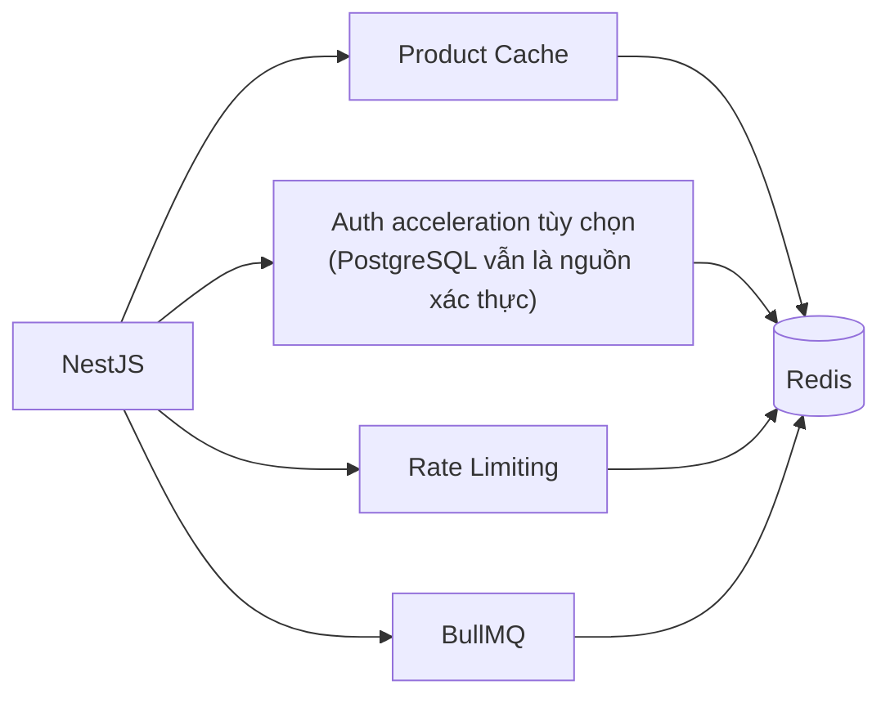

Các key khả dĩ:

```text
product:{id}
product:list:{hash}
category:{id}
session:{id}
rate-limit:{ip}
cart:{userId}
```

Dùng TTL cho dữ liệu tạm thời/cache.

PostgreSQL vẫn là nguồn xác thực cho Session, Inventory Reservation, Order, Payment, Refund, bản ghi idempotency, và outbox. Mất Redis không được làm mất trạng thái thương mại: cache rơi về (fallback) PostgreSQL, dòng outbox chờ phục hồi, và webhook thanh toán vẫn được lưu vào PostgreSQL. Các endpoint nhạy cảm bảo mật không thể enforce rate limit phân tán sẽ fail closed với `503` thay vì âm thầm trở nên không giới hạn.

**Cache và BullMQ dùng chung một Redis instance trong thiết kế này — điều đó cần một quyết định deployment tường minh, không phải mặc định.** BullMQ cần `maxmemory-policy=noeviction`: nếu Redis được phép evict key khi thiếu bộ nhớ (hành vi cache thông thường), nó có thể evict job đang queue/delayed giống như evict entry cache, điều này không chấp nhận được với dữ liệu job. Nó cũng cần persistence (AOF hoặc RDB) được cấu hình thay vì giả định một dịch vụ Redis managed đã tự bật sẵn. Việc tách cache và queue thành hai Redis instance chưa bắt buộc ngay, nhưng chính sách persistence/eviction phải là một lựa chọn có chủ đích trước khi BullMQ mang bất kỳ job liên quan thương mại nào (lên lịch retry payment, hết hạn reservation).

---

# 11. Xử lý Bất đồng bộ

Đừng để request checkout phải chờ mọi thao tác không thiết yếu.

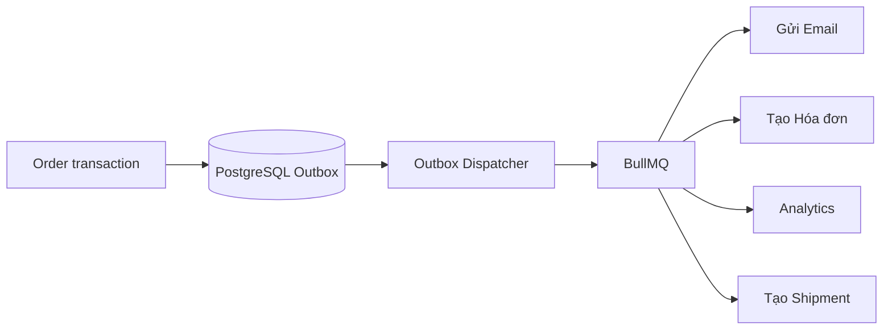

Ví dụ các job:

```text
order.created
payment.completed
order.cancelled
inventory.low
user.registered
password.reset.requested
```

Việc giao (delivery) là **at least once**, không phải exactly once. Transaction làm thay đổi trạng thái domain cũng ghi luôn outbox event có version. Việc dispatch có thể lặp lại; do đó mọi consumer và tác dụng phụ ra bên ngoài đều cần một dedup key ổn định và một chuyển trạng thái idempotent.

**Gap được đóng lại ở đây: một dòng outbox đã đánh dấu "dispatched" nhưng job BullMQ của nó sau đó bị mất** (Redis làm mất job trước khi worker kịp nhận). "Consumer idempotent" chỉ bảo vệ khỏi việc job chạy hai lần — nó không làm gì nếu job không bao giờ chạy.

**Đã quyết định ([ADR 0007](adr/0007-outbox-done-means-downstream-ack.md)): một dòng outbox chỉ hoàn tất thành công (`ACKNOWLEDGED`) khi downstream xác nhận — không bao giờ tại thời điểm enqueue.** Một dòng dùng hết retry mà chưa được xác nhận chuyển thành `DEAD_LETTER`, không được gọi là "done" và vẫn phải quan sát/replay được. Điều này có nghĩa:

- Bảng outbox cần status phân biệt "chưa enqueue", "đã enqueue/đang chờ ack", `ACKNOWLEDGED` và `DEAD_LETTER` — không phải một boolean.
- Một lượt quét reconciliation (so sánh các dòng "đã enqueue, đang chờ ack" với thời gian chúng đã chờ) là cách phát hiện một job bị mất — một dòng outbox kẹt ở "đang chờ ack" quá một ngưỡng chính là tín hiệu, không phải điều gì đó suy ra từ trạng thái nội bộ của BullMQ.
- Vẫn còn mở (**TBD**, không còn bị chặn bởi quyết định trên nhưng chưa được chốt ở đây): thời gian retention chính xác cho các dòng đã xác nhận xong, và dedup key riêng cho từng hệ thống ngoài ứng với mỗi loại job trong danh sách Mục 11 (email/invoice/analytics/shipment) — đó vẫn là các quyết định thuộc implementation-plan.

Mỗi tác dụng phụ downstream trong danh sách job ở trên (email, invoice, analytics, shipment) cần một dedup key cụ thể riêng, phù hợp với hệ thống ngoài đó — "consumer idempotent" là một tính chất cần thiết kế riêng cho từng cái, không phải một cơ chế duy nhất phủ hết tất cả.

---

# 12. Idempotency

Checkout, tạo/retry payment, yêu cầu refund, và webhook thanh toán đều idempotent.

Ví dụ:

```http
POST /api/v1/payments
Idempotency-Key: 8b7c-1234-...
```

Nếu client retry:

```text
Request #1 → Payment được tạo
Request #2 → Cùng Idempotency-Key
Request #3 → Cùng Idempotency-Key
```

Backend không được tạo ra ba payment.

```text
Idempotency Key
       ↓
Kiểm tra bản ghi idempotency trong PostgreSQL
       ↓
Đã xử lý chưa?
   ├── CÓ → Trả về kết quả trước đó
   └── CHƯA → Xử lý request
```

Bản ghi là unique theo `scope + actor/provider + key` và lưu một request fingerprint, processing state, và response snapshot. Dùng lại một key với payload khác trả về `409`; các request đồng thời đua nhau trên ràng buộc unique của database nên chỉ một request được thực thi. Redis có thể tăng tốc tra cứu nhưng không phải nguồn xác thực.

**Gap chưa được xử lý: backend bị crash trong lúc một bản ghi đang ở trạng thái `processing`.** Nếu lời gọi tới provider thực sự đã thành công trước khi crash, một retry của client không được âm thầm xử lý lại (điều đó sẽ tạo ra một lời gọi/tác dụng phụ thứ hai tới provider); nó cũng không được treo mãi mãi chờ một bản ghi sẽ không bao giờ hoàn tất. Yêu cầu ở mức kiến trúc (cơ chế chính xác là quyết định của implementation-plan, không phát minh ở đây):

- Một bản ghi `processing` cần một ngưỡng "cũ" (staleness threshold) — qua ngưỡng đó, một retry sẽ kích hoạt reconciliation (hỏi provider xem thực sự đã xảy ra gì) thay vì retry mù hoặc trả kết quả mù.
- Reconciliation cần một cách để hỏi "lời gọi ra bên ngoài đã xảy ra chưa" trước khi tạo một cái mới — đây là lý do idempotency key phía **ta** phải được liên kết với request identity phía **provider**, không coi là hai vấn đề độc lập.

**Khi backend của ta không nhận được response từ MoMo, nó nên retry cùng lời gọi dưới cùng một `requestId`** — hợp đồng idempotency của chính MoMo nhận diện một `requestId` lặp lại là "cùng một thao tác" thay vì một thao tác mới. Điều đó nghĩa là mọi HTTP retry từ client của ta phải ánh xạ về `requestId` của MoMo dựa trên bản ghi idempotency của ta (và, theo định nghĩa PaymentAttempt ở trên, ở lại cùng dòng attempt) — không sinh một `requestId` mới cho mỗi lần HTTP retry — nếu không, retry của ta và cơ chế idempotency của MoMo sẽ xung đột với nhau thay vì phối hợp.

---

# 13. Xác thực & Phân quyền

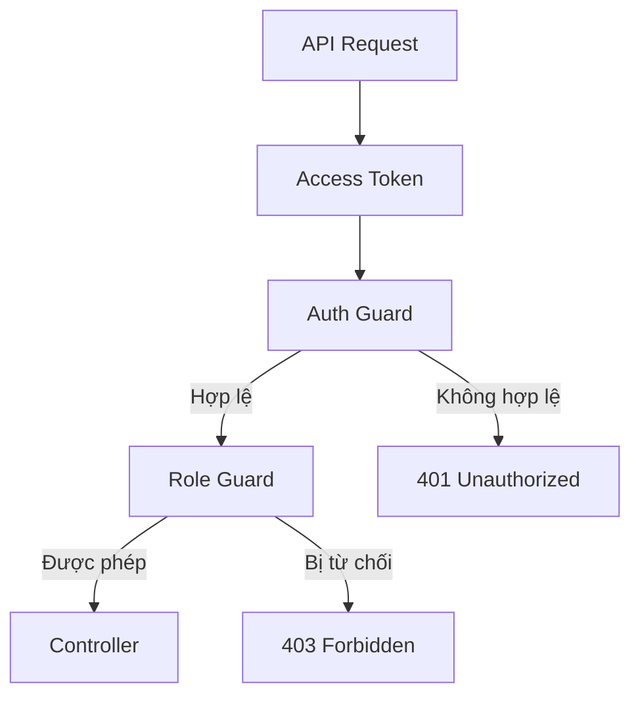

Các role chuẩn (ADR 0005):

```text
CUSTOMER
ORDER_STAFF
STORE_MANAGER
MASTER_ADMIN
```

Phân quyền nên dựa trên quyền hạn nghiệp vụ, không chỉ dựa trên việc hiển thị UI. Không có cây phân cấp role ẩn; mỗi endpoint liệt kê tường minh mọi role được chấp nhận.

| Role            | Phạm vi được phép                                                                                       |
| --------------- | ------------------------------------------------------------------------------------------------------- |
| `CUSTOMER`      | Profile của chính mình, cart, checkout, payment, và hủy Order khi đủ điều kiện                          |
| `ORDER_STAFF`   | Đọc/xử lý Order và Fulfillment; không được quản lý catalog, role, account status, hoặc thực hiện refund |
| `STORE_MANAGER` | Catalog, Inventory, Promotions, các thao tác trên Order, và refund                                      |
| `MASTER_ADMIN`  | Quản trị user/status/role cộng mọi thao tác của cửa hàng                                                |

Thay đổi role/status làm tăng `authorizationVersion` của User, thu hồi các refresh Session, và vô hiệu hóa authorization đã cache. Các request được bảo vệ phải khớp với version hiện tại; authorization đặc quyền fail closed khi không thể xác minh version. Service cũng ngăn việc gỡ bỏ, block, hoặc hạ quyền `MASTER_ADMIN` đang hoạt động, đã xác thực cuối cùng. Bất biến này cần một test concurrency, không chỉ test tuần tự: hai request đồng thời cùng cố block/demote hai admin khác nhau, mà chỉ một trong số đó thực sự là "người cuối cùng" tại thời điểm commit, vẫn phải để lại ít nhất một `MASTER_ADMIN` đứng vững — test từng request độc lập không khai thác được cuộc đua giữa chúng.

Cột `authorizationVersion` ra mắt như một phần của migration role ở Phase 1 (ADR 0005, Mục 0/22) — nó không nằm trong danh sách "migration đã chốt trước Checkout/Payment" ở Mục 7 vì đó là prerequisite của phase đó, không phải một thay đổi schema thương mại.

---

# 14. Các lớp Bảo mật

```text
Internet
   ↓
CDN / WAF
   ↓
API Gateway
   ↓
Rate Limiting
   ↓
Authentication
   ↓
Authorization
   ↓
Input Validation
   ↓
Business Logic
   ↓
Database
```

Các control quan trọng:

- TLS / HTTPS
- Hash mật khẩu
- Validate access token
- Rotate/thu hồi refresh token
- Rate limiting
- Validate input
- CORS
- Chống CSRF khi cần
- Cookie an toàn khi cần
- Chống SQL injection
- Chống XSS
- Audit log
- Xác minh chữ ký webhook
- Lưu secret ngoài source code

---

# 15. Observability

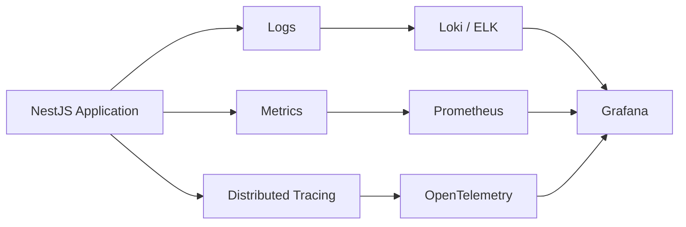

Cần theo dõi:

```text
Request latency
P50 / P95 / P99
Tỷ lệ lỗi
CPU
Bộ nhớ
Số kết nối database
Bộ nhớ Redis
Độ dài queue
Job thất bại
Payment thất bại
Inventory thất bại
```

Trước khi lên production, baseline gồm structured JSON log kèm request/correlation ID, audit log cho thay đổi role/status, điều chỉnh Inventory, chuyển trạng thái Order và Refund, cộng với alert cho outbox backlog, xử lý IPN thất bại, reservation hết hạn thất bại, queue bị trễ, và sai lệch khi reconciliation. Dashboard nâng cao có thể phát triển sau; nhưng khả năng quan sát tiền và tồn kho thì không thể.

---

# 16. Kiến trúc Deployment

Mục tiêu production dùng managed PostgreSQL, managed Redis, và object storage tương thích S3, với ít nhất hai API replica stateless và một worker có thể scale riêng, đứng sau một load balancer. Việc chọn provider tùy theo từng deployment cụ thể; PostgreSQL và trạng thái thanh toán không bao giờ chỉ được lưu trong một application container.

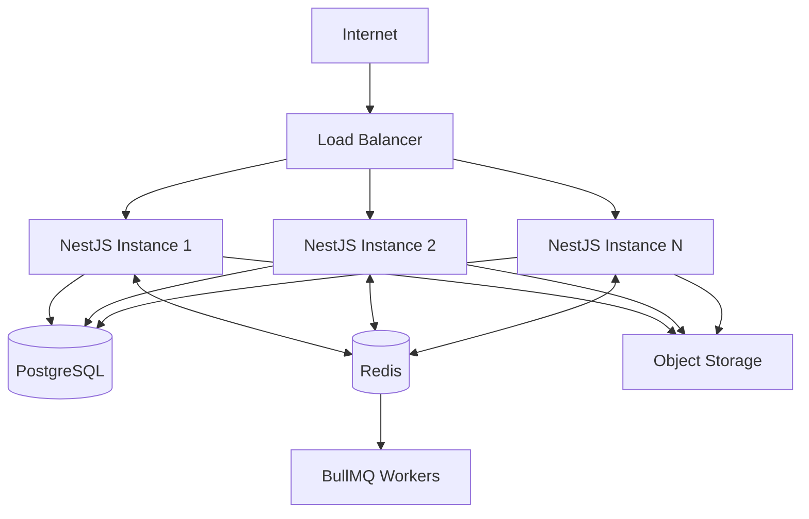

---

# 17. Kiến trúc Docker cho Development

Topology Compose này dành cho phát triển local và test tích hợp CI. Nó không phải topology deployment production đã mô tả ở Mục 16.

```text
docker-compose.yml

services:

  api
    └── NestJS

  worker
    └── BullMQ Worker

  postgres
    └── PostgreSQL

  redis
    └── Redis

  nginx
    └── Reverse Proxy
```

Example:

```text
                    Nginx
                      │
             ┌────────┴────────┐
             ↓                 ↓
          API #1             API #2
             │                 │
             └────────┬────────┘
                      ↓
                 PostgreSQL
                      │
                    Redis
                      │
                 BullMQ Worker
```

---

# 18. Tiến hóa Modular Monolith → Microservices

Bắt đầu:

```text
                 NestJS
                    │
       ┌────────────┼────────────┐
       ↓            ↓            ↓
   Products       Orders      Payments
       │            │            │
       └────────────┼────────────┘
                    ↓
               PostgreSQL
```

Về sau, nếu có lý do thật sự về scaling/team/domain:

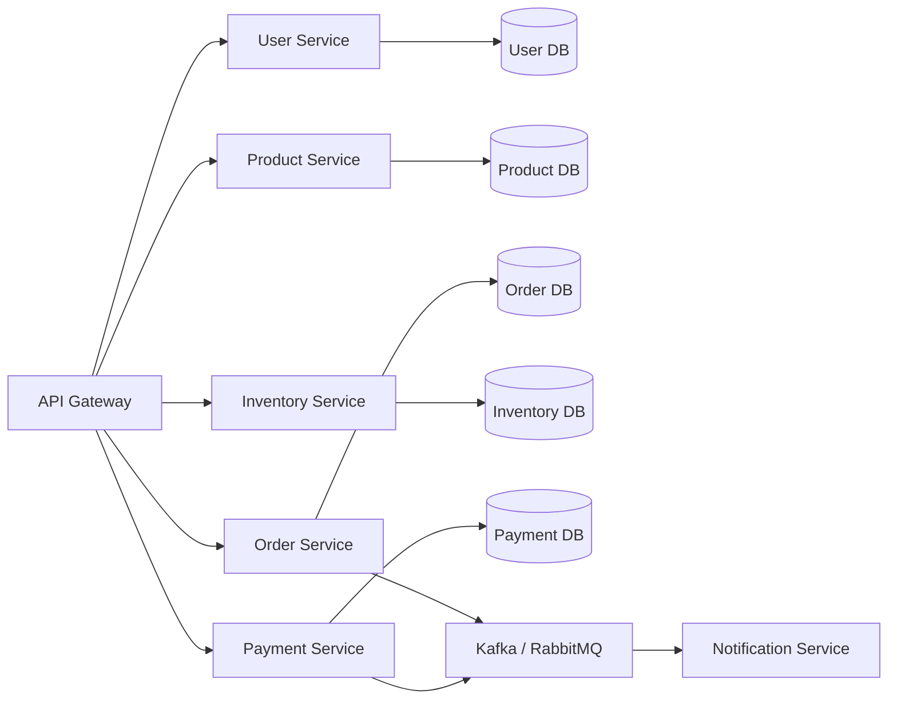

**Không** tách thành microservices chỉ vì sơ đồ kiến trúc trông ấn tượng hơn.

---

# 19. Các Vấn đề System Design Quan trọng

Với hệ thống e-commerce này, các vấn đề quan trọng cần giải quyết là:

## Product

```text
Xử lý hàng triệu sản phẩm như thế nào?
Tìm kiếm sản phẩm như thế nào?
Cache dữ liệu sản phẩm như thế nào?
```

## Cart

```text
Trạng thái cart được lưu ở đâu?
Chuyện gì xảy ra khi giá sản phẩm thay đổi?
Chuyện gì xảy ra khi sản phẩm hết hàng/ngừng bán?
```

## Inventory

```text
Ngăn oversell như thế nào?
Reserve stock như thế nào?
Reservation hết hạn như thế nào?
```

## Order

```text
State machine của order là gì?
Xử lý hủy đơn như thế nào?
Xử lý retry như thế nào?
```

## Payment

```text
Xác minh thanh toán như thế nào?
Xử lý webhook trùng như thế nào?
Xử lý payment timeout như thế nào?
```

## Scalability

```text
Chuyện gì xảy ra ở 10K request/giây?
Bottleneck nằm ở đâu?
API instance có scale ngang được không?
PostgreSQL có chịu được tải không?
Nên đưa Redis vào ở đâu?
```

## Reliability

```text
Nếu payment provider down thì sao?
Nếu Redis down thì sao?
Nếu một queue worker crash thì sao?
Nếu webhook bị gửi hai lần thì sao?
Nếu database connection bị cạn kiệt thì sao?
```

## Yêu cầu Phi chức năng (NFR)

**Đã quyết định (2026-09-17): đây hiện là một dự án học tập/portfolio cá nhân, không phải một hệ thống có khách hàng thật hay SLA đã cam kết.** Trạng thái đó thay đổi những gì một số mục dưới đây cần:

| Mục                     | Cần được quyết định                                                                                                                                                                                                                                                                                                                                  |
| ----------------------- | ---------------------------------------------------------------------------------------------------------------------------------------------------------------------------------------------------------------------------------------------------------------------------------------------------------------------------------------------------- |
| Tải mục tiêu            | **Đã quyết định: chưa đặt benchmark cố định lúc này.** Bước load-testing ở Phase 9 tồn tại để chứng minh thiết kế concurrency/correctness hoạt động đúng dưới tải, không phải để đạt một con số req/s cụ thể mà không ai bị ràng buộc hợp đồng. Chỉ quay lại với số liệu thật nếu dự án phục vụ traffic thật.                                        |
| Độ trễ                  | Tương tự trên — không đặt mục tiêu cố định; tính đúng đắn dưới tải quan trọng hơn một SLA độ trễ ở giai đoạn này.                                                                                                                                                                                                                                    |
| Availability            | **Đã quyết định: giữ như một nguyên tắc kiến trúc, không phải một con số.** Topology multi-replica (Mục 16) và backup PostgreSQL tồn tại vì đó là thiết kế tốt, không phải vì đã cam kết một con số uptime cụ thể với ai. Không đặt phần trăm mục tiêu.                                                                                              |
| RPO                     | **Đã quyết định: không áp dụng ở giai đoạn này** — không có stakeholder nào để đặt một khung mất dữ liệu tối đa chấp nhận được. Quay lại nếu/khi dự án xử lý giao dịch thật cho người dùng thật.                                                                                                                                                     |
| RTO                     | Tương tự RPO — **không áp dụng ở giai đoạn này**, quay lại nếu phạm vi dự án thay đổi.                                                                                                                                                                                                                                                               |
| Ngân sách kết nối DB    | Vẫn thực sự hữu ích để tính toán một khi có worker/replica — giữ ở trạng thái **Open**, không bỏ qua như các mục trên, vì đây là câu hỏi về sizing kỹ thuật, không phải câu hỏi cho business stakeholder.                                                                                                                                            |
| Health check            | **Đã quyết định (ADR 0008):** Redis down không bao giờ làm một replica `unready` — nó chỉ làm suy giảm các tính năng cụ thể phụ thuộc vào nó (route bị rate-limit fail closed với `503` theo Mục 10; mọi thứ dựa trên PostgreSQL, kể cả webhook thanh toán, vẫn hoạt động). Chỉ khi PostgreSQL không thể truy cập mới nên làm một replica `unready`. |
| Người phụ trách on-call | **Đã quyết định: không áp dụng khi đây còn là dự án solo** — không có team để page. Quay lại mục này nếu/khi có thêm người tham gia vận hành hệ thống.                                                                                                                                                                                               |

## Theo dõi Quyết định Còn mở

Tài liệu này đã tích lũy một số dấu **TBD** rải rác qua các mục (chính sách retry/refund thanh toán, phục hồi outbox, các edge case về thời gian reservation, mục tiêu deployment/vận hành). Đánh dấu một thứ là `TBD` ghi nhận rằng nó đã được nhận ra — không đồng nghĩa với việc đã giải quyết nó. Bảng này tồn tại để những mục đó không bị âm thầm coi là "đã quyết định" chỉ vì có một nhãn:

| Nhóm quyết định      | Cần chốt gì                                                                                                         | Mốc chặn                                                  | Owner                    | Trạng thái                                                                                                                                                                                                                                                                                    |
| -------------------- | ------------------------------------------------------------------------------------------------------------------- | --------------------------------------------------------- | ------------------------ | --------------------------------------------------------------------------------------------------------------------------------------------------------------------------------------------------------------------------------------------------------------------------------------------- |
| **Payment/Refund**   | Chính sách retry-limit, xử lý giao dịch thành công trùng, giải quyết late-success, hoàn tiền toàn phần vs. một phần | Trước khi implement Payment thật (Phase 6)                | Product/business         | **Đã quyết định** (2026-09-17, ADR 0006) — retry không giới hạn trong cửa sổ reservation; refund cho khoản thu dư qua `STORE_MANAGER` review, không tự động; MVP chỉ full-refund; late-success giữ Order ở `CANCELLED`; cho phép hủy sau `CONFIRMED` khi còn `UNFULFILLED`                    |
| **Outbox/Worker**    | Successful acknowledgement, dead-letter, retention/replay và phát hiện job bị mất                                   | Trước khi worker mang các job commerce-critical           | Backend/infra            | **Đã quyết định một phần** ([ADR 0007](adr/0007-outbox-done-means-downstream-ack.md)) — success = `ACKNOWLEDGED`; retry exhausted = `DEAD_LETTER`; retention và dedup key từng consumer vẫn **Open**                                                                                          |
| **Cart/Reservation** | Cơ chế khóa cho CartItem-mutation-vs-checkout, ngữ nghĩa reservation-expiry đã chọn ở trên (cần implement)          | Trước khi bắt đầu implement Checkout (Phase 5)            | Backend                  | **Đã quyết định** (2026-09-17, ADR 0009) — row lock (`SELECT ... FOR UPDATE`) trên Cart lúc bắt đầu checkout, không có cột `version`                                                                                                                                                          |
| **Operations**       | Mục tiêu load/latency/availability/RPO/RTO, phân loại health-check theo dependency, người phụ trách on-call         | Chỉ quay lại nếu dự án phục vụ người dùng/thanh toán thật | Product/business + infra | **Đã quyết định** (2026-09-17) — đây hiện là dự án học tập/portfolio solo: load/latency/availability/RPO/RTO/on-call được đánh dấu không-áp-dụng-lúc-này thay vì để mở; phân loại health-check đã quyết định (ADR 0008); ngân sách kết nối DB là câu hỏi sizing duy nhất thực sự vẫn **Open** |

Mỗi dòng nên có thêm link tới ADR hoặc phần implementation-plan tương ứng một khi đã quyết định, và Trạng thái nên chuyển từ `Open` sang `Đã quyết định` (kèm ngày) — không xóa đi, để lịch sử về thời điểm đóng lại vẫn còn hiển thị.

---

# 20. Kiến trúc Đề xuất cho Dự án Học tập

Với một dự án học tập thực tế, dùng:

```text
Frontend
    │
    │ HTTPS
    ▼
Next.js
    │
    ▼
Nginx / API Gateway
    │
    ▼
NestJS Modular Monolith
    │
    ├── Auth
    ├── Users
    ├── Products
    ├── Categories
    ├── Cart
    ├── Orders
    ├── Inventory
    ├── Payments
    ├── Promotions
    └── Notifications
         │
         ├───────────────┐
         ▼               ▼
   PostgreSQL           Redis
                           │
                           ▼
                        BullMQ
                           │
                           ▼
                       Workers
```

Sau đó thêm:

```text
Object Storage
Search Engine
Payment Gateway
Shipping Provider
Email Provider
Monitoring
CI/CD
Docker
```

khi hệ thống lớn lên.

---

# 21. Nguyên tắc Kiến trúc

1. **Modular Monolith trước**
2. **Module hướng theo domain**
3. **PostgreSQL là nguồn xác thực giao dịch**
4. **Redis cho hiệu năng và trạng thái tạm thời**
5. **Queue cho công việc bất đồng bộ**
6. **Webhook cho xác nhận thanh toán**
7. **Idempotency cho các thao tác có thể retry**
8. **Transaction cho các thao tác inventory/order quan trọng**
9. **Scale ngang cho API server stateless**
10. **Observability ngay từ đầu**
11. **Bảo mật ở mọi lớp**
12. **Microservices chỉ khi có lý do cụ thể**

---

# 22. Thứ tự Implementation

Một trình tự implementation thực tế cho MVP nhiều instance, thanh toán thật:

```text
Phase 1
├── Migrate route sang /api/v1; Swagger sang /docs
├── Migrate ADMIN sang bốn role chuẩn
├── Thu hồi authorization-version và nền tảng audit
├── Docker image + Compose local cho PostgreSQL/Redis
├── CI, migration job, graceful shutdown, liveness/readiness
└── Structured logs + metrics cơ bản

Phase 2
├── Categories
├── Products
├── Product Variants
└── Object Storage cho media sản phẩm

Phase 3
├── Users
└── Ma trận phân quyền staff

Phase 4
├── Cart
├── Inventory
└── Inventory Reservation 15 phút

Phase 5
├── Orders + snapshot tài chính/địa chỉ
├── Concurrency + idempotency cho checkout
└── Transactional Outbox + worker idempotent

Phase 6
├── MoMo Payment + Payment Attempts
├── IPN có ký và loại trùng
├── Refund + reconciliation
└── Sandbox/UAT và các gate production

Phase 7
└── Promotions dùng một mã duy nhất

Phase 8
├── Fulfillment + workflow shipping nội địa
└── Notifications

Phase 9
├── Load Testing
├── Tối ưu Database
├── Cache sản phẩm chỉ sau khi đo được nhu cầu thật
├── Search engine chỉ khi tìm kiếm bằng PostgreSQL không đủ
├── Adapter quốc tế PayPal khi cần
└── Tách microservice chỉ khi có lý do chính đáng
```

Mọi lượt rollout schema trên nhiều replica dùng **expand–migrate–contract**: thêm schema tương thích ngược, deploy code tương thích cả hai chiều, backfill và xác nhận, thay hết mọi replica, rồi mới xóa hình dạng cũ ở một release sau.

Các gate production cho payment gồm integration test thật với PostgreSQL/Redis, test concurrency cho oversell và duplicate-checkout, test hợp đồng với provider, các kịch bản IPN của MoMo bị timeout/trùng/không đúng thứ tự, replay worker/outbox, hết hạn reservation, rolling migration, và graceful shutdown.

---

## Kiến trúc Cuối cùng

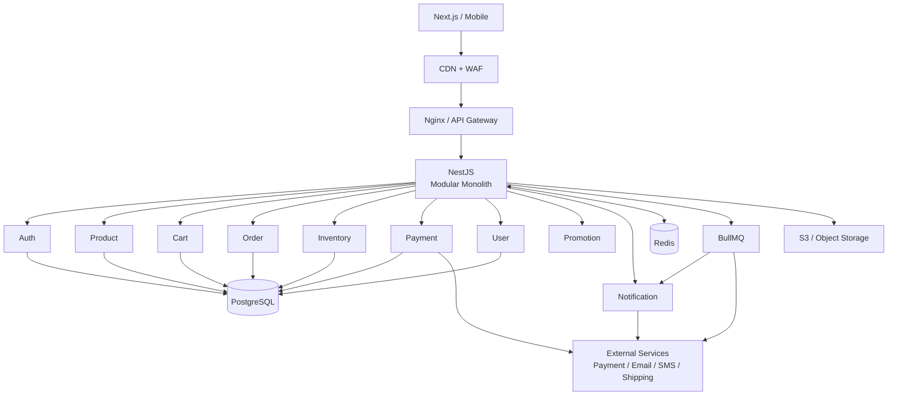
